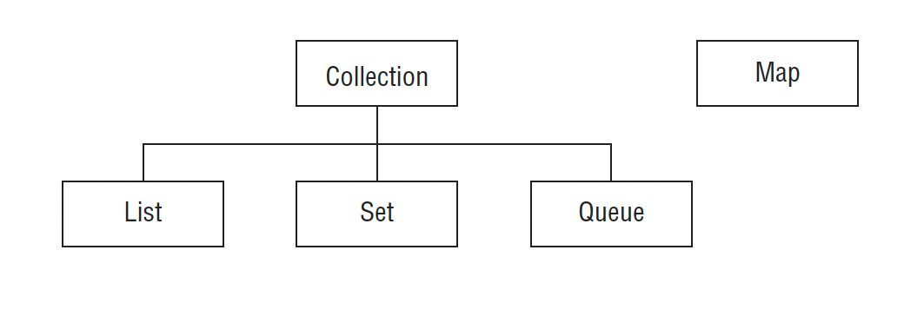
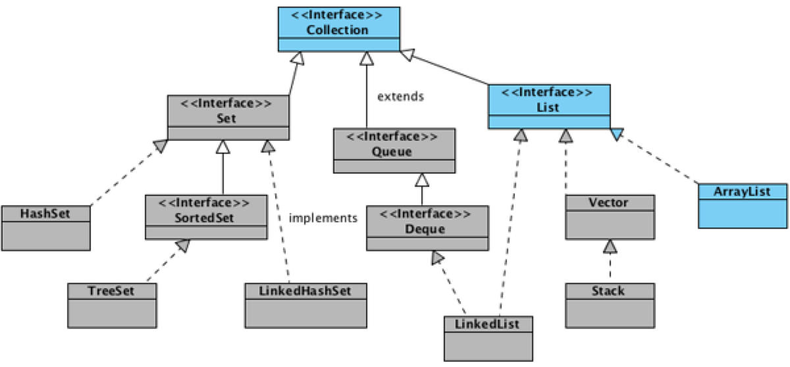
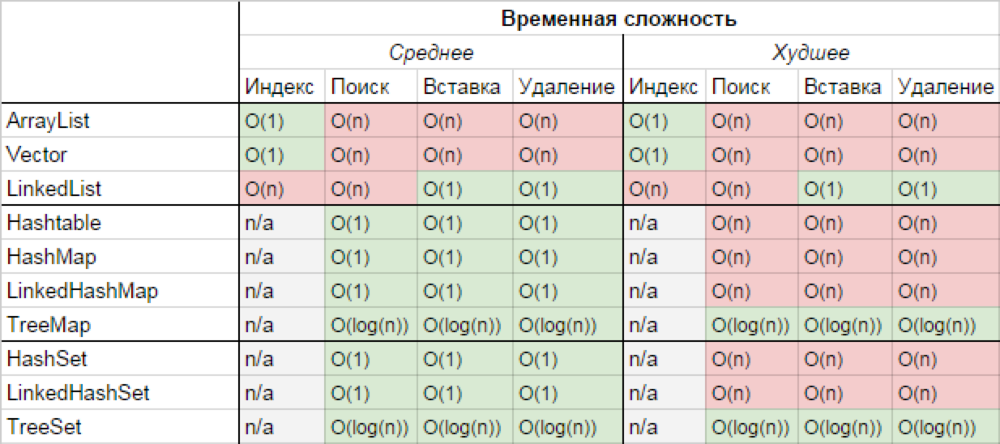

= Java Data structures and Collections
:sectnums:
:toc: left
:toclevels: 5
:icons: font
:source-highlighter: coderay

== Introduction

Java Collections Framework includes classes that implement List, Map, Queue, and Set.

=== Array and ArrayList

*An array is not part of the Collections Framework*

An ArrayList cannot contain primitives.
An array is a built-in data structure that contains other objects or primitives.

We access elements in ArrayLists with get(), and we check the number of elements with size().
By contrast, we access elements in arrays using brackets and check the number of elements with the length variable.

[source,java]
----
List<String> list = new ArrayList<>(); // empty list
list.add("Fluffy"); // [Fluffy]
list.add("Webby"); // [Fluffy, Webby]

String[] array = new String[list.size()]; // empty array
array[0] = list.get(1); // [Webby]
array[1] = list.get(0); // [Webby, Fluffy]
----

=== Searching and Sorting

Arrays.sort(numbers); Arrays.binarySearch(numbers, 6)

Collections.sort(list); Collections.binarySearch(list, 3)

*We needed to sort structures first*

=== Wrapper Classes and Autoboxing

Autoboxing automatically converts a primitive to the corresponding wrapper classes when needed if the generic type is specifi ed in the declaration.
Unsurprisingly, unboxing automatically converts a wrapper class back to a primitive.

== Java Collections Framework

A collection is a group of objects contained in a single object.
The Java Collections Framework is a set of classes in java.util for storing collections.

*There are four main interfaces in the Java Collections Framework:*

* *List:* A list is an ordered collection of elements that allows duplicate entries.
Elements in a list can be accessed by an int index.
* *Set:* A set is a collection that does not allow duplicate entries.
* *Queue:* A queue is a collection that orders its elements in a specific order for processing.
A typical queue processes its elements in a first-in, first-out order, but other orderings are possible.
* *Map:* A map is a collection that maps keys to values, with no duplicate keys allowed.
The elements in a map are key/value pairs.

=== Common Collections Methods

[source,java]
----
boolean add(E element)
boolean remove(Object object)
boolean isEmpty()
int size()
void clear()
boolean contains(Object object)
----

=== List

You use a list when you want an ordered collection that can contain duplicate entries.
Items can be retrieved and inserted at specific positions in the list based on an int index much like an array.

==== ArrayList

An ArrayList is like a resizable array.
When elements are added, the ArrayList automatically grows.
When you aren’t sure which collection to use, use an ArrayList.

The main benefit of an ArrayList is that you can look up any element in constant time.
Adding or removing an element is slower than accessing an element.

https://habr.com/ru/articles/128269/

==== LinkedList

A LinkedList is special because it implements both List and Queue.
It has all of the methods of a List.
It also has additional methods to facilitate adding or removing from the beginning and/or end of the list.

The main benefits of a LinkedList are that you can access, add, and remove from the beginning and end of the list in constant time.
The tradeoff is that dealing with an arbitrary index takes linear time.
This makes a LinkedList a good choice when you’ll be using it as Queue.

https://habr.com/ru/articles/127864/

==== ArrayList vs LinkedList

ArrayList это список, реализованный на основе массива, а LinkedList — это классический связный список, основанный на объектах с ссылками между ними.

*Преимущества ArrayList:* в возможности доступа к произвольному элементу по индексу за постоянное время (так как это массив), минимум накладных расходов при хранении такого списка, вставка в конец списка в среднем производится так же за постоянное время.
В среднем потому, что массив имеет определенный начальный размер n (в коде это параметр capacity), по умолчанию n = 10, при записи n+1 элемента, будет создан новый массив размером (n * 3) / 2 + 1, в него будут помещены все элементы из старого массива + новый, добавляемый элемент.
В итоге получаем, что при добавлении элемента при необходимости расширения массива, время добавления будет значительно больше, нежели при записи элемента в готовую пустую ячейку.
Тем не менее, в среднем время вставки элемента в конец списка является постоянным.
Удаление последнего элемента происходит за константное время.
Недостатки ArrayList проявляются при вставке/удалении элемента в середине списка — это взывает перезапись всех элементов размещенных «правее» в списке на одну позицию влево, кроме того, при удалении элементов размер массива не уменьшается, до явного вызова метода trimToSize().

*LinkedList наоборот*, за постоянное время может выполнять вставку/удаление элементов в списке (именно вставку и удаление, поиск позиции вставки и удаления сюда не входит).
Доступ к произвольному элементу осуществляется за линейное время (но доступ к первому и последнему элементу списка всегда осуществляется за константное время — ссылки постоянно хранятся на первый и последний, так что добавление элемента в конец списка вовсе не значит, что придется перебирать весь список в поисках последнего элемента).
В целом же, LinkedList в абсолютных величинах проигрывает ArrayList и по потребляемой памяти и по скорости выполнения операций.
LinkedList предпочтительно применять, когда происходит активная работа (вставка/удаление) с серединой списка или в случаях, когда необходимо гарантированное время добавления элемента в список.

=== Set
TODO

=== Queue
TODO

=== Map

*Implementations*

A *HashMap* stores the keys in a hash table. This means that it uses the hashCode() method
of the keys to retrieve their values more efficiently.
The main benefit is that adding elements and retrieving the element by key both have
constant time. The tradeoff is that you lose the order in which you inserted the elements.

Most of the time, you aren’t concerned with this in a map anyway. If you were, you could
use *LinkedHashMap*.

A *TreeMap* stores the keys in a sorted tree structure. The main benefit is that the keys are
always in sorted order. The tradeoff is that adding and checking if a key is present are both
O(log n).

A *Hashtable* is like Vector in that it is really old and thread-safe and that you won’t be
expected to use it. It contains a lowercase t as a mistake from the olden days. All you have
to do is be able to pick it out in a lineup. In the form of old school analogies, ArrayList is
to Vector as HashMap is to Hashtable.

==== HashMap

==== LinkedHashMap

==== TreeMap

=== Comparing Collection Types

https://habr.com/ru/articles/237043/

== Comparator vs. Comparable

=== Comparable

=== Comparator

== Searching and Sorting

