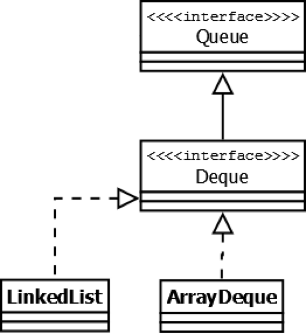
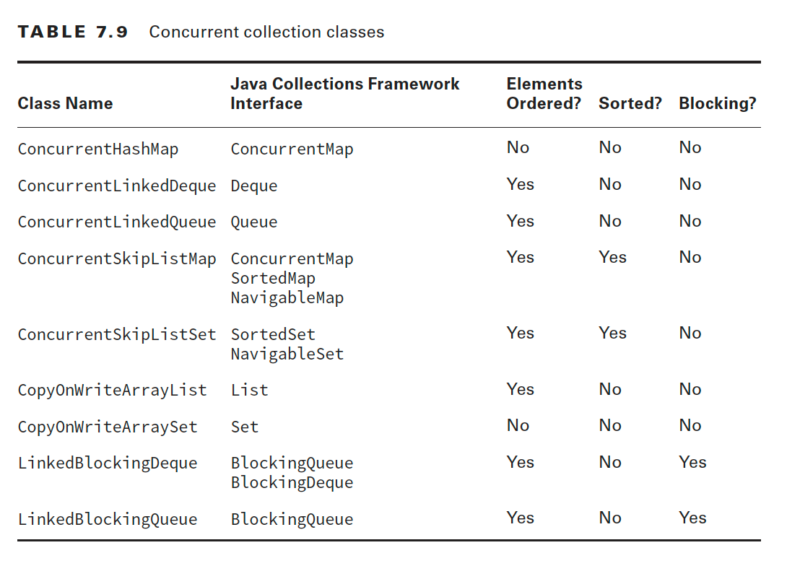

= Java Data structures and Collections
:sectnums:
:toc: left
:toclevels: 5
:icons: font
:source-highlighter: coderay

== Introduction

Java Collections Framework includes classes that implement List, Map, Queue, and Set.

=== Array and ArrayList

*An array is not part of the Collections Framework*

An ArrayList cannot contain primitives.
An array is a built-in data structure that contains other objects or primitives.

We access elements in ArrayLists with get(), and we check the number of elements with size().
By contrast, we access elements in arrays using brackets and check the number of elements with the length variable.

[source,java]
----
List<String> list = new ArrayList<>(); // empty list
list.add("Fluffy"); // [Fluffy]
list.add("Webby"); // [Fluffy, Webby]

String[] array = new String[list.size()]; // empty array
array[0] = list.get(1); // [Webby]
array[1] = list.get(0); // [Webby, Fluffy]
----

=== Searching and Sorting

Arrays.sort(numbers); Arrays.binarySearch(numbers, 6)

Collections.sort(list); Collections.binarySearch(list, 3)

*We needed to sort structures first*

=== Wrapper Classes and Autoboxing

Autoboxing automatically converts a primitive to the corresponding wrapper classes when needed if the generic type is specified in the declaration.
Unsurprisingly, unboxing automatically converts a wrapper class back to a primitive.

== Java Collections Framework

A collection is a group of objects contained in a single object.
The Java Collections Framework is a set of classes in java.util for storing collections.

*There are four main interfaces in the Java Collections Framework:*

* *List:* A list is an ordered collection of elements that allows duplicate entries.
Elements in a list can be accessed by an int index.
* *Set:* A set is a collection that does not allow duplicate entries.
* *Queue:* A queue is a collection that orders its elements in a specific order for processing.
A typical queue processes its elements in a first-in, first-out order, but other orderings are possible.
* *Map:* A map is a collection that maps keys to values, with no duplicate keys allowed.
The elements in a map are key/value pairs.

image::images/image-2024-05-25-14-04-59-171.png[width=500]

image::images/image-2024-05-25-14-44-21-708.png[width=500]

=== Common Collections Methods

[source,java]
----
boolean add(E element)
boolean remove(Object object)
boolean isEmpty()
int size()
void clear()
boolean contains(Object object)
----

=== List

You use a list when you want an ordered collection that can contain duplicate entries.
Items can be retrieved and inserted at specific positions in the list based on an int index much like an array.

==== ArrayList

An ArrayList is like a resizable array.
When elements are added, the ArrayList automatically grows.
When you aren’t sure which collection to use, use an ArrayList.

The main benefit of an ArrayList is that you can look up any element in constant time.
Adding or removing an element is slower than accessing an element.

https://habr.com/ru/articles/128269/

==== LinkedList

A LinkedList is special because it implements both List and Queue.
It has all of the methods of a List.
It also has additional methods to facilitate adding or removing from the beginning and/or end of the list.

The main benefits of a LinkedList are that you can access, add, and remove from the beginning and end of the list in constant time.
The tradeoff is that dealing with an arbitrary index takes linear time.
This makes a LinkedList a good choice when you’ll be using it as Queue.

https://habr.com/ru/articles/127864/

==== ArrayList vs LinkedList

ArrayList это список, реализованный на основе массива, а LinkedList — это классический связный список, основанный на объектах с ссылками между ними.

*Преимущества ArrayList:* в возможности доступа к произвольному элементу по индексу за постоянное время (так как это массив), минимум накладных расходов при хранении такого списка, вставка в конец списка в среднем производится так же за постоянное время.
В среднем потому, что массив имеет определенный начальный размер n (в коде это параметр capacity), по умолчанию n = 10, при записи n+1 элемента, будет создан новый массив размером (n * 3) / 2 + 1, в него будут помещены все элементы из старого массива + новый, добавляемый элемент.
В итоге получаем, что при добавлении элемента при необходимости расширения массива, время добавления будет значительно больше, нежели при записи элемента в готовую пустую ячейку.
Тем не менее, в среднем время вставки элемента в конец списка является постоянным.
Удаление последнего элемента происходит за константное время.
Недостатки ArrayList проявляются при вставке/удалении элемента в середине списка — это взывает перезапись всех элементов размещенных «правее» в списке на одну позицию влево, кроме того, при удалении элементов размер массива не уменьшается, до явного вызова метода trimToSize().

*LinkedList наоборот*, за постоянное время может выполнять вставку/удаление элементов в списке (именно вставку и удаление, поиск позиции вставки и удаления сюда не входит).
Доступ к произвольному элементу осуществляется за линейное время (но доступ к первому и последнему элементу списка всегда осуществляется за константное время — ссылки постоянно хранятся на первый и последний, так что добавление элемента в конец списка вовсе не значит, что придется перебирать весь список в поисках последнего элемента).
В целом же, LinkedList в абсолютных величинах проигрывает ArrayList и по потребляемой памяти и по скорости выполнения операций.
LinkedList предпочтительно применять, когда происходит активная работа (вставка/удаление) с серединой списка или в случаях, когда необходимо гарантированное время добавления элемента в список.

=== Set

HashSet — реализация интерфейса Set, базирующаяся на HashMap.
Внутри использует объект HashMap для хранения данных.
В качестве ключа используется добавляемый элемент, а в качестве значения — объект-пустышка (new Object()).
Из-за особенностей реализации порядок элементов не гарантируется при добавлении.

LinkedHashSet — отличается от HashSet только тем, что в основе лежит LinkedHashMap вместо HashMap.
Благодаря этому отличию порядок элементов при обходе коллекции является идентичным порядку добавления элементов.

TreeSet — аналогично другим классам-реализациям интерфейса Set содержит в себе объект NavigableMap, что и обуславливает его поведение.
Предоставляет возможность управлять порядком элементов в коллекции при помощи объекта Comparator, либо сохраняет элементы с использованием "natural ordering".

=== Queue

Этот интерфейс описывает коллекции с предопределённым способом вставки и извлечения элементов, а именно — очереди FIFO (first-in-first-out).
Помимо методов, определённых в интерфейсе Collection, определяет дополнительные методы для извлечения и добавления элементов в очередь.
Большинство реализаций данного интерфейса находится в пакете java.util.concurrent

PriorityQueue — является единственной прямой реализацией интерфейса Queue (была добавлена, как и интерфейс Queue, в Java 1.5), не считая класса LinkedList, который так же реализует этот интерфейс, но был реализован намного раньше.
Особенностью данной очереди является возможность управления порядком элементов.
По-умолчанию, элементы сортируются с использованием «natural ordering», но это поведение может быть переопределено при помощи объекта Comparator, который задаётся при создании очереди.
Данная коллекция не поддерживает null в качестве элементов.

=== Map

*Implementations*

A *HashMap* stores the keys in a hash table.
This means that it uses the hashCode() method of the keys to retrieve their values more efficiently.
The main benefit is that adding elements and retrieving the element by key both have constant time.
The tradeoff is that you lose the order in which you inserted the elements.

Most of the time, you aren’t concerned with this in a map anyway.
If you were, you could use *LinkedHashMap*.

A *TreeMap* stores the keys in a sorted tree structure.
The main benefit is that the keys are always in sorted order.
The tradeoff is that adding and checking if a key is present are both O(log n).

A *Hashtable* is like Vector in that it is really old and thread-safe and that you won’t be expected to use it.
It contains a lowercase t as a mistake from the olden days.
All you have to do is be able to pick it out in a lineup.
In the form of old school analogies, ArrayList is to Vector as HashMap is to Hashtable.

==== HashMap

https://habr.com/ru/articles/128017/

https://habr.com/ru/articles/421179/

* *table* — Массив типа Entry[], который является хранилищем ссылок на списки (цепочки) значений;
* *loadFactor* — Коэффициент загрузки.
Значение по умолчанию 0.75 является хорошим компромиссом между временем доступа и объемом хранимых данных;
* *threshold* — Предельное количество элементов, при достижении которого, размер хэш-таблицы увеличивается вдвое.
Рассчитывается по формуле (capacity * loadFactor);
* *size* — Количество элементов HashMap-а;

*Изменения в Java 8*

----
Как мы уже знаем в случае возникновения коллизий объект node сохраняется в структуре данных "связанный список" и метод equals() используется для сравнения ключей. Это сравнения для поиска верного ключа в связанном списке -линейная операция и в худшем случае сложность равнa O(n).

Для исправления этой проблемы в Java 8 после достижения определенного порога вместо связанных списков используются сбалансированные деревья. Это означает, что HashMap в начале сохраняет объекты в связанном списке, но после того, как колличество элементов в хэше достигает определенного порога происходит переход к сбалансированным деревьям. Что улучшает производительность в худшем случае с O(n) до O(log n).
----

==== LinkedHashMap

https://habr.com/ru/articles/129037/

==== TreeMap

A TreeMap stores its data in a hierarchical tree with the ability to sort the elements with the help of a custom Comparator.

https://www.baeldung.com/java-treemap-vs-hashmap

=== Comparing Collection Types

https://habr.com/ru/articles/237043/

image::images/image-2024-05-25-15-29-33-410.png[width=500]

== Concurrent Collections

-> OCP : Chapter 7 Concurrency : Using Concurrent Collections

=== ConcurrentHashMap

It allows concurrent access to the map.
Part of the map called Segment (internal data structure) is only getting locked while adding or updating the map.
So ConcurrentHashMap allows concurrent threads to read the value without locking at all.
This data structure was introduced to improve performance.

IMPORTANT: Нужно отметить, что реализация ConcurrentHashMap в Java 1.8 была существенно изменена с 1.7.
В 1.7 это была идея сегментов, где число сегментов равно уровню параллелизма.
В java 8 массив бакетов представляет собой единый массив.

The main difference between ConcurrentHashMap and a regular HashMap is that the first implements total concurrency for reads and high concurrency for writes.

Read operations are guaranteed not to be blocked or block a key.
Write operations are blocked and block other writes at the map Entry level.
These two ideas are important in environments where we want to achieve high throughput and eventual consistency.

HashTable and Collections.synchronizedMap collections also implement concurrency for reads and writes.
However, they are less efficient because they lock the entire collection instead of locking just the Entry at which the thread is writing.

On the other hand, the ConcurrentHashMap class locks at a map Entry level.
Thus, other threads are not blocked from writing on other map keys.
Therefore, to achieve high throughput, ConcurrentHashMap in multi-thread environments is a better option when compared to HashTable and synchronizedMap collections.

The ConcurrentHashMap implements eventual consistency for reads.
That means we won’t always read a consistent value (the most updated one), but once the map stops receiving writes, then reads become consistent again.
Check out this introduction to transactions to get more details about eventual consistency.

Iterators, Spliterators and Enumerations return elements reflecting the state of the hash table at some point at or since the creation of the iterator/enumeration.
They do not throw ConcurrentModificationException.
However, iterators are designed to be used by only one thread at a time.

https://dzone.com/articles/how-concurrenthashmap-works-internally-in-java
https://habr.com/ru/articles/327186/
https://www.baeldung.com/concurrenthashmap-reading-and-writing
https://docs.oracle.com/javase/8/docs/api/java/util/concurrent/ConcurrentHashMap.html

== Comparator vs. Comparable

You can sort objects that you create.
Java provides an interface called *Comparable*.
If your class implements *Comparable*, it can be used in these data structures that require comparison.
There is also a class called *Comparator*, which is used to specify that you want to use a different order than the object itself provides.

For numbers, order is obvious—it is numerical order.
For String objects, order is defi ned according to the Unicode character mapping.

=== Comparable

[source,java]
----
public interface Comparable<T> {
    public int compareTo(T o);
}

public class Duck implements Comparable<Duck> {
    private String name;

    public Duck(String name) {
        this.name = name;
    }

    public String toString() {
        return name;
    }

    public int compareTo(Duck d) {
        return name.compareTo(d.name);
    }
}
----

* The number zero is returned when the current object is equal to the argument to compareTo().
* A number less than zero is returned when the current object is smaller than the argument to compareTo().
* A number greater than zero is returned when the current object is larger than the argument to compareTo().

=== Comparator

Sometimes you want to sort an object that did not implement Comparable, or you want to sort objects in different ways at different times.

[source,java]
----
Comparator<Duck> byWeight = new Comparator<Duck>() {
    public int compare(Duck d1, Duck d2) {
    return d1.getWeight() — d2.getWeight();}
};

// or
Comparator<Duck> byWeight = (d1, d2) -> d1.getWeight()—d2.getWeight();

// use
Collections.sort(ducks, byWeight);
----

== Questions

=== Java собеседование. Коллекции

https://habr.com/ru/articles/162017/

