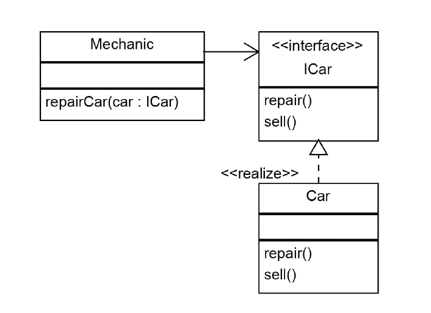
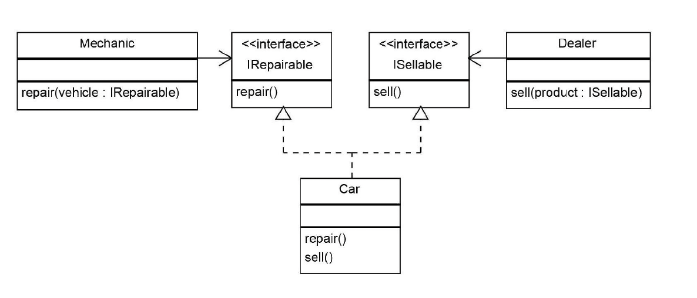
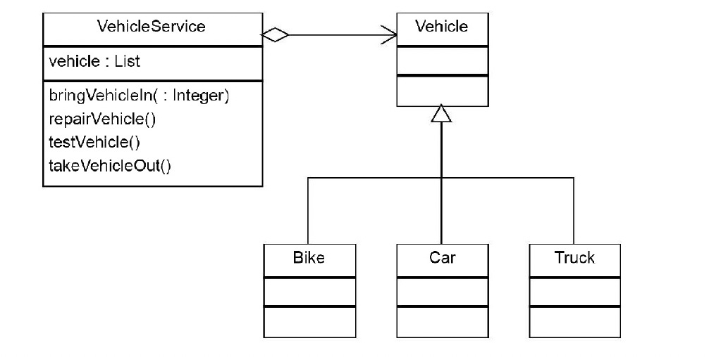
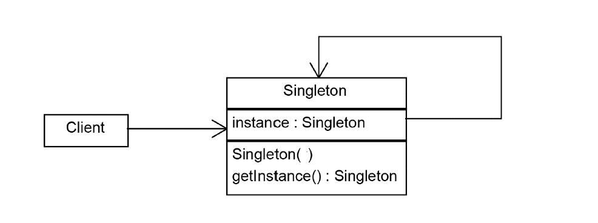

= Design Patterns
:sectnums:
:toc: left
:toclevels: 5
:icons: font
:source-highlighter: coderay

== Sources

=== Design Patterns and Best Practices in Java 9

== SOLID

*The SOLID principles include:*

* Single responsibility principle
* Open/closed principle
* Liskov Substitution Principle
* Interface Segregation Principle
* Dependency inversion principle

=== Single responsibility

The single responsibility principle is an object-oriented design principle that states that a software module should have only one reason to change.

The solution would create two classes: one to encapsulate the Car logic and the other to be responsible for persistence:

image::images/image-2024-05-29-22-45-49-643.png[width=500]

=== Open/closed principle

====
Modules, classes, and functions should be open for extension but closed for modifications.
====

Applying this principle will help us to develop complex and robust software.
We must imagine the software we develop is building a complex structure.
Once we finish a part of it, we should not modify it any more but build on top of it.

For this reason, best practice is to try to keep modules unchanged once finished and to add new functionality by extending them using inheritance and polymorphism.

=== Liskov Substitution Principle

Barbara Liskov states that, Derived types must be completely substitutable for their base types.
The Liskov Substitution Principle (LSP) is strongly related to subtyping polymorphism.
Based on subtyping polymorphism in an object-oriented language, a derived object can be substituted with its parent type.
For example, if we have a Car object, it can be used in the code as a Vehicle.

==== Example 1

In mathematics, a Square is a Rectangle.
Indeed, it is a specialization of a rectangle.
The "is a" makes you want to model this with inheritance.
However, if in code you made Square derive from Rectangle, then a Square should be usable anywhere you expect a Rectangle.
This makes for some strange behavior.

Imagine you had SetWidth and SetHeight methods on your Rectangle base class; this seems perfectly logical.
However, if your Rectangle reference pointed to a Square, then SetWidth and SetHeight doesn't make sense because setting one would change the other to match it.
In this case Square fails the Liskov Substitution Test with Rectangle and the abstraction of having Square inherit from Rectangle is a bad one.

==== Example 2

If you inherit CarWithoutDoors from the Car.
In this situation you can't provide methods openDoors(Key key) in the Car class.

=== Interface Segregation Principle

====
Clients should not be forced to depend upon interfaces that they don't use
====

==== Example

The mechanic repairs cars, so we add a method of repair car.
In this case, the Mechanic class depends upon the I class.
However, the Car class exposes a richer sets of methods than the Mechanic class needs:

This is a bad design because if we want to replace a car with another one, we need to make changes in the Mechanic class, which violates the open/closed principle.
Instead, we must create an interface that exposes only the relevant methods required in the Mechanic class, as shown in the following diagram:

=== Dependency Inversion Principle

====
High-level modules should not depend on low-level modules.
Both should depend on abstractions.
Abstractions should not depend on details.
Details should depend on abstractions.
====

There are different approaches to decoupling the components of a system.
One of them is to separate the high-level logic from the low-level modules, as shown in the following diagram.
When doing this, we should try to reduce the dependency between the two by making them depend on abstractions.
This way, any of them can be replaced or extended without affecting other modules:

== Creational patterns

=== Singleton

Is used to ensure that only a single instance of an object can be created.
In addition to that, it also provides global access to that instance.

==== Simple implementation

[source,java]
----
public class Singleton {
    private static Singleton instance;
    private Singleton() { }

    public static Singleton getInstance() {
        if (instance == null)
            instance = new Singleton();
        return instance;
    }

    public void doSomething() { }
}
----

==== Synchronized singletons

If we use our code in a multithreading application, it may be the case that two threads invoke the getInstance method at the same time when the instance is null.

This can be done in the following two ways:

[source,java]
----
public static synchronized Singleton getInstance()
----

[source,java]
----
synchronized (SingletonSync2.class) {
    if (instance == null)
        instance = new SingletonSync2();
}
----

==== Synchronized singleton with doublechecked locking mechanism

The previous implementation is thread-safe but it introduces an unnecessary delay: the block that checks whether the instance has already been created is synchronized.
This means that the block can be executed by only one thread at a time, but locking makes sense only when the instance has not been created.
When the singleton instance has already been created, each thread can get the current instance in an unsynchronized manner.

[source,java]
----
if (instance == null) {
    synchronized (SingletonSync2.class) {
        if (instance == null)
            instance = new SingletonSync2();
    }
}
----

==== Lock-free thread-safe singleton

One of the best implementations of the singleton pattern in Java relies on the fact that a class is loaded a single time.
By instantiating the static member directly when declared, we make sure that we have a single instance of the class.

[source,java]
----
public class LockFreeSingleton {
    private static final LockFreeSingleton instance = new LockFreeSingleton();
    private LockFreeSingleton() {}

    public static LockFreeSingleton getInstance() {
        return instance;
    }

    public void doSomething() {}
}
----

The lock-free thread-safe singleton presented in the previous example is considered an *early-loading* singleton in the first version of Java.
However, in the latest version of Java, classes are loaded when they are needed, so that version is also a *lazy-loading* version.

==== Lock-free thread-safe singleton (Using enum)

[source,java]
----
public enum Elvis {
    INSTANCE;
    public void doSomething() { }
}
----

=== Builder

=== Factory

=== Factory Method

=== Abstract Factory

=== Prototype

== Structural patterns

=== Adapter

=== Bridge

=== Composite

=== Decorator

=== Facade

=== Flyweight

=== Proxy

== Behavioral patterns

=== Chain of responsibility

=== Command

=== Interpreter

=== Iterator

=== Mediator

=== Memento

=== Observer

=== State

=== Strategy

=== Template

=== Visitor

