= Design Patterns
:sectnums:
:toc: left
:toclevels: 5
:icons: font
:source-highlighter: coderay

== Sources

=== https://refactoring.guru/design-patterns

== SOLID

*The SOLID principles include:*

* Single responsibility principle
* Open/closed principle
* Liskov Substitution Principle
* Interface Segregation Principle
* Dependency inversion principle

=== Single responsibility

The single responsibility principle is an object-oriented design principle that states that a software module should have only one reason to change.

The solution would create two classes: one to encapsulate the Car logic and the other to be responsible for persistence:

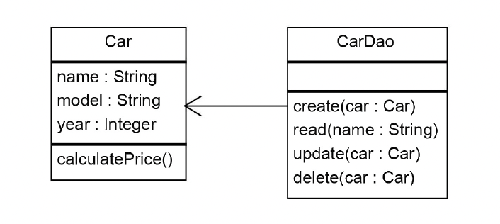

=== Open/closed principle

====
Modules, classes, and functions should be open for extension but closed for modifications.
====

Applying this principle will help us to develop complex and robust software.
We must imagine the software we develop is building a complex structure.
Once we finish a part of it, we should not modify it any more but build on top of it.

For this reason, best practice is to try to keep modules unchanged once finished and to add new functionality by extending them using inheritance and polymorphism.

=== Liskov Substitution Principle

Barbara Liskov states that, Derived types must be completely substitutable for their base types.
The Liskov Substitution Principle (LSP) is strongly related to subtyping polymorphism.
Based on subtyping polymorphism in an object-oriented language, a derived object can be substituted with its parent type.
For example, if we have a Car object, it can be used in the code as a Vehicle.

==== Example 1

In mathematics, a Square is a Rectangle.
Indeed, it is a specialization of a rectangle.
The "is a" makes you want to model this with inheritance.
However, if in code you made Square derive from Rectangle, then a Square should be usable anywhere you expect a Rectangle.
This makes for some strange behavior.

Imagine you had SetWidth and SetHeight methods on your Rectangle base class; this seems perfectly logical.
However, if your Rectangle reference pointed to a Square, then SetWidth and SetHeight doesn't make sense because setting one would change the other to match it.
In this case Square fails the Liskov Substitution Test with Rectangle and the abstraction of having Square inherit from Rectangle is a bad one.

==== Example 2

If you inherit CarWithoutDoors from the Car.
In this situation you can't provide methods openDoors(Key key) in the Car class.

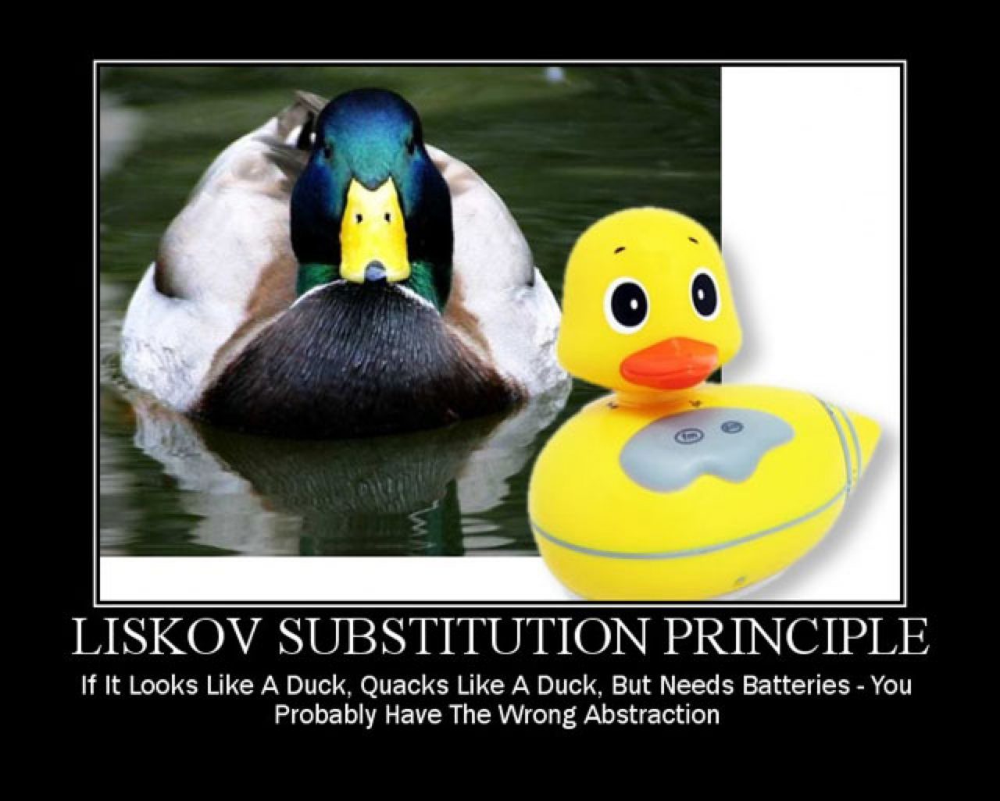

=== Interface Segregation Principle

====
Clients should not be forced to depend upon interfaces that they don't use
====

==== Example

The mechanic repairs cars, so we add a method of repair car.
In this case, the Mechanic class depends upon the I class.
However, the Car class exposes a richer sets of methods than the Mechanic class needs:

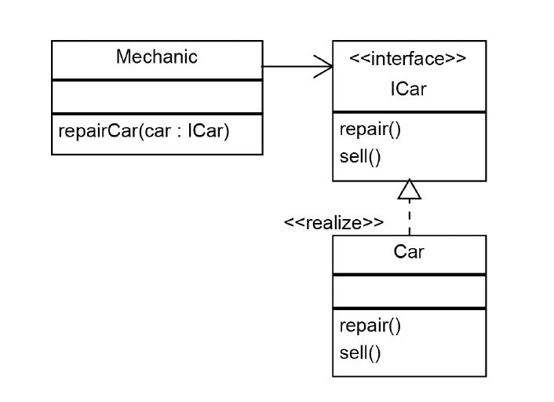

This is a bad design because if we want to replace a car with another one, we need to make changes in the Mechanic class, which violates the open/closed principle.
Instead, we must create an interface that exposes only the relevant methods required in the Mechanic class, as shown in the following diagram:

image::images/image-2024-05-29-23-17-33-976.png[width=500]

=== Dependency Inversion Principle

====
High-level modules should not depend on low-level modules.
Both should depend on abstractions.
Abstractions should not depend on details.
Details should depend on abstractions.
====

There are different approaches to decoupling the components of a system.
One of them is to separate the high-level logic from the low-level modules, as shown in the following diagram.
When doing this, we should try to reduce the dependency between the two by making them depend on abstractions.
This way, any of them can be replaced or extended without affecting other modules:

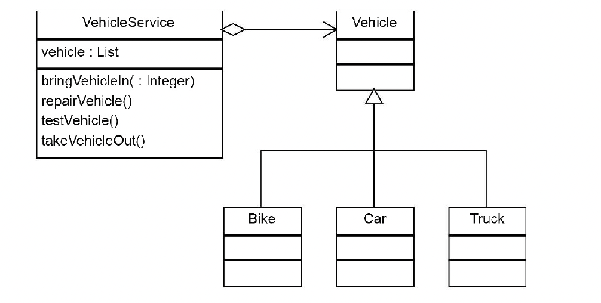

== Creational patterns

=== Singleton

Is used to ensure that only a single instance of an object can be created.
In addition to that, it also provides global access to that instance.

image::images/image-2024-05-29-23-26-25-608.png[width=500]

==== Simple implementation

[source,java]
----
public class Singleton {
    private static Singleton instance;
    private Singleton() { }

    public static Singleton getInstance() {
        if (instance == null)
            instance = new Singleton();
        return instance;
    }

    public void doSomething() { }
}
----

==== Synchronized singletons

If we use our code in a multithreading application, it may be the case that two threads invoke the getInstance method at the same time when the instance is null.

This can be done in the following two ways:

[source,java]
----
public static synchronized Singleton getInstance()
----

[source,java]
----
synchronized (SingletonSync2.class) {
    if (instance == null)
        instance = new SingletonSync2();
}
----

==== Synchronized singleton with doublechecked locking mechanism

The previous implementation is thread-safe but it introduces an unnecessary delay: the block that checks whether the instance has already been created is synchronized.
This means that the block can be executed by only one thread at a time, but locking makes sense only when the instance has not been created.
When the singleton instance has already been created, each thread can get the current instance in an unsynchronized manner.

[source,java]
----
if (instance == null) {
    synchronized (SingletonSync2.class) {
        if (instance == null)
            instance = new SingletonSync2();
    }
}
----

==== Lock-free thread-safe singleton

One of the best implementations of the singleton pattern in Java relies on the fact that a class is loaded a single time.
By instantiating the static member directly when declared, we make sure that we have a single instance of the class.

[source,java]
----
public class LockFreeSingleton {
    private static final LockFreeSingleton instance = new LockFreeSingleton();
    private LockFreeSingleton() {}

    public static LockFreeSingleton getInstance() {
        return instance;
    }

    public void doSomething() {}
}
----

The lock-free thread-safe singleton presented in the previous example is considered an *early-loading* singleton in the first version of Java.
However, in the latest version of Java, classes are loaded when they are needed, so that version is also a *lazy-loading* version.

==== Lock-free thread-safe singleton (Using enum)

[source,java]
----
public enum Elvis {
    INSTANCE;
    public void doSomething() { }
}
----

=== Simple factory pattern

The factory pattern is used to encapsulate the logic to instantiate objects referred through a common interface.
New classes can be added with minimal changes.

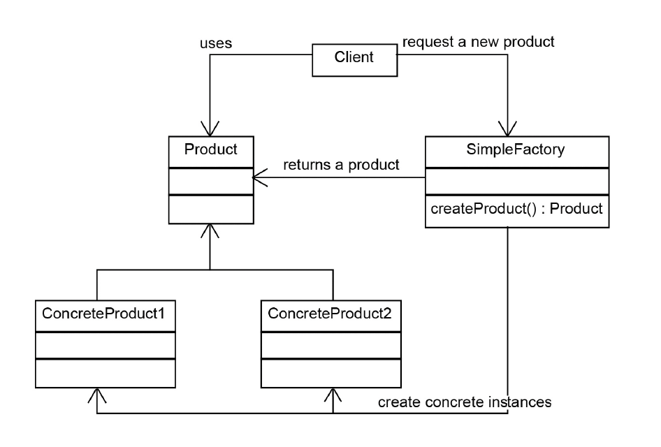

==== Static factory

[source,java]
----
public class VehicleFactory {
    public enum VehicleType {
        Bike,Car,Truck
    }

    public static Vehicle create(VehicleType type) {
        if (type.equals(VehicleType.Bike))
            return new Bike();
        if (type.equals(VehicleType.Car))
            return new Car();
        if (type.equals(VehicleType.Truck))
            return new Truck();
        else return null;
    }
}
----

=== Factory Method

The factory method pattern is an improvement upon the static factory.
The factory class is made abstract and the code to instantiate specific products is moved to subclasses that implement an abstract method.

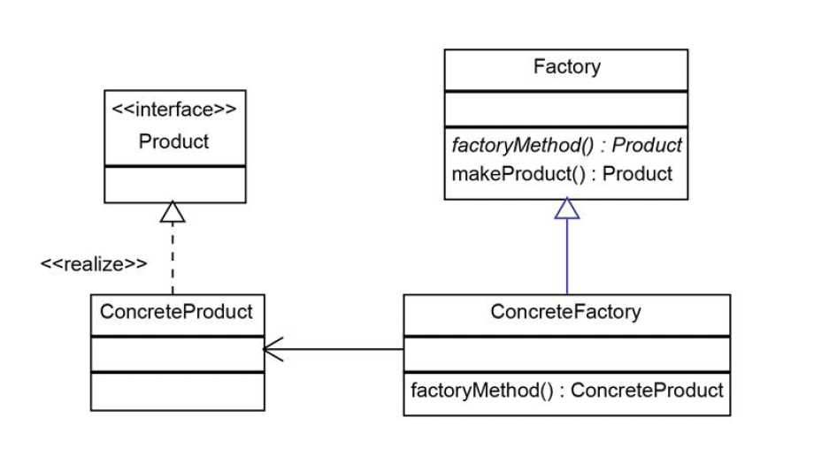

[source,java]
----
public abstract class VehicleFactory {
    protected abstract Vehicle createVehicle(String item);
    public Vehicle orderVehicle(String size, String color) { }
}

public class CarFactory extends VehicleFactory {
    @Override
    protected Vehicle createVehicle(String size) { }
}

public class TruckFactory extends VehicleFactory {
    @Override
    protected Vehicle createVehicle(String size) { }
}

// usage
VehicleFactory carFactory = new CarFactory();
carFactory.orderVehicle("large", "blue");

VehicleFactory truckFactory = new TruckFactory();
truckFactory.orderVehicle("large", "blue");
----

Anonymous concrete factory

[source,java]
----
VehicleFactory bikeFactory = new VehicleFactory() {
    @Override
    protected Vehicle createVehicle(String size) { }
};
bikeFactory.orderVehicle("large", "blue");
----

=== Abstract Factory

The abstract factory is an extended version of the factory method.
Instead of creating a single type of object, it is used to create a family of related objects.
If the factory method had one AbstractProduct, the abstract factory has several AbstractProduct classes.

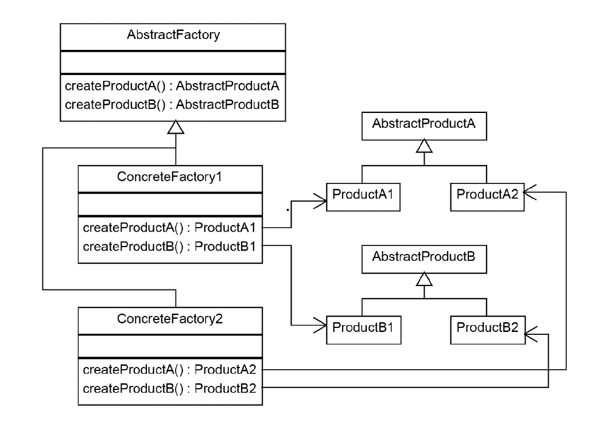

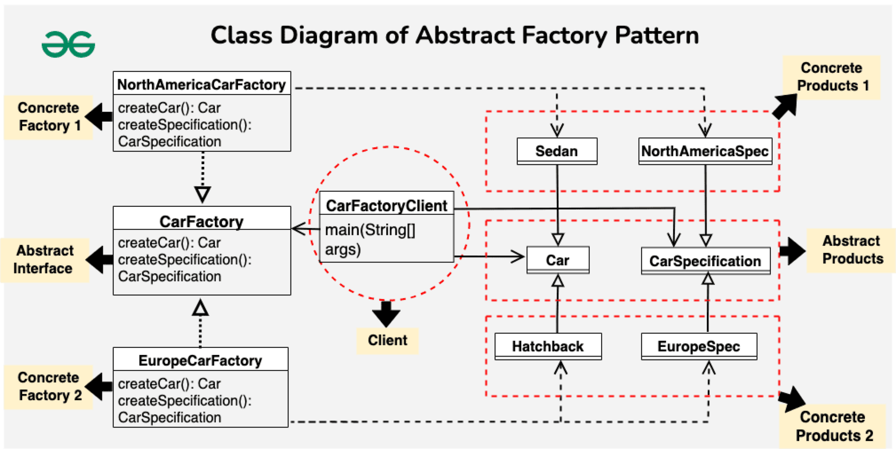

If more information required https://www.geeksforgeeks.org/abstract-factory-pattern/

=== Builder

Creating builder classes to encapsulate the logic to instantiate complex objects is consistent with the single responsibility principle and with the open/closed principle.
The logic to instantiate a complex object is moved to a separate Builder class.
When we need objects with different structures, we can add new builder classes, so the code is closed for modification and open for extension

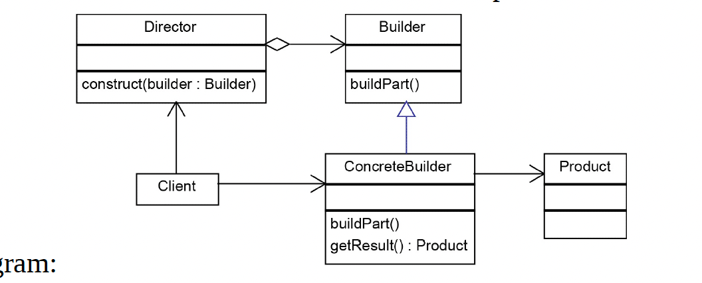

Example:

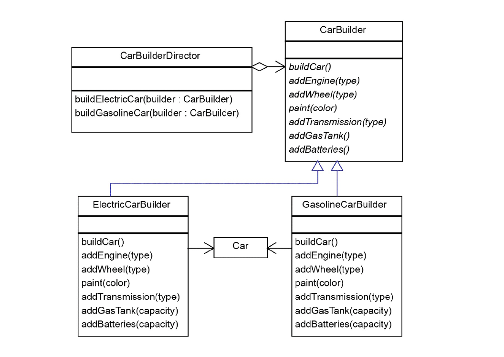

==== Simplified builder pattern

In some implementations of the builder pattern, the Director class can be removed.
In our class example, the logic it encapsulates is quite simple, so in that case we don't really need a director.

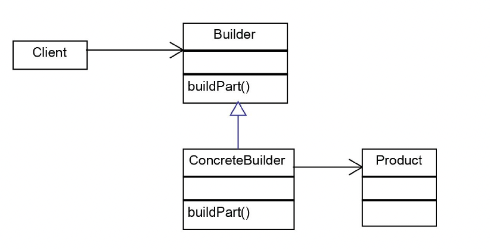

==== Anonymous builders with method chaining

[source,java]
----
builder.setColor("Blue")
    .setEngine("1500cc")
    .addTank("50")
    .addTransmission("auto")
    .build();
----

=== Prototype

It is just a method to clone objects.

There are several situations in which it is required to clone objects that are already instantiated:

* When the creation of a new object relies on an external resource or a hardware-intensive operation
* When we need a copy of the same object with the same state without having to redo all of the operations to get to that state
* When we need an instance of an object without knowing to which concrete class it belongs

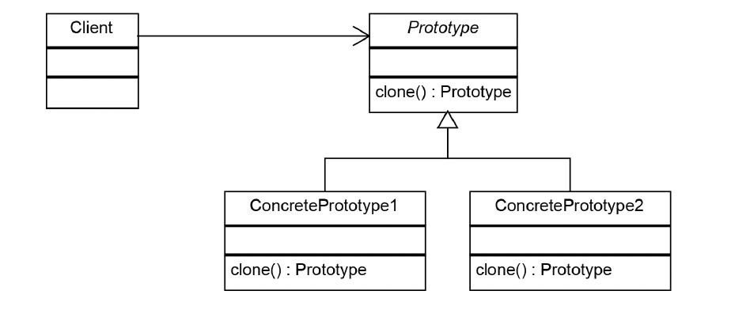

==== Shallow clone versus deep clone

When cloning objects, we should be aware of the deepness of cloning.
When we clone an object that contains simple datatypes, such as int and float, or immutable objects, such as strings, we should simply copy those fields to the new object, and that's it.

A problem arises when our objects contain references to other objects.
For example, if we have to implement a clone method for a Car class that has an engine and a list of four wheels, we should create not only a new Car object but also a new Engine and four new Wheel objects.
After all, two cars cannot share the same engine and the same wheels.
This is called a *deep clone*.

In practice, we should decide whether we need *deep*, *shallow*, or *mixed* cloning based on each scenario.

=== Object pool pattern

The instantiation of objects is one of the most costly operations in terms of performance.
While in the past this could have been an issue, nowadays we shouldn't be concerned about it.
However, when we deal with objects that encapsulate external resources, such as database connections, the creation of new objects becomes expensive.

The solution is to implement a mechanism that reuses and shares objects that are expensive to create.

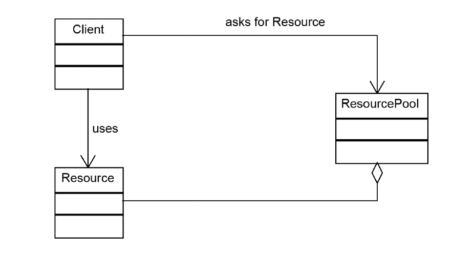

[source,java]
----
public Resource acquireResource() {
    if (available.size() <= 0) {
        Resource resource = new Resource();
        inuse.add(resource);
        return resource;
    } else {
        return available.remove(0);
    }
}

public void releaseResource(Resource resource) {
    available.add(resource);
}
----

== Behavioral patterns

Behavioral patterns are patterns that focus on object interaction, communication, and control flows.
Most behavioral patterns are based on composition and delegation rather than inheritance.

=== The chain-of-responsibility pattern

The chain-of-responsibility pattern chains the handlers in such a way that they will be able to process the request or pass it on if they are not able to do it.

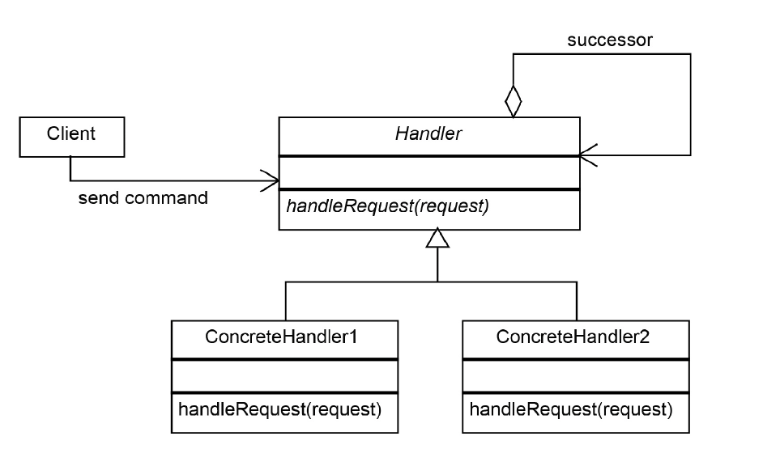

[source,java]
----
protected Handler successor;
public void setSuccessor(Handler successor) {
    this.successor = successor;
}

public void handleRequest(Request request) {
    if (canHandle(request)) {
        //code to handle the request
    } else {
        successor.handleRequest();
    }
}
----

Car service application example

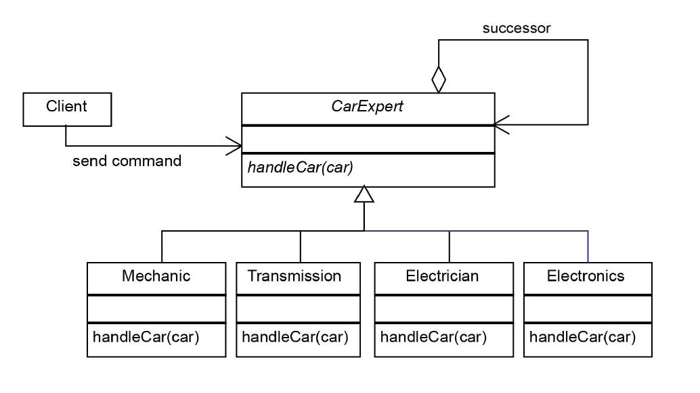

*Applicability and examples*

* *Event handlers:* For example, most GUI frameworks use the chain-ofresponsibility pattern to handle events.
Let's say, for example, a window contains a panel that contains some buttons.
We have to write the event handler of the button.
If we decide to skip it and pass it on, the next one in the chain will be able to handle the request: the panel.
If the panel skips it, it will go to the window.
* *Log handlers:* Similar to the event handlers, each log handler will log a specific request based on its status, or it will pass it on to the next handler.
* *Servlets:* In Java, javax.servlet.Filter (http://docs.oracle.com/javaee/7/api/javax/s
ervlet/Filter.html) is used to filter requests or responses.
The doFilter method also receives the filter chain as a parameter, and it can pass the request on.

=== The command pattern

*The command pattern does the following:*

* Provides a unified way to encapsulate a command along with the required parameters to execute an action
* Allows the handling of commands, such as storing them in queues

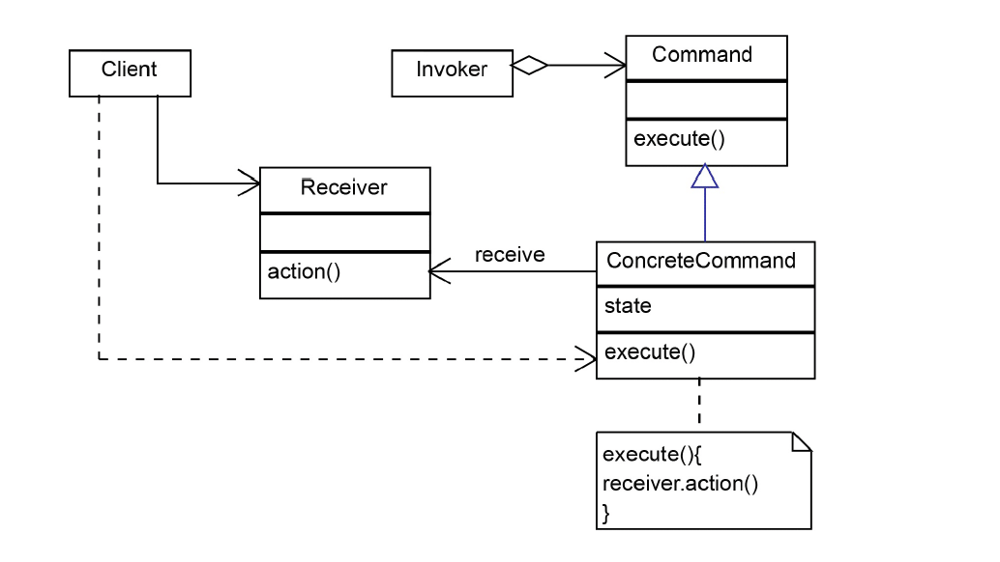

*Before the command pattern implementation*

[source,java]
----
public void performAction(ActionEvent e) {
    Object obj = e.getSource();

    if (obj == fileNewMenuItem)
        doFileNewAction();
    else if (obj == fileOpenMenuItem)
        doFileOpenAction();
    else if (obj == fileOpenRecentMenuItem)
        doFileOpenRecentAction();
    else if (obj == fileSaveMenuItem)
        doFileSaveAction();
}
----

*After the command pattern implementation*

[source,java]
----
public interface Command {
    public void execute();
}

public class OpenMenuItem extends JMenuItem implements Command {
    public void execute() { }
}

public void performAction(ActionEvent e) {
    Command command = (Command)e.getSource();
    command.execute();
}
----

*Example:*

[source,java]
----
class RunnableThread implements Runnable {
    public void run() {
        // the command implementation code
    }
}

public class ClientThread {
    public static void main(String a[]) {
        RunnableThread mrt = new RunnableThread();
        Thread t = new Thread(mrt);
        t.start();
    }
}
----

=== The iterator pattern

The iterator pattern provides a way to traverse the elements of an aggregate object sequentially without exposing its internal representation.

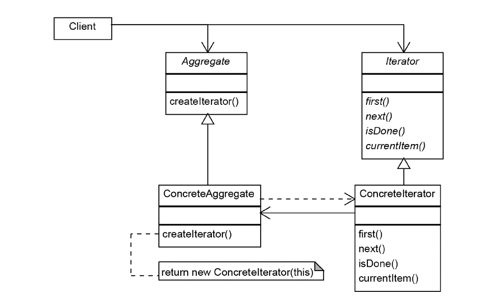

Iterators are popular in most programming languages these days.

It is probably most widely used in Java, along with the collections package.

It is also implemented at the language level when a collection is traversed with the following loop construction: for (String item : strCollection)

=== The observer pattern

The observer pattern makes the state changes of one object observable to other objects that are registered to be informed.

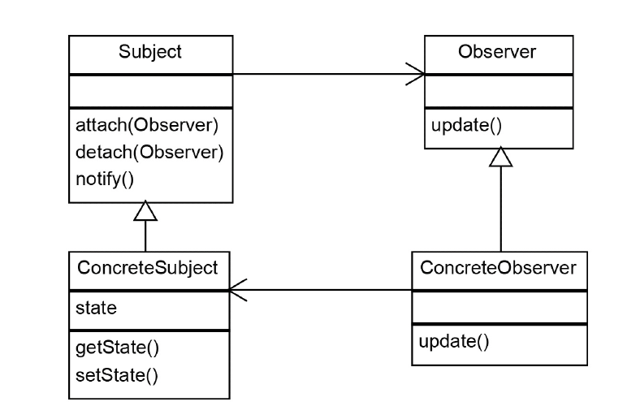

* Observer objects are objects that want to be notified whenever Observable objects change.
* Observable objects are objects that can be watched by Observers

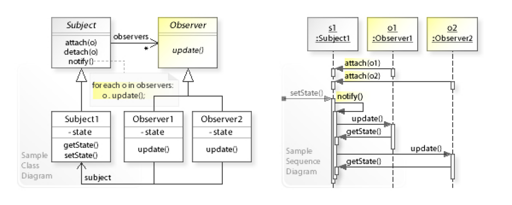

=== The mediator pattern

The mediator pattern defines an object that encapsulates how a set of objects interacts, reducing their dependency on one another.

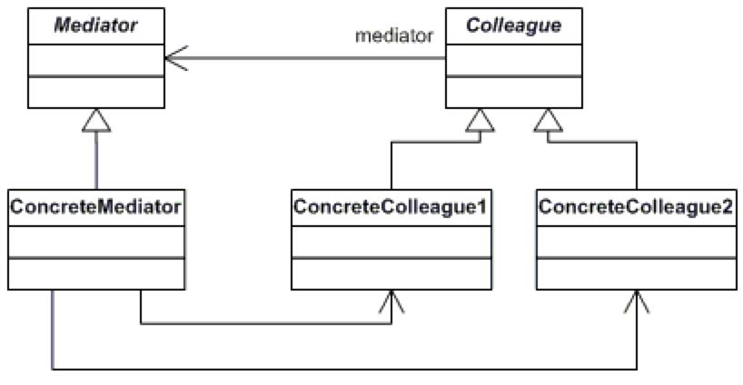

=== The memento pattern

The memento pattern is used to save the internal state of an object without breaking its encapsulation, and to restore its state at a later stage.

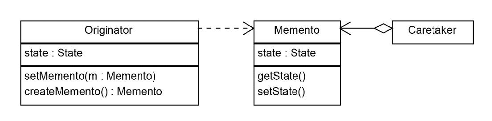

The memento pattern is used whenever rollback operations need to be implemented.
It can be used in all kinds of atomic transactions in which the object must be reverted to the initial state if one of the actions fails.

=== The state pattern

A finite state machine is an important concept in computer science.
It has a strong mathematical base and it represents an abstract machine that can be in a finite number of states.
Finite state machines are used in all fields of computer science.

The state pattern is just an implementation of a finite state machine in object-oriented design.

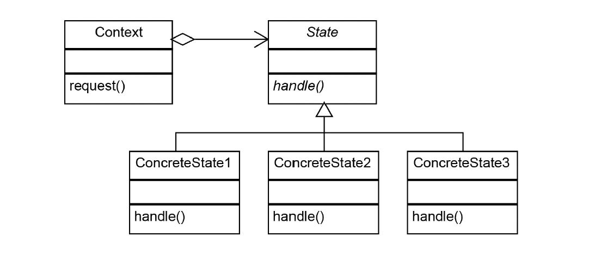

=== The strategy pattern

A particular situation specific to behavioral patterns is when we need to change the way to solve a problem with another one.
As we already learned in the first chapter, changing is bad, while extending is good.
So, instead of replacing a portion of code with another one, we can encapsulate it in a class.
Then we can create an abstraction of that class on which our code depends.
From that point, our code becomes very flexible, as we can now use any class that implements the abstraction we just created.

The strategy pattern defines a family of algorithms, encapsulating each one, and makes them interchangeable.

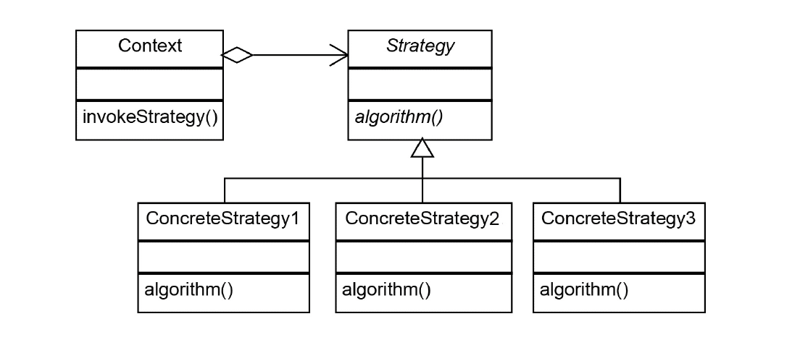

=== The template method pattern

The idea of using the template method pattern is to avoid writing duplicate code so that developers can focus on core logic.

The template method pattern is best implemented using an abstract class.
The areas for which we know about the implementation will be provided; the default implementation and the areas that are to be kept open for implementation are marked abstract.

For example, think of a database fetch query at a very high level.
We need to execute the following steps:

1. Create a connection
2. Create a query
3. Execute the query
4. Parse and return the data
5. Close the connection We can see that creating and closing the connection part will always remain the same.

So, we can add this as part of the template implementation.
The remaining methods can be implemented independently for different needs.

=== The null object pattern

In the following diagram, we can see that we simply create a NullClass, which can replace the real class in our program.
As mentioned before, this is just a particular case of the strategy pattern in which we choose the strategy of doing nothing.

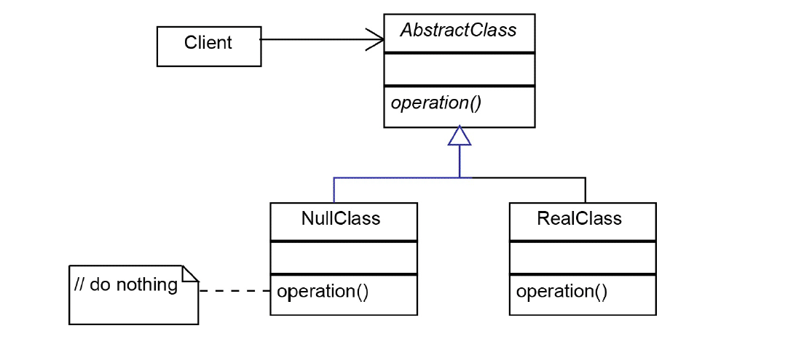

=== The visitor pattern

The visitor pattern separates an operation from the object structure on which it operates, allowing the addition of new operations without changing the structure classes.

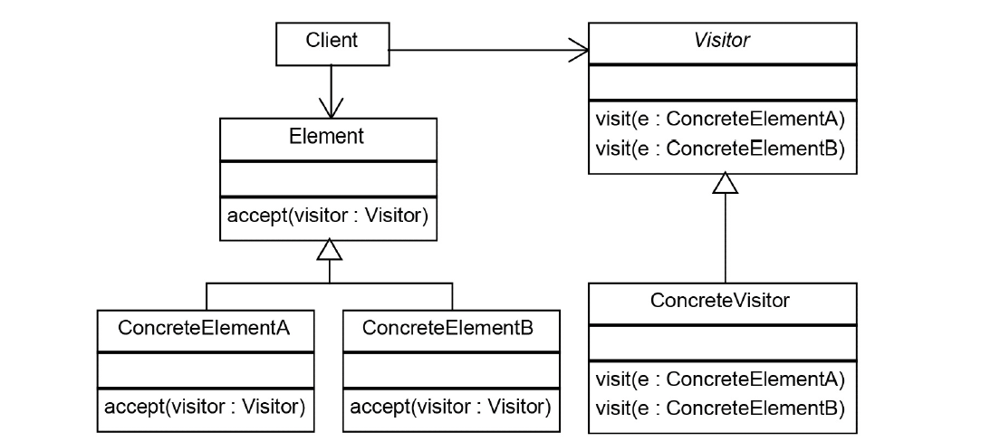

image::images/image-2024-06-01-16-01-35-588.png[width=500]

== Structural Patterns

Structural patterns are patterns that focus on creating complex structures by making use of relations between objects and classes.
Most structural patterns are based on inheritance.

=== The adapter pattern

The adapter pattern provides a solution for code reusability; it adapts/wraps existing old code to new interfaces, interfaces that were unknown at the design time of the original code.

The intent is to adopt an existing old interface to a new client interface.
The goal is to reuse as much as possible the old and already tested code, while being free to make changes to the new interface.

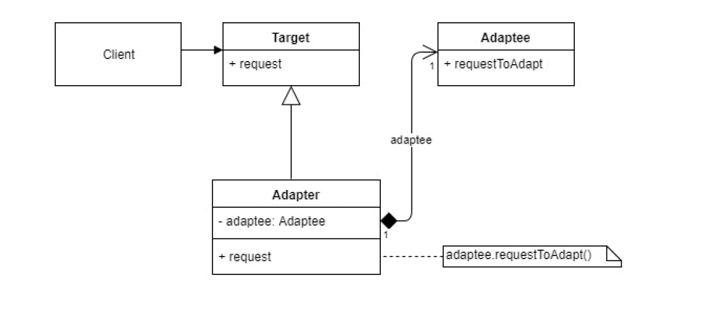

=== The proxy pattern

Whenever you work with Enterprise or Spring beans, mocked instances, and implement AOP, make RMI or JNI calls to another object with the same interface, or directly/indirectly use java.lang.reflect.Proxy, there is a proxy object involved.
Its purpose is to provide a surrogate for a real object, with exactly the same footprint.
It delegates the work to it while doing something else before or after the call.

The intent is to provide a surrogate for a real object in order to better control it.
It is a handle to a real object that behaves like it, thus making the client code to use it just as it would use the real object.

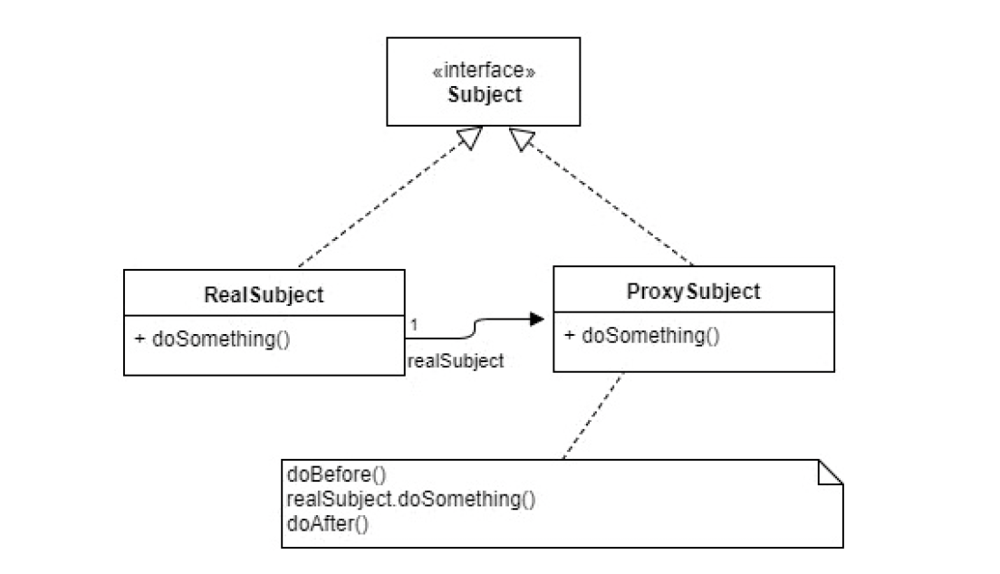

=== The decorator pattern

There are times when we need to add or remove functionality to/from existing code, without affecting it, and when it is not practical to make a subclass.
The decorator comes in handy in these cases because it allows doing so without changing the existing code.
It does this by implementing the same interface, aggregating the object that it is going to decorate, delegating all the common interface calls to it, and implementing in the child classes the new functionality.

The intent is to dynamically extend the existing object's functionality without changing its code.
It conforms to the original interface and is able to extend the functionally by using composition, rather than subclassing.

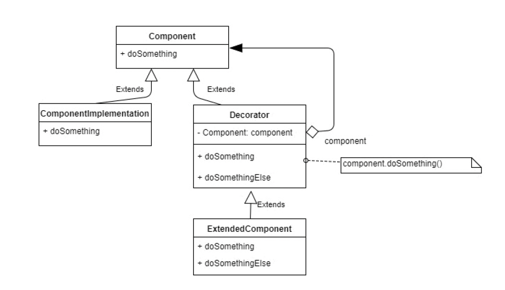

=== The bridge pattern

The intent is to decouple the abstraction from the implementation to allow them to vary independently.
It does this by using inheritance, both in the public interface and in the implementation.

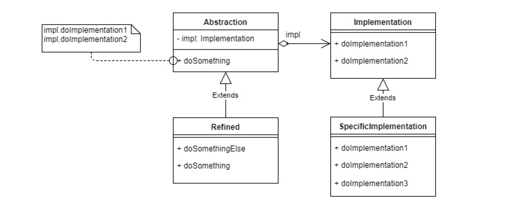

=== The composite pattern

Composite is a structural design pattern that lets you compose objects into tree structures and then work with these structures as if they were individual objects.

OR

The intent is to enable the modeling of objects into a tree or graph-like structures and treat them in the same manner.
The client code does not need to know whether a node is an individual object (leaf node) or a composition of objects (a node with children, such as the root node); the client code can make an abstraction of these details and treat them uniformly.

Using the Composite pattern makes sense only when the core model of your app can be represented as a tree.

For example, imagine that you have two types of objects: Products and Boxes.
A Box can contain several Products as well as a number of smaller Boxes.
These little Boxes can also hold some Products or even smaller Boxes, and so on.

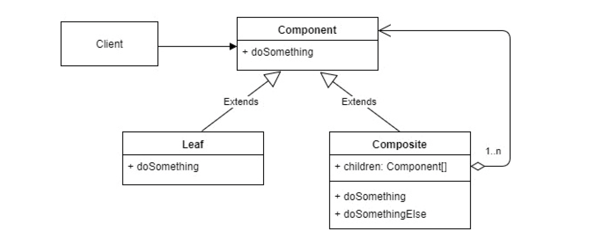

=== The façade pattern

The intent is to provide a single unified interface for a complex subsystem.
This simplifies the usage of big and complex systems by providing the interface for the most important use cases.

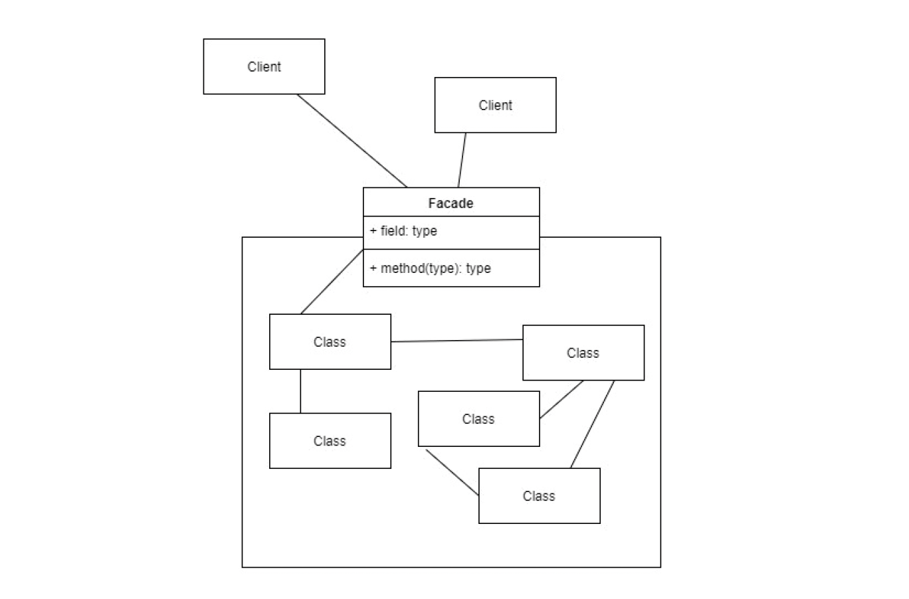

=== The flyweight pattern

Lets you fit more objects into the available amount of RAM by sharing common parts of state between multiple objects instead of keeping all of the data in each object.

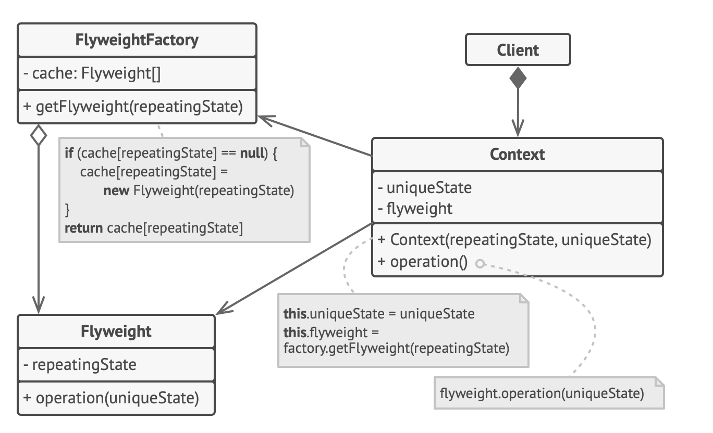

==== Example

* Computer games, bullets and appearance
* Java String class
* java.lang.Integer#valueOf(int)

==== Usage

*Flyweight factory*

For more convenient access to various flyweights, you can create a factory method that manages a pool of existing flyweight objects.
The method accepts the intrinsic state of the desired flyweight from a client, looks for an existing flyweight object matching this state, and returns it if it was found.
If not, it creates a new flyweight and adds it to the pool.
