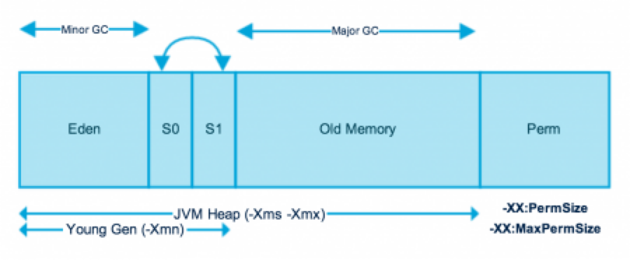
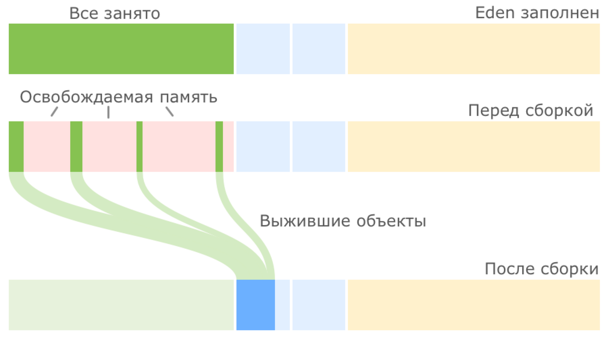
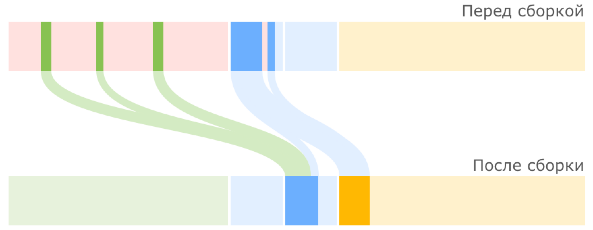
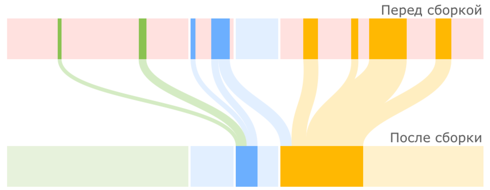
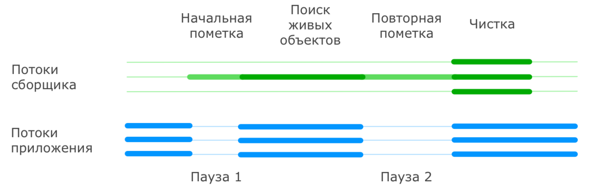
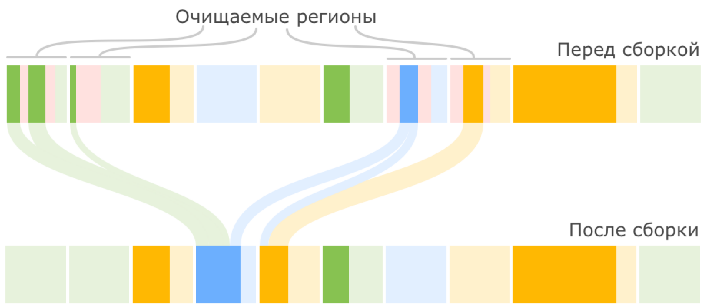

= Java Memory Management Garbage Collection
:sectnums:
:toc: left
:toclevels: 5
:icons: font
:source-highlighter: coderay

== Heap Inside

JVM memory is divided into separate parts.
At broad level, JVM Heap memory is physically divided into two parts - *Young Generation* and *Old Generation*.

=== Young Generation

The young generation is the place where all the new objects are created.
When the young generation is filled, garbage collection is performed.
This garbage collection is called *Minor GC*.

Young Generation is divided into three parts - *Eden Memory* and two *Survivor Memory* spaces.

* Most of the newly created objects are located in the Eden memory space.
* When Eden space is filled with objects, Minor GC is performed and all the survivor objects are moved to one of the survivor spaces.
* Minor GC also checks the survivor objects and move them to the other survivor space.
So at a time, one of the survivor space is always empty.
* Objects that are survived after many cycles of GC, are moved to the Old generation memory space.
Usually, it’s done by setting a threshold for the age of the young generation objects before they become eligible to promote to Old generation.

=== Old Generation

Old Generation memory contains the objects that are long-lived and survived after many rounds of Minor GC.
Usually, garbage collection is performed in Old Generation memory when it’s full.
Old Generation Garbage Collection is called *Major GC* and usually takes a longer time.

*Major GC can involve young and old generation*
TODO: check it

=== Stop the World Event

All the Garbage Collections are “Stop the World” events because all application threads are stopped until the operation completes.
Since Young generation keeps short-lived objects, Minor GC is very fast and the application doesn’t get affected by this.
However, Major GC takes a long time because it checks all the live objects.

=== Permanent Generation (Metaspace)

Permanent Generation or “Perm Gen” contains the application metadata required by the JVM to describe the classes and methods used in the application.
Note that Perm Gen is not part of Java Heap memory.
Perm Gen is populated by JVM at runtime based on the classes used by the application.
Perm Gen also contains Java SE library classes and methods.
Perm Gen objects are garbage collected in a full garbage collection.

*For java 8 it is Metaspace*

Metaspace is autoextending TODO:

=== References

WeakReference SoftReference TODO:

== Memory Management

=== Java Heap Memory Switches

* **-Xms**    For setting the initial heap size when JVM starts
* **-Xmx**    For setting the maximum heap size.
* **-Xmn**    For setting the size of the Young Generation, rest of the space goes for Old Generation.
* **-XX:PermGen**    For setting the initial size of the Permanent Generation memory
* **-XX:MaxPermGen**    For setting the maximum size of Perm Gen
* **-XX:SurvivorRatio**    For providing ratio of Eden space and Survivor Space, for example if Young Generation size is 10m and VM switch is -XX:SurvivorRatio=2 then 5m will be reserved for Eden Space and 2.5m each for both the Survivor spaces.
The default value is 8.
* **-XX:NewRatio**    For providing ratio of old/new generation sizes.
The default value is 2.

=== Java Garbage Collection

Garbage Collector is the program running in the background that looks into all the objects in the memory and find out objects that are not referenced by any part of the program.
All these unreferenced objects are deleted and space is reclaimed for allocation to other objects.
One of the basic ways of garbage collection involves three steps:

* **Marking:** This is the first step where garbage collector identifies which objects are in use and which ones are not in use.
* **Normal Deletion:** Garbage Collector removes the unused objects and reclaim the free space to be allocated to other objects.
* **Deletion with Compacting:** For better performance, after deleting unused objects, all the survived objects can be moved to be together.
This will increase the performance of allocation of memory to newer objects.

There are two problems with a simple mark and delete approach.

* First one is that it’s not efficient because most of the newly created objects will become unused
* Secondly objects that are in-use for multiple garbage collection cycle are most likely to be in-use for future cycles too.

=== Java Garbage Collection Types

There are five types of garbage collectors that we can use in our applications.
We just need to use the JVM switch to enable the garbage collection strategy for the application.

** *Serial GC (-XX:+UseSerialGC):*
Serial GC uses the simple mark-sweep-compact approach for young and old generations garbage collection i.e Minor and Major GC.
Serial GC is useful in client machines such as our simple stand-alone applications and machines with smaller CPU.
It is good for small applications with low memory footprint.
** *Parallel GC (-XX:+UseParallelGC):*
Parallel GC is same as Serial GC except that is spawns N threads for young generation garbage collection where N is the number of CPU cores in the system.
We can control the number of threads using -XX:ParallelGCThreads=n JVM option.
Parallel Garbage Collector is also called throughput collector because it uses multiple CPUs to speed up the GC performance.
Parallel GC uses a single thread for Old Generation garbage collection.
** *Concurrent Mark Sweep (CMS) Collector (-XX:+UseConcMarkSweepGC):*
CMS Collector is also referred as concurrent low pause collector.
It does the garbage collection for the Old generation.
CMS collector tries to minimize the pauses due to garbage collection by doing most of the garbage collection work concurrently with the application threads.
CMS collector on the young generation uses the same algorithm as that of the parallel collector.
This garbage collector is suitable for responsive applications where we can’t afford longer pause times.
We can limit the number of threads in CMS collector using -XX:ParallelCMSThreads=n JVM option.
** *G1 Garbage Collector (-XX:+UseG1GC):*
The Garbage First or G1 garbage collector is available from Java 7 and its long term goal is to replace the CMS collector.
The G1 collector is a parallel, concurrent, and incrementally compacting low-pause garbage collector.
Garbage First Collector doesn’t work like other collectors and there is no concept of Young and Old generation space.
It divides the heap space into multiple equal-sized heap regions.
When a garbage collection is invoked, it first collects the region with lesser live data, hence “Garbage First”.
You can find more details about it at Garbage-First Collector Oracle Documentation.
** *Epsilon GC:*
The Garbage is not needed.
** *ZGC:*
** *Shenandoah GC:*

==== Serial GC

Serial GC (он же последовательный сборщик) — младший с точки зрения заложенной в него функциональности, но старший с точки зрения продолжительности присутствия в JVM сборщик мусора.

Куча разбивается на четыре региона, три из которых относятся к младшему поколению (Eden, Survivor 0 и Survivor 1), а один (Tenured) — к старшему

Среднестатистический объект начинает свою жизнь в регионе Eden (переводится как Эдем, что вполне логично).
Именно сюда его помещает JVM в момент создания.
Но со временем может оказаться так, что места для вновь создаваемого объекта в Eden нет, в таких случаях запускается малая сборка мусора.

Первым делом такая сборка находит и удаляет мертвые объекты из Eden.
Оставшиеся живые объекты переносятся в пустой регион Survivor.
Один из двух регионов Survivor всегда пустой, именно он выбирается для переноса объектов из Eden:

Мы видим, что после малой сборки регион Eden полностью опорожнен и может быть использован для размещения новых объектов.
Но рано или поздно наше приложение опять займет всю область Eden и JVM снова попытается провести малую сборку, на этот раз очищая Eden и частично занятый Survivor 0, после чего перенося все выжившие объекты в пустой регион Survivor 1:

В следующий раз в качестве региона назначения опять будет выбран Survivor 0. Пока места в регионах Survivor достаточно, все идет хорошо:

JVM постоянно следит за тем, как долго объекты перемещаются между Survivor 0 и Survivor 1, и выбирает подходящий порог для количества таких перемещений, после которого объекты перемещаются в Tenured, то есть переходят в старшее поколение.
Если регион Survivor оказывается заполненным, то объекты из него также отправляются в Tenured:

Из двух основных способов работы с выжившими объектами — уплотнение и копирование — в Sun при разработке малого сборщика мусора пошли по второму пути, так как он проще в реализации и зачастую оказывается производительнее.

В случае, когда места для новых объектов не хватает уже в Tenured, в дело вступает полная сборка мусора, работающая с объектами из обоих поколений.
При этом старшее поколение не делится на подрегионы по аналогии с младшим, а представляет собой один большой кусок памяти, поэтому после удаления мертвых объектов из Tenured производится не перенос данных (переносить уже некуда), а их уплотнение, то есть размещение последовательно, без фрагментации.
Такой механизм очистки называется Mark-Sweep-Compact по названию его шагов (пометить выжившие объекты, очистить память от мертвых объектов, уплотнить выжившие объекты).

*Акселераты* - объекты, размер которых настолько велик, что создавать их в Eden, а потом таскать за собой по Survivor’ам слишком накладно.
В этом случае они размещаются сразу в Tenured.

По мере заполнения кучи данными JVM может не только проводить чистку памяти, но и запрашивать у ОС выделение дополнительной памяти для расширения регионов.
Причем в случае, если реально используемый объем памяти падает ниже определенного порога, JVM может вернуть часть памяти операционной системе.
Для регулирования аппетита виртуальной машины существуют известные всем опции Xms и Xmx.

If it is not enough memory for application execution application will cause java.lang.OutOfMemoryError: Java heap space.

Технически, это происходит в случае, если работа сборщика начинает занимать не менее 98% времени и при этом сборки мусора освобождают не более 2% памяти.

*Ситуации STW*

В начале каждой сборки мусора работа основных потоков приложения останавливается и возобновляется только после окончания сборки.
Причем всю работу по очистке Serial GC выполняет не торопясь, в одном потоке, последовательно, за что и удостоился своего имени.

Основное достоинство данного сборщика очевидно — это непритязательность по части ресурсов компьютера.
Так как всю работу он выполняет последовательно в одном потоке, никаких заметных оверхедов и негативных побочных эффектов у него нет.

Главный недостаток тоже понятен — это долгие паузы на сборку мусора при заметных объемах данных.

Если вашему приложению не требуется большой размер кучи для работы (Oracle указывает условную границу 100 МБ), оно не очень чувствительно к коротким остановкам и ему для работы доступно только одно ядро процессора, то можно приглядеться к этому варианту.
В противном случае можно поискать вариант по-лучше.

==== Parallel GC

При подключении параллельного сборщика используются те же подходы к организации кучи, что и в случае с Serial GC.
Но есть два принципиальных отличия в работе с этими регионами: во-первых, сборкой мусора занимаются несколько потоков параллельно; во-вторых, данный сборщик может самостоятельно подстраиваться под требуемые параметры производительности.

Для определения количества потоков, которые будут использоваться при сборке мусора, на компьютере с N ядрами процессора, JVM по умолчанию применяет следующую формулу: если N ≤ 8, то количество потоков равно N, иначе для получения количества потоков N домножается на коэффициент, зависящий от других параметров, обычно это 5/8, но на некоторых платформах коэффициент может быть меньше.

* -XX:+UseParallelGC = Use parallel garbage collection for Young generation GC
* -XX:+UseParallelOldGC = Use parallel garbage collection for the full collections.
Enabling this option automatically sets -XX:+UseParallelGC.

*Ситуации STW*

Как и в случае с последовательным сборщиком, на время операций по очистке памяти все основные потоки приложения останавливаются.
Разница только в том, что пауза, как правило, короче за счет выполнения части работ в параллельном режиме.

==== CMS GC

Сборщик CMS (расшифровывается как Concurrent Mark Sweep) появился в HotSpot VM в одно время с Parallel GC в качестве его альтернативы.

Заложенные в него идеи перекочевали в более современный G1 GC

При этом CMS GC использует ту же самую организацию памяти, что и уже рассмотренные Serial / Parallel GC: регионы Eden + Survivor 0 + Survivor 1 + Tenured и такие же принципы малой сборки мусора.
Отличия начинаются только тогда, когда дело доходит до полной сборки.
В случае CMS ее называют старшей (major) сборкой, а не полной, так как она не затрагивает объекты младшего поколения.
В результате, малая и старшая сборки здесь всегда разделены.

Важным отличием сборщика CMS от рассмотренных ранее является также то, что он не дожидается заполнения Tenured для того, чтобы начать старшую сборку.
Вместо этого он трудится в фоновом режиме постоянно, пытаясь поддерживать Tenured в компактном состоянии.

Давайте рассмотрим, что из себя представляет старшая сборка мусора при использовании CMS GC.

Начинается она с остановки основных потоков приложения и пометки всех объектов, напрямую доступных из корней.
После этого приложение возобновляет свою работу, а сборщик параллельно с ним производит поиск всех живых объектов, доступных по ссылкам из тех самых помеченных корневых объектов (эту часть он делает в одном или в нескольких потоках).

Естественно, за время такого поиска ситуация в куче может поменяться, и не вся информация, собранная во время поиска живых объектов, оказывается актуальной.
Поэтому сборщик еще раз приостанавливает работу приложения и просматривает кучу для поиска живых объектов, ускользнувших от него за время первого прохода.
При этом допускается, что в живые будут записаны объекты, которые на время окончания составления списка таковыми уже не являются.
Эти объекты называются плавающим мусором (floating garbage), они будут удалены в процессе следующей сборки.

После того как живые объекты помечены, работа основных потоков приложения возобновляется, а сборщик производит очистку памяти от мертвых объектов в нескольких параллельных потоках.
При этом следует иметь в виду, что *после очистки не производится упаковка объектов в старшем поколении*, так как делать это при работающем приложении весьма затруднительно.

*Ситуации STW*

Из всего сказанного выше следует, что при обычной сборке мусора у CMS GC существуют следующие ситуации, приводящие к STW:

* Малая сборка мусора.
Эта пауза ничем не отличается от аналогичной паузы в Parallel GC.
* Начальная фаза поиска живых объектов при старшей сборке (так называемая initial mark pause).
Эта пауза обычно очень короткая.
* Фаза дополнения набора живых объектов при старшей сборке (известная также как remark pause).
Она обычно длиннее начальной фазы поиска.

==== G1 GC

Не является явным продолжением линейки Serial / Parallel / CMS, а использует уже существенно отличающийся подход к задаче очистки памяти.

Первое, что бросается в глаза при рассмотрении G1 — это изменение подхода к организации кучи.
Здесь память разбивается на множество регионов одинакового размера.
Размер этих регионов зависит от общего размера кучи и по умолчанию выбирается так, чтобы их было не больше 2048, обычно получается от 1 до 32 МБ. Исключение составляют только так называемые громадные (humongous) регионы, которые создаются объединением обычных регионов для размещения очень больших объектов.

Разделение регионов на Eden, Survivor и Tenured в данном случае логическое, регионы одного поколения не обязаны идти подряд и даже могут менять свою принадлежность к тому или иному поколению.
Пример разделения кучи на регионы может выглядеть следующим образом (количество регионов сильно приуменьшено):

image::images/image-2024-05-24-22-57-44-961.png[width=500]

Малые сборки выполняются периодически для очистки младшего поколения и переноса объектов в регионы Survivor, либо их повышения до старшего поколения с переносом в Tenured.
Над переносом объектов трудятся несколько потоков, и на время этого процесса работа основного приложения останавливается.
Это уже знакомый нам подход из рассмотренных ранее сборщиков, но отличие состоит в том, что очистка выполняется не на всем поколении, а только на части регионов, которые сборщик сможет очистить не превышая желаемого времени.
При этом он выбирает для очистки те регионы, в которых, по его мнению, скопилось наибольшее количество мусора и очистка которых принесет наибольший результат.
Отсюда как раз название Garbage First — мусор в первую очередь.

А с полной сборкой (точнее, здесь она называется смешанной (mixed)) все немного хитроумнее, чем в рассмотренных ранее сборщиках.
В G1 существует процесс, называемый циклом пометки (marking cycle), который работает параллельно с основным приложением и составляет список живых объектов.
За исключением последнего пункта, этот процесс выглядит уже знакомо для нас:
* Initial mark.
Пометка корней (с остановкой основного приложения) с использованием информации, полученной из малых сборок.
* Concurrent marking.
Пометка всех живых объектов в куче в нескольких потоках, параллельно с работой основного приложения.
* Remark.
Дополнительный поиск не учтенных ранее живых объектов (с остановкой основного приложения).
* Cleanup.
Очистка вспомогательных структур учета ссылок на объекты и поиск пустых регионов, которые уже можно использовать для размещения новых объектов.
Первая часть этого шага выполняется при остановленном основном приложении.

Для получения списка живых объектов G1 использует алгоритм Snapshot-At-The-Beginning (SATB), то есть в список живых попадают все объекты, которые были таковыми на момент начала работы алгоритма, плюс все объекты, созданные за время его выполнения.
G1 допускает наличие плавающего мусора, с которым мы познакомились при рассмотрении сборщика CMS.

Смешанная сборка мусора в приведенном выше примере кучи может пройти вот так:

Может оказаться так, что в процессе очистки памяти в куче не остается свободных регионов, в которые можно было бы копировать выжившие объекты.
Это приводит к возникновению ситуации allocation (evacuation) failure, подобие которой мы видели в CMS.
В таком случае сборщик выполняет полную сборку мусора по всей куче при остановленных основных потоках приложения.

*Гиганты*

С точки зрения JVM любой объект размером больше половины региона считается громадным и обрабатывается специальным образом:
* Он никогда не перемещается между регионами.
* Он может удаляться в рамках цикла пометки или полной сборки мусора.
* В регион, занятый громадным объектом, больше никого не подселяют, даже если в нем остается свободное место.

Объекты большого размера, особенно короткоживущие, могут доставлять много неудобств всем типам сборщиков, так как не удаляются при малых сборках, а занимают драгоценное пространство в регионах старшего поколения (помните объекты-акселераты, обсуждавшиеся в предыдущей главе?).
Но G1 оказывается более уязвимым к их негативному влиянию в силу того, что для него даже объект в несколько мегабайт (а в некоторых случаях и 500 КБ) уже является громадным.

*Ситуации STW*

* Процессы переноса объектов между поколениями.
Для минимизации таких пауз G1 использует несколько потоков.
* Короткая фаза начальной пометки корней в рамках цикла пометки.
* Более длинная пауза в конце фазы remark и в начале фазы cleanup цикла пометки.

==== ZGC
