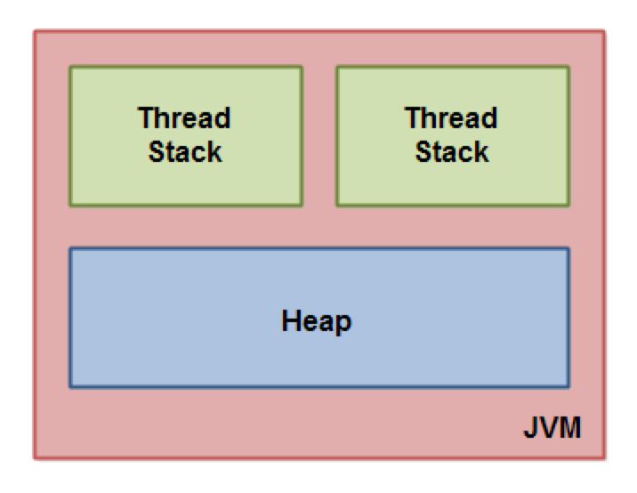
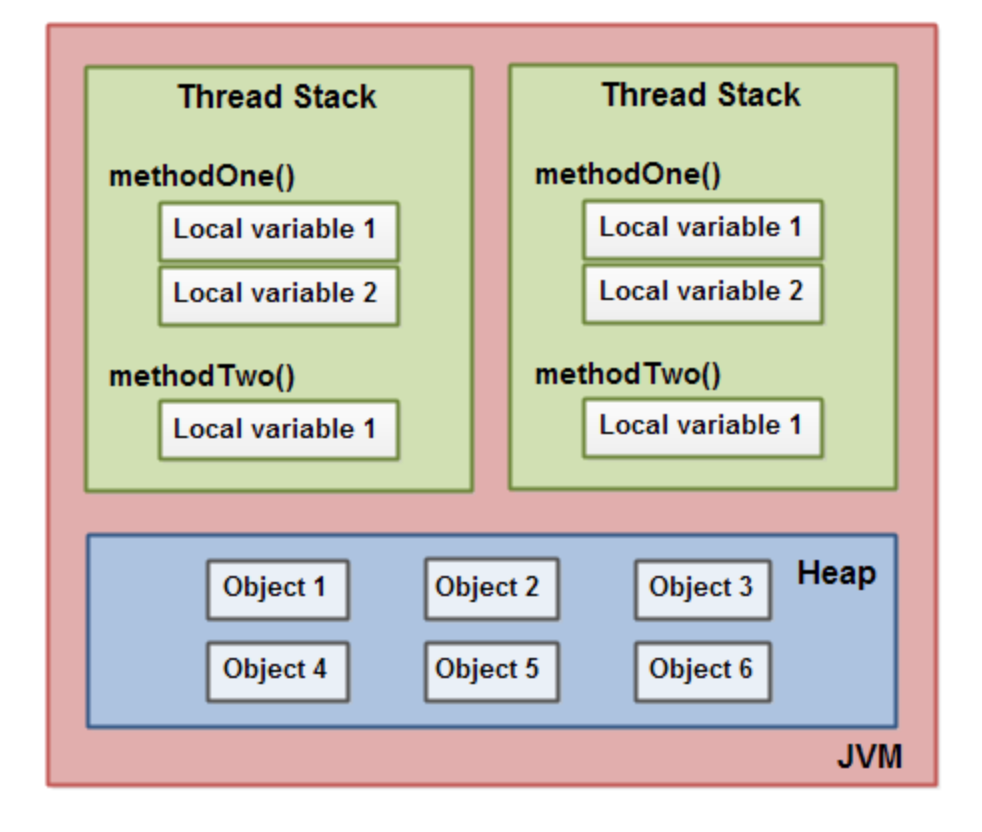
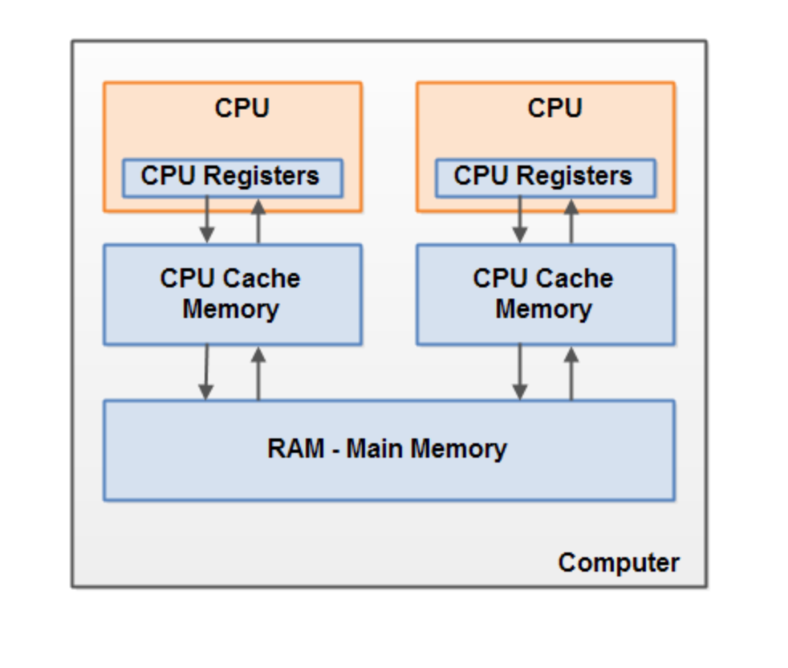
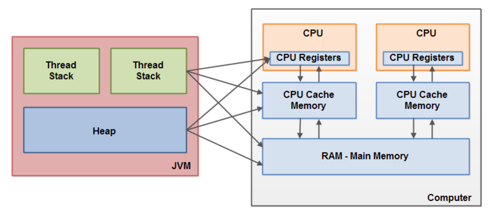

= Java Memory Model
:sectnums:
:toc: left
:toclevels: 5
:icons: font
:source-highlighter: coderay

== Introduction

The Java Memory Model (JMM) defines the allowable behavior of multithreaded programs.
It places execution-time constraints on the relationship between threads and main memory in order to achieve consistent and reliable Java applications.

Модель памяти делает легальными многие оптимизации компилятора, JVM и процессора, но в то же время закрепляет условия, при которых программа будет вести себя корректно в многопоточной среде даже в присутствие оптимизаций.

* Разрешает выполнение различных оптимизаций компилятора, JVM или процессора
* Строго закрепляет условия, при которых программа считается правильно синхронизированной, и закрепляет поведение правильно синхронизированных программ
* Описывает отношение между высокоуровневым кодом и памятью
* Является trade-off между строгостью исполнения кода и возможными оптимизациями

== Memory Ordering

В многопоточной программе нам важно знать ответы на следующие вопросы:

*Как сохраняется порядок программы при работе с памятью?*
Если программа не синхронизирована, то разрешены все переупорядочивания.
Если программа правильно синхронизирована, запрещены все переупорядочивания.

*Валиден ли наблюдаемый memory order?*
Если программа не синхронизирована, то memory order, неконсистентный с program order, валиден с точки зрения JMM.
Если программа правильно синхронизирована, то валиден только консистентный порядок

В свою очередь, Memory Reordering — это высокоуровневое понятие, которое абстрагирует и обобщает низкоуровневые проблемы, которые мы рассматривали выше.
Всего существует 4 типа memory reordering:

* LoadLoad: переупорядочивание чтений с другими чтениями.
Например, действия r1, r2 могут выполниться в порядке r2, r1
* LoadStore: переупорядочивание чтений с записями, идущими позже в порядке программы.
Например, действия r, w могут выполниться в порядке w, r
* StoreStore: переупорядочивание записей с другими записями.
Например, действия w1, w2 могут выполниться в порядке w2, w1
* StoreLoad: переупорядочивание записей с чтениями, идущими позже в порядке программы.
Например, действия w, r могут выполниться в порядке r, w

Memory Model описывает, какие переупорядочивания возможны.
В зависимости от строгости модели памяти подразделяются на следующие типы:

* Sequential Consistency: запрещены все переупорядочивания
* Relaxed Consistency: разрешены некоторые переупорядочивания
* Weak Consistency: разрешены все переупорядочивания

IMPORTANT: Intel разрешает только StoreLoad переупорядочивания, а все остальные запрещены.
ARM разрешает все переупорядочивания.

== Memory Ordering vs Instructions Ordering

Memory Ordering и Instructions Ordering — это не одно и то же.
Инструкции могут переупорядочиваться под капотом как угодно, но их memory effect должен подчиняться некоторым Memory Ordering правилам, которые гарантируются (или не гарантируются) Memory Model.
Наконец, memory ordering — это высокоуровневое понятие, созданное для простоты понимания работы с памятью.

Java Memory Model — это Sequential Consistency-Data Race Free (SC-DRF) модель: нам предоставляется sequential consistency, но только в том случае, если мы избавимся от всех data race в программе — про это мы еще поговорим далее.

Модель памяти, memory order, sequential consistency — это все абстракция между нами, пользователями JMM, и собственно самой имплементацией JMM.
Нам данные абстракции позволяют нам рассуждать о корректности нашей программы без вдавания в низкоуровневые подробности, а разработчикам JMM делать любые оптимизации под капотом, пока они не нарушают этих абстракций.

== Memory Model

The Java memory model used internally in the JVM divides memory between thread stacks and the heap.

Each thread running in the Java virtual machine has its own thread stack.

*The thread stack contains:*

* information about what methods the thread has called to reach the current point of execution.
* all local variables for each method being executed.
* all local variables of primitive types ( boolean, byte, short, char, int, long, float, double) are fully stored on the thread stack and are thus not visible to other threads.
One thread may pass a copy of a primitive variable to another thread, but it cannot share the primitive local variable itself.

*The heap contains:*

* all objects created in your Java application, regardless of what thread created the object.
This includes the object versions of the primitive types (e.g. Byte, Integer, Long etc.).
It does not matter if an object was created and assigned to a local variable, or created as a member variable of another object, the object is still stored on the heap.

=== Java Heap Space vs Stack Memory

TODO: https://www.digitalocean.com/community/tutorials/java-heap-space-vs-stack-memory

=== Hardware Memory Architecture

Each CPU contains:

* a set of registers which are essentially in-CPU memory.
* a CPU cache memory layer.

A computer contains:

* a main memory area (RAM).

The hardware memory architecture does not distinguish between thread stacks and heap.

*The two main problems are:*

* Visibility of thread updates (writes) to shared variables.
* Race conditions when reading, checking and writing shared variables.

== Problems

=== Visibility of Shared Objects

If two or more threads are sharing an object, without the proper use of either volatile declarations or synchronization, updates to the shared object made by one thread may not be visible to other threads.

A thread running on CPU one then reads the shared object into its CPU cache.
There it makes a change to the shared object.
As long as the CPU cache has not been flushed back to main memory, the changed version of the shared object is not visible to threads running on other CPUs.

====
Процессоры имеют Cache Coherence механизм, который гарантирует консистентность данных среди локальных кэшей: как только значение попадает в локальный кэш одного ядра, оно будет видно всем остальным ядрам

Cache Coherence действительно гарантирует чтение актуальных значений, но пропагация записи происходит не мгновенно, а с некоторой задержкой
====

To solve this problem you can use Java's `volatile` keyword.
The volatile keyword can make sure that a given variable is read directly from main memory, and always written back to main memory when updated.

=== Race Conditions

If two or more threads share an object, and more than one thread updates variables in that shared object, race conditions may occur.

To solve this problem you can use a Java `synchronized` block.
A synchronized block guarantees that only one thread can enter a given critical section of the code at any given time.

== Volatile

`volatile` says for a programmer that the value always will be up to date.
The problem is that the value can be saved on different types of hardware memory.
For example it can be CPU registers, CPU cache, RAM.
СPU registers and CPU cache belong to CPU and can not share a data unlike of RAM which is on the rescue in multithreading environment

image::images/image-2024-05-20-21-03-12-208.png[width=500]

`volatile` keyword says that a variable will be read and written from/to RAM memory directly.

IMPORTANT: `volatile` keyword does not cure a race condition situation.
To solve it use `synchronized` keyword.

*As a result it is safety only when one thread writes and others just read the `volatile` value.*

Locking can guarantee both visibility and atomicity; volatile variables can only guarantee visibility.

== Happens Before

*Ordering* - compiler is able to change an ordering of operations/instructions of source code to make some optimisations.

*Код часто переупорядочивается на уровне:*

* Компилятора байткода (в частности, javac).
* Компилятора машинного кода (в частности, JIT компилятор HotSpot C1/C2).
Например, среди компиляторов широко распространена такая оптимизация как Instruction scheduling
* Процессора.
Например, в мире процессоров широко распространены такие практики как Out-of-order execution, Branch Prediction + Speculation, Prefetching, а также многие другие

*Good news:*

* Java дает гарантию as-if-serial выполнения кода — вне зависимости от используемой JDK итоговый результат выполнения будет не отличим от такого порядка, как если бы действия выполнялись действительно последовательно согласно порядку в коде.
* Процессоры тоже делают только такие переупорядочивания, которые не изменят итогового результата выполнения инструкций

*Bad news:*

* Java дает as-if-serial гарантию только для единственного треда в изоляции.
Это означает, что в многопоточной программе при работе с shared данными мы можем не увидеть записи там, где полагаемся на порядок выполнения действий в коде другого треда.
Другими словами, для первого треда в изоляции валидно переупорядочивать инструкции местами, если это не повлияет на его результат выполнения, но переупорядочивание может повлиять на другие треды
* Процессор также дает гарантию только для единственного ядра в изоляции

Two actions can be ordered by a happens-before relationship.
If one action happens-before another, then the first is visible to and ordered before the second.

*A write to a volatile field happens-before every subsequent read of that field.*

*Happens-before определяется как отношение между двумя действиями:*

* Пусть есть поток T1 и поток T2 (необязательно отличающийся от потока T1) и действия x и y, выполняемые в потоках T1 и T2 соответственно
* Если x happens-before y, то во время выполнения y треду T2 будут видны все изменения, выполняемые в x тредом T1

== Interview questions

=== When are static variables loaded in memory ?

They are loaded at runtime when the respective Class is loaded.

=== What is a String Pool ?

String pool (String intern pool) is a special storage area in Java heap.
When a string is created and if the string already exists in the pool, the reference of the existing string will be returned, instead of creating a new object and returning its reference.

=== How many objects are created with this code ?

String s =new String("abc");

Two objects will be created here.
One object creates memory in heap with new operator and second in stack constant pool with "abc".

=== Which are the different segments of memory ?

1. Stack Segment - contains local variables and Reference variables(variables that hold the address of an object in the heap)

2. Heap Segment - contains all created objects in runtime, objects only plus their object attributes (instance variables)

3. Code Segment - The segment where the actual compiled Java bytecodes resides when loaded

=== Which memory segment loads the java code ?

Code segment.

=== Does garbage collection guarantee that a program will not run out of memory?

Garbage collection does not guarantee that a program will not run out of memory.
It is possible for programs to use up memory resources faster than they are garbage collected.
It is also possible for programs to create objects that are not subject to garbage collection

=== Describe what happens when an object is created in Java ?

1. Memory is allocated from heap to hold all instance variables and implementation-specific data of the object and its superclasses.
Implemenation-specific data includes pointers to class and method data.

2. The instance variables of the objects are initialized to their default values.

3. The constructor for the most derived class is invoked.
The first thing a constructor does is call the constructor for its superclasses.
This process continues until the constructor for java.lang.Object is called, as java.lang.Object is the base class for all objects in java.

4. Before the body of the constructor is executed, all instance variable initializers and initialization blocks are executed.
Then the body of the constructor is executed.
Thus, the constructor for the base class completes first and constructor for the most derived class completes last.

=== Describe, in general, how java's garbage collector works ?

The Java runtime environment deletes objects when it determines that they are no longer being used.
This process is known as garbage collection.
The Java runtime environment supports a garbage collector that periodically frees the memory used by objects that are no longer needed.
The Java garbage collector scans Java's dynamic memory areas for objects, marking those that are referenced.
After all possible paths to objects are investigated, those objects that are not marked (i.e. are not referenced) are known to be garbage and are collected.

=== Can I import same package/class twice?

Will the JVM load the package twice at runtime?

One can import the same package or same class multiple times.
Neither compiler nor JVM complains wil complain about it.
And the JVM will internally load the class only once no matter how many times you import the same class.

=== Different types of memory used by JVM ?

Class (???), Heap , Stack , Register , Native Method Stack.

=== What is a class loader ?

What are the different class loaders used by JVM ?

Part of JVM which is used to load classes and interfaces.

Bootstrap , Extension and System are the class loaders used by JVM.

=== Explain java.lang.OutOfMemoryError ?

This Error is thrown when the Java Virtual Machine cannot allocate an object because it is out of memory, and no more memory could be made available by the garbage collector.

=== Is JVM, a compiler or interpretor ?

It's an interpretor.

=== Difference between loadClass and Class.forName ?

loadClass only loads the class but doesn't initialize the object whereas Class.forName initialize the object after loading it.

=== Should we override finalize method ?

Finalize is used by Java for Garbage collection.
It should not be done as we should leave the Garbage Collection to Java itself.

=== Which kind of memory is used for storing object member variables and function local variables ?

Local variables are stored in stack whereas object variables are stored in heap.

=== Why do member variables have default values whereas local variables don't have any default value ?

Member variable are loaded into heap, so they are initialized with default values when an instance of a class is created.
In case of local variables, they are stored in stack until they are being used.

=== Why Java don't use pointers ?

Pointers are vulnerable and slight carelessness in their use may result in memory problems and hence Java intrinsically manage their use.

=== What are various types of Class loaders used by JVM ?

Bootstrap - Loads JDK internal classes, java.* packages.

Extensions - Loads jar files from JDK extensions directory - usually lib/ext directory of the JRE

System - Loads classes from system classpath.

=== How are classes loaded by JVM ?

Class loaders are hierarchical.
The very first class is specially loaded with the help of static main() method declared in your class.
All the subsequently loaded classes are loaded by the classes, which are already loaded and running.

=== Difference between static vs. dynamic class loading?

static loading - Classes are statically loaded with Java’s “new” operator.

dynamic class loading - Dynamic loading is a technique for programmatically invoking the functions of a class loader at run time.

Class.forName (Test className);

=== What are strong, soft, weak and phantom references in Java ?

Garbage Collector won’t remove a strong reference.

A soft reference will only get removed if memory is low.

A weak reference will get removed on the next garbage collection cycle.

A phantom reference will be finalized but the memory will not be reclaimed.
Can be useful when you want to be notified that an object is about to be collected.

=== Name few tools for probing Java Memory Leaks ?

JProbe, OptimizeIt

=== Which memory areas does instance and static variables use ?

heap

=== What is PermGen or Permanent Generation ?

The memory pool containing all the reflective data of the java virtual machine itself, such as class and method objects.
With Java VMs that use class data sharing, this generation is divided into read-only and read-write areas.
The Permanent generation contains metadata required by the JVM to describe the classes and methods used in the application.
The permanent generation is populated by the JVM at runtime based on classes in use by the application.
In addition, Java SE library classes and methods may be stored here.

=== What is metaspace ?

The Permanent Generation (PermGen) space has completely been removed and is kind of replaced by a new space called Metaspace.
The consequences of the PermGen removal is that obviously the PermSize and MaxPermSize JVM arguments are ignored and you will never get a java.lang.OutOfMemoryError: PermGen error.

=== What are the disadvantages of using arrays ?

Arrays are of fixed size and have to reserve memory prior to use.
Hence, if we don't know size in advance arrays are not recommended to use.

Arrays can store only homogeneous elements.

Arrays store its values in contentious memory location.
Not suitable if the content is too large and needs to be distributed in memory.

There is no underlying data structure for arrays and no ready made method support for arrays, for every requriment we need to code explicitly

=== Can we call the garbage collector explicitly ?

Yes, We can call garbage collector of JVM to delete any unused variables and unreferenced objects from memory using gc( ) method.
This gc( ) method appears in both Runtime and System classes of java.lang package.

=== What are different ways to create String Object?

Explain.

String str = new String("abc"); String str1 = "abc";

When we create a String using double quotes, JVM looks in the String pool to find if any other String is stored with same value.
If found, it just returns the reference to that String object else it creates a new String object with given value and stores it in the String pool.

When we use new operator, JVM creates the String object but don’t store it into the String Pool.
We can use intern() method to store the String object into String pool or return the reference if there is already a String with equal value present in the pool.

=== How substring() method of String class create memory leaks?

substring method would build a new String object keeping a reference to the whole char array, to avoid copying it.
Hence you can inadvertently keep a reference to a very big character array with just a one character string.

=== How Java provide high Performance ?

Java uses Just-In-Time compiler to enable high performance.
Just-In-Time compiler is a program that turns Java bytecode into instructions that can be sent directly to the processor.

=== Why is Java considered Portable Language ?

Java is a portable-language because without any modification we can use Java byte-code in any platform(which supports Java).
So this byte-code is portable and we can use in any other major platforms.

=== How to find if JVM is 32 or 64 bit from Java program. ?

You can find JVM - 32 bit or 64 bit by using System.getProperty() from Java program.
