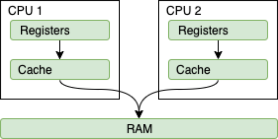

= Java Memory Model notes
:sectnums:
:toc: left
:toclevels: 5
:icons: font
:source-highlighter: coderay

== Memory Model

image::images/image-2024-05-20-21-36-37-769.png[width=500]

JVM memory is divided into separate parts.
At broad level, JVM Heap memory is physically divided into two parts - *Young Generation* and *Old Generation*.

=== Young Generation

The young generation is the place where all the new objects are created.
When the young generation is filled, garbage collection is performed.
This garbage collection is called *Minor GC*.

Young Generation is divided into three parts - *Eden Memory* and two *Survivor Memory* spaces.

* Most of the newly created objects are located in the Eden memory space.
* When Eden space is filled with objects, Minor GC is performed and all the survivor objects are moved to one of the survivor spaces.
* Minor GC also checks the survivor objects and move them to the other survivor space.
So at a time, one of the survivor space is always empty.
* Objects that are survived after many cycles of GC, are moved to the Old generation memory space.
Usually, it’s done by setting a threshold for the age of the young generation objects before they become eligible to promote to Old generation.

=== Old Generation

Old Generation memory contains the objects that are long-lived and survived after many rounds of Minor GC.
Usually, garbage collection is performed in Old Generation memory when it’s full.
Old Generation Garbage Collection is called *Major GC* and usually takes a longer time.

=== Stop the World Event

All the Garbage Collections are “Stop the World” events because all application threads are stopped until the operation completes.
Since Young generation keeps short-lived objects, Minor GC is very fast and the application doesn’t get affected by this.
However, Major GC takes a long time because it checks all the live objects.

=== Permanent Generation

Permanent Generation or “Perm Gen” contains the application metadata required by the JVM to describe the classes and methods used in the application.
Note that Perm Gen is not part of Java Heap memory.
Perm Gen is populated by JVM at runtime based on the classes used by the application.
Perm Gen also contains Java SE library classes and methods.
Perm Gen objects are garbage collected in a full garbage collection.

=== Java Stack Memory

Java Stack memory is used for execution of a thread.
They contain method specific values that are short-lived and references to other objects in the heap that is getting referred from the method.

// TODO: https://www.digitalocean.com/community/tutorials/java-heap-space-vs-stack-memory

== Memory Management

=== Java Heap Memory Switches

* **-Xms**    For setting the initial heap size when JVM starts
* **-Xmx**    For setting the maximum heap size.
* **-Xmn**    For setting the size of the Young Generation, rest of the space goes for Old Generation.
* **-XX:PermGen**    For setting the initial size of the Permanent Generation memory
* **-XX:MaxPermGen**    For setting the maximum size of Perm Gen
* **-XX:SurvivorRatio**    For providing ratio of Eden space and Survivor Space, for example if Young Generation size is 10m and VM switch is -XX:SurvivorRatio=2 then 5m will be reserved for Eden Space and 2.5m each for both the Survivor spaces.
The default value is 8.
* **-XX:NewRatio**    For providing ratio of old/new generation sizes.
The default value is 2.

=== Java Garbage Collection

Garbage Collector is the program running in the background that looks into all the objects in the memory and find out objects that are not referenced by any part of the program.
All these unreferenced objects are deleted and space is reclaimed for allocation to other objects.
One of the basic ways of garbage collection involves three steps:

* **Marking:** This is the first step where garbage collector identifies which objects are in use and which ones are not in use.
* **Normal Deletion:** Garbage Collector removes the unused objects and reclaim the free space to be allocated to other objects.
* **Deletion with Compacting:** For better performance, after deleting unused objects, all the survived objects can be moved to be together.
This will increase the performance of allocation of memory to newer objects.

There are two problems with a simple mark and delete approach.

* First one is that it’s not efficient because most of the newly created objects will become unused
* Secondly objects that are in-use for multiple garbage collection cycle are most likely to be in-use for future cycles too.

=== Java Garbage Collection Types

There are five types of garbage collectors that we can use in our applications.
We just need to use the JVM switch to enable the garbage collection strategy for the application.

** *Serial GC (-XX:+UseSerialGC):*
Serial GC uses the simple mark-sweep-compact approach for young and old generations garbage collection i.e Minor and Major GC.
Serial GC is useful in client machines such as our simple stand-alone applications and machines with smaller CPU.
It is good for small applications with low memory footprint.
** *Parallel GC (-XX:+UseParallelGC):*
Parallel GC is same as Serial GC except that is spawns N threads for young generation garbage collection where N is the number of CPU cores in the system.
We can control the number of threads using -XX:ParallelGCThreads=n JVM option.
Parallel Garbage Collector is also called throughput collector because it uses multiple CPUs to speed up the GC performance.
Parallel GC uses a single thread for Old Generation garbage collection.
** *Parallel Old GC (-XX:+UseParallelOldGC):*
This is the same as Parallel GC except that it uses multiple threads for both Young Generation and Old Generation garbage collection.
** *Concurrent Mark Sweep (CMS) Collector (-XX:+UseConcMarkSweepGC):*
CMS Collector is also referred as concurrent low pause collector.
It does the garbage collection for the Old generation.
CMS collector tries to minimize the pauses due to garbage collection by doing most of the garbage collection work concurrently with the application threads.
CMS collector on the young generation uses the same algorithm as that of the parallel collector.
This garbage collector is suitable for responsive applications where we can’t afford longer pause times.
We can limit the number of threads in CMS collector using -XX:ParallelCMSThreads=n JVM option.
** *G1 Garbage Collector (-XX:+UseG1GC):*
The Garbage First or G1 garbage collector is available from Java 7 and its long term goal is to replace the CMS collector.
The G1 collector is a parallel, concurrent, and incrementally compacting low-pause garbage collector.
Garbage First Collector doesn’t work like other collectors and there is no concept of Young and Old generation space.
It divides the heap space into multiple equal-sized heap regions.
When a garbage collection is invoked, it first collects the region with lesser live data, hence “Garbage First”.
You can find more details about it at Garbage-First Collector Oracle Documentation.

== Java Volatile

`volatile` says for a programmer that the value always will be up to date.
The problem is that the value can be saved on different types of hardware memory.
For example it can be CPU registers, CPU cache, RAM.
СPU registers and CPU cache belong to CPU and can not share a data unlike of RAM which is on the rescue in multithreading environment

_`volatile` keyword says that a variable will be read and written from/to RAM memory directly.
(TODO: check this information)_

IMPORTANT: `volatile` keyword does not cure a race condition situation.
To solve it use `synchronized` keyword.

*As a result it is safety only when one thread writes and others just read the `volatile` value.*

== Interview questions

Q1. When are static variables loaded in memory ?

Ans.
They are loaded at runtime when the respective Class is loaded.

Q2. What is a String Pool ?

Ans.
String pool (String intern pool) is a special storage area in Java heap.
When a string is created and if the string already exists in the pool, the reference of the existing string will be returned, instead of creating a new object and returning its reference.

Q3. how many objects are created with this code ?

String s =new String("abc");

Ans.
Two objects will be created here.
One object creates memory in heap with new operator and second in stack constant pool with "abc".

Q4. Which are the different segments of memory ?

Ans.

1. Stack Segment - contains local variables and Reference variables(variables that hold the address of an object in the heap)

2. Heap Segment - contains all created objects in runtime, objects only plus their object attributes (instance variables)

3. Code Segment - The segment where the actual compiled Java bytecodes resides when loaded

Q5. Which memory segment loads the java code ?

Ans.
Code segment.

Q6. Does garbage collection guarantee that a program will not run out of memory?

Ans.
Garbage collection does not guarantee that a program will not run out of memory.
It is possible for programs to use up memory resources faster than they are garbage collected.
It is also possible for programs to create objects that are not subject to garbage collection

Q7. Describe what happens when an object is created in Java ?

Ans.

1. Memory is allocated from heap to hold all instance variables and implementation-specific data of the object and its superclasses.
Implemenation-specific data includes pointers to class and method data.

2. The instance variables of the objects are initialized to their default values.

3. The constructor for the most derived class is invoked.
The first thing a constructor does is call the constructor for its superclasses.
This process continues until the constructor for java.lang.Object is called, as java.lang.Object is the base class for all objects in java.

4. Before the body of the constructor is executed, all instance variable initializers and initialization blocks are executed.
Then the body of the constructor is executed.
Thus, the constructor for the base class completes first and constructor for the most derived class completes last.

Q8. Describe, in general, how java's garbage collector works ?

Ans.
The Java runtime environment deletes objects when it determines that they are no longer being used.
This process is known as garbage collection.
The Java runtime environment supports a garbage collector that periodically frees the memory used by objects that are no longer needed.
The Java garbage collector is a mark-sweep garbage collector that scans Java's dynamic memory areas for objects, marking those that are referenced.
After all possible paths to objects are investigated, those objects that are not marked (i.e. are not referenced) are known to be garbage and are collected.

Q9. Can I import same package/class twice?
Will the JVM load the package twice at runtime?

Ans.
One can import the same package or same class multiple times.
Neither compiler nor JVM complains wil complain about it.
And the JVM will internally load the class only once no matter how many times you import the same class.

Q10. Different types of memory used by JVM ?

Ans.
Class , Heap , Stack , Register , Native Method Stack.

Q11. What is a class loader ?
What are the different class loaders used by JVM ?

Ans.
Part of JVM which is used to load classes and interfaces.

Bootstrap , Extension and System are the class loaders used by JVM.

Q12. Explain java.lang.OutOfMemoryError ?

Ans.
This Error is thrown when the Java Virtual Machine cannot allocate an object because it is out of memory, and no more memory could be made available by the garbage collector.

Q13. Is JVM, a compiler or interpretor ?

Ans.
Its an interpretor.

Q14. Difference between loadClass and Class.forName ?

Ans. loadClass only loads the class but doesn't initialize the object whereas Class.forName initialize the object after loading it.

Q15. Should we override finalize method ?

Ans.
Finalize is used by Java for Garbage collection.
It should not be done as we should leave the Garbage Collection to Java itself.

Q16. Which kind of memory is used for storing object member variables and function local variables ?

Ans.
Local variables are stored in stack whereas object variables are stored in heap.

Q17. Why do member variables have default values whereas local variables don't have any default value ?

Ans. member variable are loaded into heap, so they are initialized with default values when an instance of a class is created.
In case of local variables, they are stored in stack until they are being used.

Q18. Why Java don't use pointers ?

Ans.
Pointers are vulnerable and slight carelessness in their use may result in memory problems and hence Java intrinsically manage their use.

Q19. What are various types of Class loaders used by JVM ?

Ans.

Bootstrap - Loads JDK internal classes, java.* packages.

Extensions - Loads jar files from JDK extensions directory - usually lib/ext directory of the JRE

System - Loads classes from system classpath.

Q20. How are classes loaded by JVM ?

Ans.
Class loaders are hierarchical.
The very first class is specially loaded with the help of static main() method declared in your class.
All the subsequently loaded classes are loaded by the classes, which are already loaded and running.

Q21. Difference between static vs. dynamic class loading?

Ans.

static loading - Classes are statically loaded with Java’s “new” operator.

dynamic class loading - Dynamic loading is a technique for programmatically invoking the functions of a class loader at run time.

Class.forName (Test className);

Q22. What are strong, soft, weak and phantom references in Java ?

Ans.
Garbage Collector won’t remove a strong reference.

A soft reference will only get removed if memory is low.

A weak reference will get removed on the next garbage collection cycle.

A phantom reference will be finalized but the memory will not be reclaimed.
Can be useful when you want to be notified that an object is about to be collected.

Q23. Name few tools for probing Java Memory Leaks ?

Ans.
JProbe, OptimizeIt

Q24. Which memory areas does instance and static variables use ?

Ans. instance variables are stored on stack whereas static variables are stored on heap.

Q25. What is PermGen or Permanent Generation ?

Ans.
The memory pool containing all the reflective data of the java virtual machine itself, such as class and method objects.
With Java VMs that use class data sharing, this generation is divided into read-only and read-write areas.
The Permanent generation contains metadata required by the JVM to describe the classes and methods used in the application.
The permanent generation is populated by the JVM at runtime based on classes in use by the application.
In addition, Java SE library classes and methods may be stored here.

Q26. What is metaspace ?

Ans.
The Permanent Generation (PermGen) space has completely been removed and is kind of replaced by a new space called Metaspace.
The consequences of the PermGen removal is that obviously the PermSize and MaxPermSize JVM arguments are ignored and you will never get a java.lang.OutOfMemoryError: PermGen error.

Q27. What are the disadvantages of using arrays ?

Ans.
Arrays are of fixed size and have to reserve memory prior to use.
Hence if we don't know size in advance arrays are not recommended to use.

Arrays can store only homogeneous elements.

Arrays store its values in contentious memory location.
Not suitable if the content is too large and needs to be distributed in memory.

There is no underlying data structure for arrays and no ready made method support for arrays, for every requriment we need to code explicitly

Q28. Can we call the garbage collector explicitly ?

Ans.
Yes, We can call garbage collector of JVM to delete any unused variables and unreferenced objects from memory using gc( ) method.
This gc( ) method appears in both Runtime and System classes of java.lang package.

Q29. What are different ways to create String Object?
Explain.

Ans.

String str = new String("abc"); String str1 = "abc";

When we create a String using double quotes, JVM looks in the String pool to find if any other String is stored with same value.
If found, it just returns the reference to that String object else it creates a new String object with given value and stores it in the String pool.

When we use new operator, JVM creates the String object but don’t store it into the String Pool.
We can use intern() method to store the String object into String pool or return the reference if there is already a String with equal value present in the pool.

Q30. How substring() method of String class create memory leaks?

Ans. substring method would build a new String object keeping a reference to the whole char array, to avoid copying it.
Hence you can inadvertently keep a reference to a very big character array with just a one character string.

Q31. How Java provide high Performance ?

Ans.
Java uses Just-In-Time compiler to enable high performance.
Just-In-Time compiler is a program that turns Java bytecode into instructions that can be sent directly to the processor.

Q32. Why is Java considered Portable Language ?

Ans.
Java is a portable-language because without any modification we can use Java byte-code in any platform(which supports Java).
So this byte-code is portable and we can use in any other major platforms.

Q33. How to find if JVM is 32 or 64 bit from Java program. ?

Ans.
You can find JVM - 32 bit or 64 bit by using System.getProperty() from Java program.
