= Kafka notes
:sectnums:
:toc: left
:toclevels: 5
:icons: font
:source-highlighter: coderay

== Introduction

Publish-subscribe based durable messaging system.

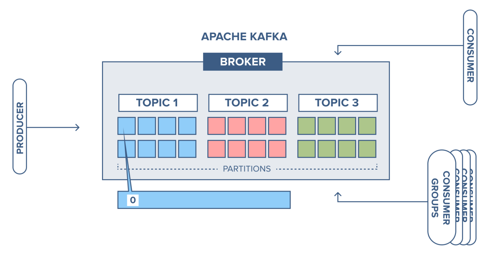

=== Main features

* *Multiple brokers across different machines*

* *Multiple producers and consumers at any given time.*
This feature is provided by topics divided by partitions.

* *Disk-Based retention.*
All information is stored to disk for some period of time (Retention policy).

* *High Performance.*
Multiple producers and consumers.
Multiple nodes in cluster.

* *Replication between nodes.*
Provides strong reliability.

* *Batch data in chunks.*
This minimises cross machine latency.

* *Sequential Disk Access.*
Consumer reads data in sequential manner and don't have random access.

=== Alternatives

* RabbitMq
* ActiveMq
* Redis (for queues)

=== Use Cases

* *Activity tracking*
* *Messaging*
* *Metrics and logging.* For example with ELK stack
* *Commit log.* For synchronisation between DB and search engine (Solr)
* *Stream processing*

== Start kafka

*docker-compose.yml*

[source,yaml]
----
version: '2'
services:
  broker:
    image: confluentinc/cp-kafka:7.4.1
    hostname: broker
    container_name: broker
    ports:
    - 29092:29092
    environment:
      KAFKA_BROKER_ID: 1
      KAFKA_LISTENER_SECURITY_PROTOCOL_MAP: PLAINTEXT:PLAINTEXT,PLAINTEXT_HOST:PLAINTEXT,CONTROLLER:PLAINTEXT
      KAFKA_ADVERTISED_LISTENERS: PLAINTEXT://broker:9092,PLAINTEXT_HOST://localhost:29092
      KAFKA_OFFSETS_TOPIC_REPLICATION_FACTOR: 1
      KAFKA_GROUP_INITIAL_REBALANCE_DELAY_MS: 0
      KAFKA_TRANSACTION_STATE_LOG_MIN_ISR: 1
      KAFKA_TRANSACTION_STATE_LOG_REPLICATION_FACTOR: 1
      KAFKA_PROCESS_ROLES: broker,controller
      KAFKA_NODE_ID: 1
      KAFKA_CONTROLLER_QUORUM_VOTERS: 1@broker:29093
      KAFKA_LISTENERS: PLAINTEXT://broker:9092,CONTROLLER://broker:29093,PLAINTEXT_HOST://0.0.0.0:29092
      KAFKA_INTER_BROKER_LISTENER_NAME: PLAINTEXT
      KAFKA_CONTROLLER_LISTENER_NAMES: CONTROLLER
      KAFKA_LOG_DIRS: /tmp/kraft-combined-logs
      CLUSTER_ID: MkU3OEVBNTcwNTJENDM2Qk
----

*Use in docker*

[source,shell]
----
docker exec -it broker bash
----

== Topics

Topics are like a Queues in the Rabbit.

=== Create topic

[source,shell]
----
bin/kafka-topics.sh --create --bootstrap-server localhost:9094
--topic kinaction_helloworld --partitions 3 --replication-factor 3

OR

kafka-topics --create --topic example-topic --bootstrap-server broker:9092 --replication-factor 1 --partitions 2
----

*bootstrap.servers*
Property that can take many or just one initial broker.
By connecting to this broker, the client can discover the metadata it needs, which includes data about other brokers in the cluster as well.

Disable auto creation for topics using property *auto.create.topics.enable* to false.

Attempting to create a topic with the number of replicas being greater than the total number of brokers results in an error: *InvalidReplicationFactorException*.

=== Get topics

[source,shell]
----
bin/kafka-topics.sh --list --bootstrap-server localhost:9094

OR

kafka-topics --list --bootstrap-server broker:9092
----

=== Describe topic

[source,shell]
----
bin/kafka-topics.sh --bootstrap-server localhost:9094 \
--describe --topic kinaction_helloworld

OR

kafka-topics --bootstrap-server broker:9092 \
--describe --topic example-topic

Topic:kinaction_helloworld PartitionCount:3 ReplicationFactor:3 Configs:
Topic: kinaction_helloworld Partition: 0 Leader: 0 Replicas: 0,1,2 Isr: 0,1,2
Topic: kinaction_helloworld Partition: 1 Leader: 1 Replicas: 1,2,0 Isr: 1,2,0
Topic: kinaction_helloworld Partition: 2 Leader: 2 Replicas: 2,0,1 Isr: 2,0,1
----

* *Partition.* In this situation all partitions are spread between nodes of cluster.
* *Leader.* And each partition has its own leader.
* *Replicas.* Topic has several replicas.
* *Isr.* Stands for in-sync replicas (ISRs).
In-sync replicas show which brokers are current and not lagging behind the leader.

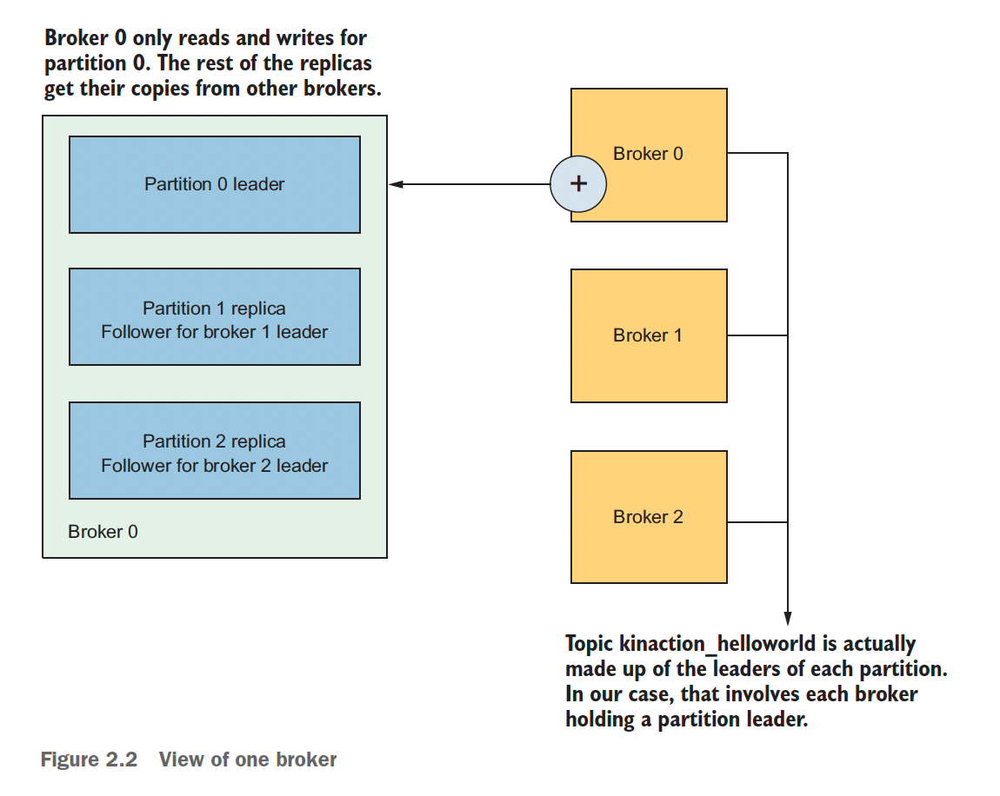

=== Write to topic

[source,shell]
----
bin/kafka-console-producer.sh --bootstrap-server localhost:9094 \
--topic kinaction_helloworld
----

=== Read from topic

[source,shell]
----
bin/kafka-console-consumer.sh --bootstrap-server localhost:9094 \
--topic kinaction_helloworld --from-beginning
----

If we eliminate the `--from-beginning` option when we restart command.
We will see only messages that were produced since the consumer console was started show up.
This is provided by `offset` property.

=== Delete topic

[source,shell]
----
bin/kafka-topics.sh --delete --bootstrap-server localhost:9094
--topic kinaction_topicandpart
----

== Partitions

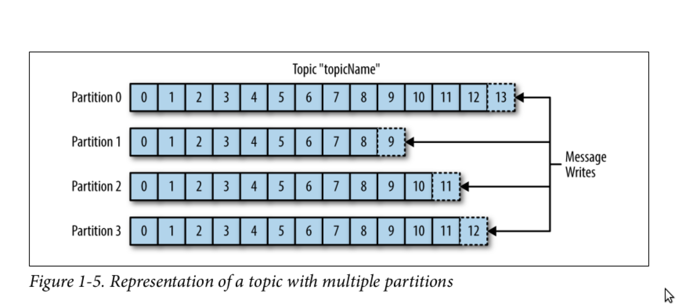

*Topics are divided to partitions*

Each partition can be hosted on the different server, which provides horizontal scalability.
Capacity of a given topic isn't limited by the available disk space on one server.

*How to divide to partitions?*

Topic can be divided to partitions in creation time.
By parameter `--partitions 3`

=== How producer spreads data between partitions?

==== Round Robin

The producer does not care what partition a specific message is written to and will balance messages over all partitions of a topic evenly.

==== By key

If the key isn't null.
Kafka uses the formula to calculate which partition the message will be sent to.
Records with the same key will always be sent to the same partition and in order.

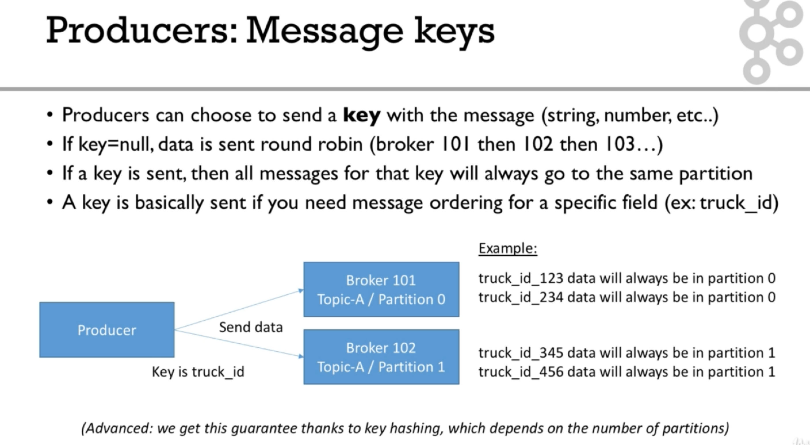

==== Producer and acknowledgments

When broker receives the messages, it sends back a response.
If the messages were successfully written to Kafka, return a RecordMetaData object contains <topic, partition, offset>.
If failed, the broker will return an error.
The producer may retry sending the message a few more times before giving up and returning an error.

==== Batches

Messages are written into Kafka in batches.
A batch is just a collection of messages, all of which are being produced to the same topic and partition.

*linger.ms* Number of milliseconds a producer is willing to wait before sending a batch out.

*linger.ms=5* we increase the chances of messages being sent together in a batch.
At the expense of introducing a small delay, we can increase throughput, compression and efficiency for our producer

*batch.size* Maximum number of bytes that will be included in a batch.
The default is 16KB

Increase batch size to 32KB or 64KB can help increasing throughput A batch is allocated per partition, make sure don't set it to a number that's too high

If the producer produces faster than the broker can take, the records will be buffered in memory

*buffer.memory=33554432(32MB)*
If the buffer is full(all 32 MB), .send() method wil start to block

**max.block.ms=60000 **
The time .send() method will block until throwing an exception

==== Producer properties

* *message.timestamp.type*
`CreateTime` uses the time set by the client, whereas setting it to `LogAppendTime` uses the broker time

* *acks*
Number of replica acknowledgments that a producer requires before success is established

* *bootstrap.servers*
One or more Kafka brokers to connect for startup

* *value.serializer*
The class that’s used for serialization of the value.
AVRO may be used

* *key.serializer*
The class that’s used for serialization of the key.
AVRO may be used

==== Partitioner

Configuration as a code that defines what partition will be used by producer.

**Use case.
** Separate partition can be used for ERROR alerts to mace sure that they are processed ASAP.

=== How consumer gets data from partitions?

* The consumer subscribes to one or more topics and reads the messages in the order in which they were produced.
* The consumer keeps track of which message it has already consumed by keeping track of the `offset` of messages.

==== Offset

Each consumer in `consumer group` has its own offset

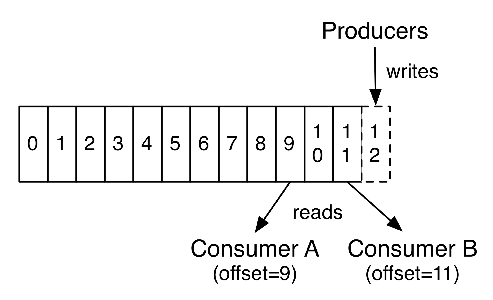

Delivery semantics for consumers

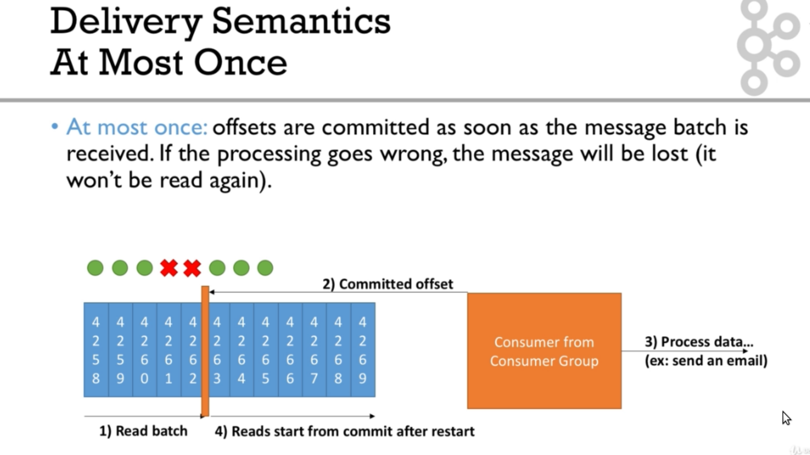
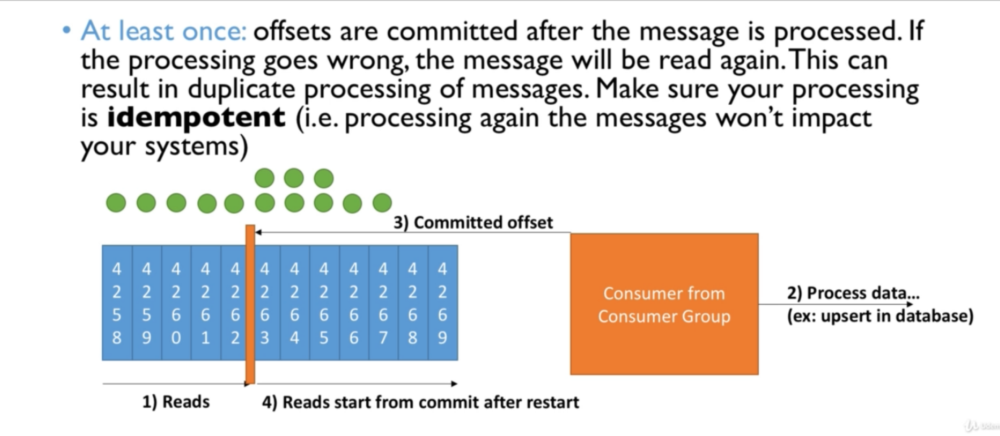

==== Consumer group

Consumers work as part of a consumer group, which is one or more consumers that work together to consume a topic.
Group assures that each partition is only consumed by one member.
If a single consumer fails, the remaining members of group will rebalance the partitions being consumed to take over the missing member.

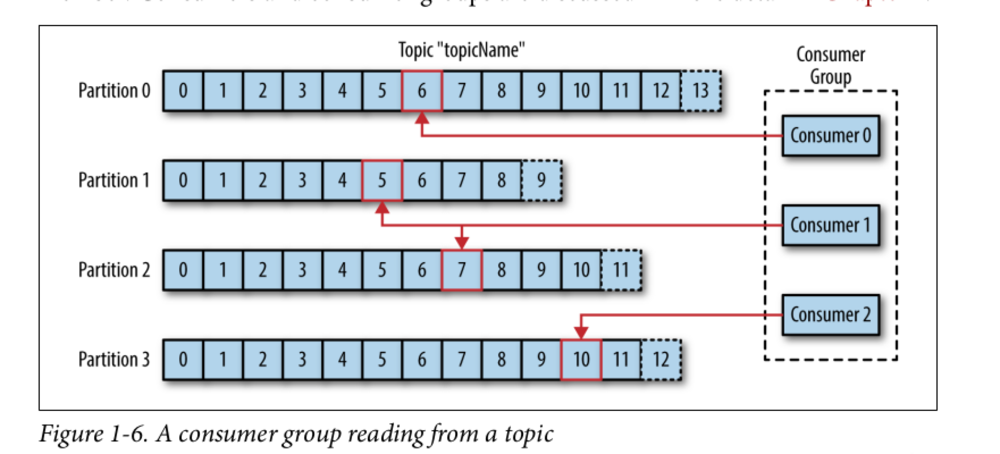

IMPORTANT: One consumer to multiple partitions but one partition for one consumer.

Using additional consumer group

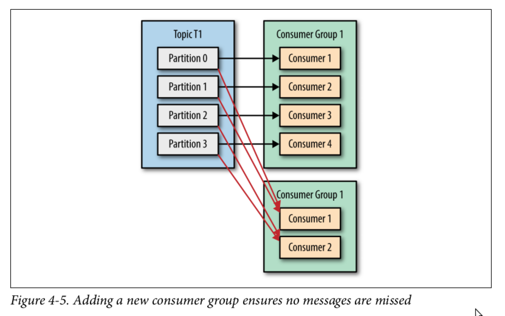

==== Consumer properties

* **bootstrap.servers**
One or more Kafka brokers to connect on startup

* **value.deserializer**
Needed for deserialization of the value

* **key.deserializer**
Needed for deserialization of the key

* **group.id**
A name that’s used to join a consumer group

* **client.id**
An ID to identify a user (we will use this in chapter 10)

* **heartbeat.interval.ms**
Interval for consumer’s pings to the group coordinator

==== Partition assignment strategy for consumer

* **range assigner**
Uses a single topic to find the number of partitions (ordered by number) and then is broken down by the number of consumers.
If the split is not even, then the first consumers (using alphabetical order) get the remaining partitions.

* **round-robin**
Strategy is where the partitions are uniformly distributed down the row of consumers.

* **sticky**
???
TODO

* **cooperative-sticky**
???
TODO

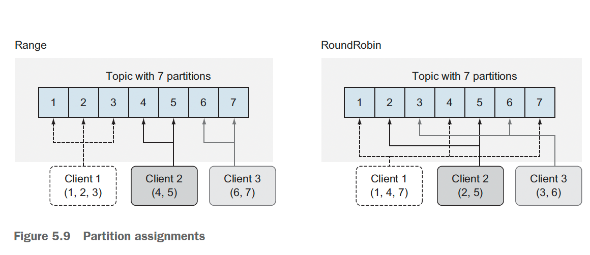

=== Partitions count

* Small cluster(<6 brokers>): #partitions per topic = 2 x number of brokers
* Big cluster(>12 brokers): 1 x # of brokers

== Broker and clusters

A single Kafka server is called a broker.
The broker receives messages from producers, assigns offsets to them and commits the messages to storage on disk.
Brokers are designed to operate as part of a cluster.

Kafka uses `Apache Zookeeper` to maintain the list of brokers and offsets.

IMPORTANT: Now cluster could be created without Zookeeper

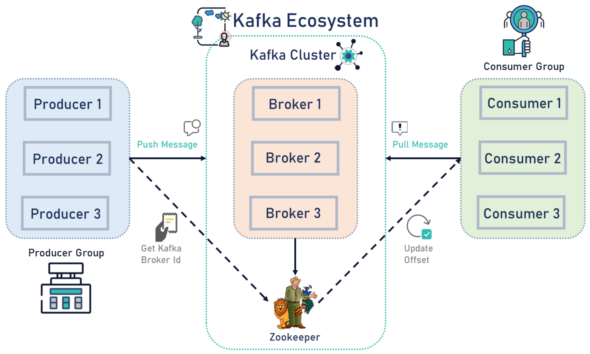

=== Cluster controller

In a cluster, one broker will also function as the cluster controller

A cluster controller is one of the kafka brokers that in addition to the usual broker functionality:

* administrative operations: assigning partitions to brokers and monitoring for broker failures
* electing partition leaders(explained in the next section)
* Cluster only have one controller at a time

The first broker that starts in the cluster becomes the controller.

== Replication

It guarantees availability and durability when individual nodes inevitably fail.

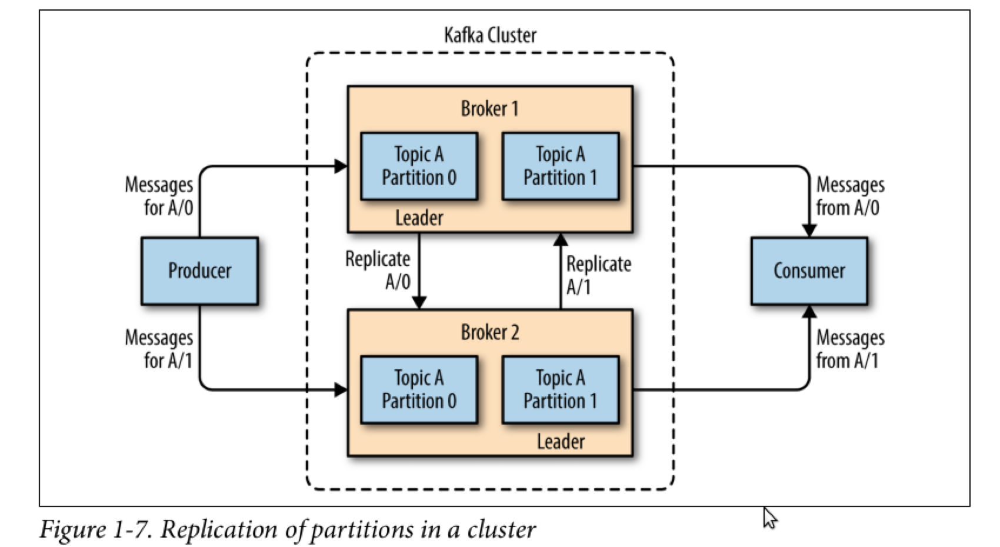

Each broker holds a number of partitions and each of these partitions can be either a leader or a replica for a topic

*Leader replica*

* Each partition has a single replica designated as the leader.
* All produce and consume requests go through the leader, in order to guarantee consistency.

*Follower replica*

* All replicas for a partition that are not leaders are called followers
* Followers don't serve client requests
* When a leader crashes, one of follower replica will be promoted to become the leader
* Only in-sync replicas are eligible to be elected as partition leader in case the existing leader fail

=== How to set replication?

Set replication factor in time of topic creation.
By parameter `--replication-factor 3`

=== Replication count

Should be at least 2, usually 3, maximum 4

=== How to write to multiple replications? (acknowledgments)

*acks*

Controls how many partition replicas must receive the record before the producer can consider write successful.

**acks=0**
The producer will not wait for a reply from the broker before assuming the message was sent successfully.
The message may be lost, but it can send messages as fast as the network will support.

*acks=1*
The producer will consider write successful when the leader receives the record.

*acks=all* or *acks=-1*
The producer will consider write successful when all of the in-sync replicas receive the record.

=== Leader election after fail

When `unclean.leader.election.enable is true`, the controller selects a leader for a partition even if it is not up to date so that the system keeps running.
The problem with this is that data could be lost because none of the replicas have all the data at the time of the leader’s failure.
At the cost of missing data, this option allows us to keep serving clients.

== Retention and compaction policy

Retention is the durable storage of messages for some period of time.
For example, a tracking topic might be retained for several days, whereas application metrics might be retained for only a few hours.

*log.cleanup.policy=delete*

Delete based on age of data(default is a week) Deleted based on max size of log(default is -1 == infinite)

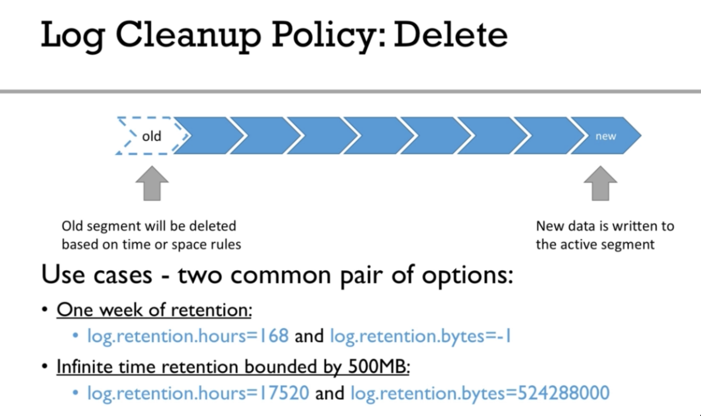

*log.cleanup.policy=compact*

Delete based on keys of your message Will delete old duplicate keys after the active segment is committed

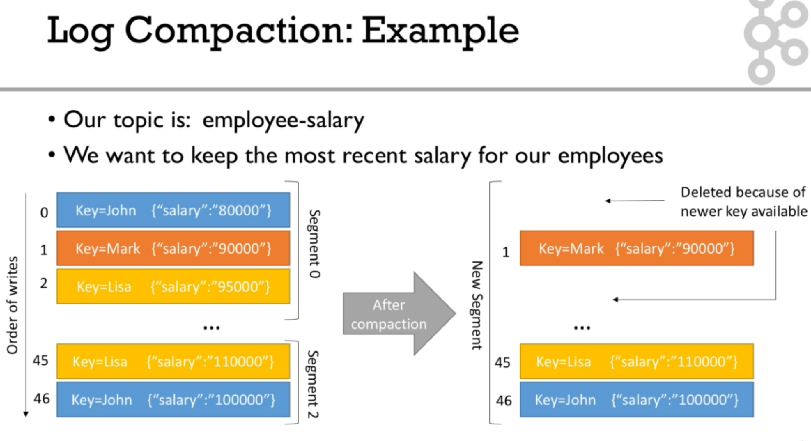

*log.retention.hours*

*log.retention.minutes*

*log.retention.ms*

*log.retention.bytes*

By setting both `log.retention.bytes` and `log.retention.ms` to –1, we can effectively turn off data deletion

=== Creating a compacted topic

[source,shell]
----
bin/kafka-topics.sh --create --bootstrap-server localhost:9094 \
--topic kinaction_compact --partitions 3 --replication-factor 3 \
--config cleanup.policy=compact
----

== Kafka’s high-level architecture

In general, core Kafka can be thought of as Scala application processes that run on a Java virtual machine (JVM).
Kafka uses operating system’s _page cache_ by avoiding caching in the __JVM heap__.
Another design consideration is the access pattern of data.
When new messages flood in, it is likely that the latest messages are of more interest to many consumers, which can then be served from this cache.

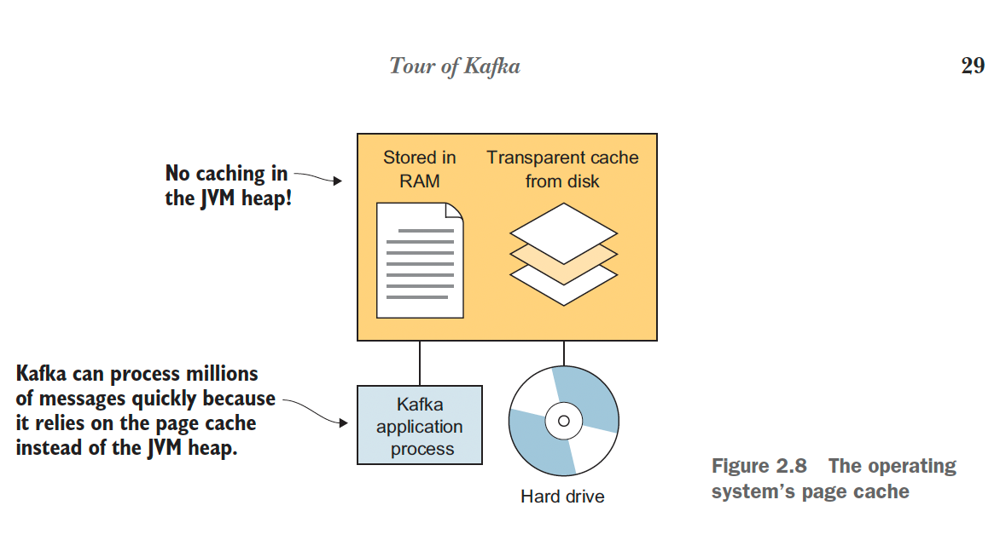

All information is stored into the log files sequentially

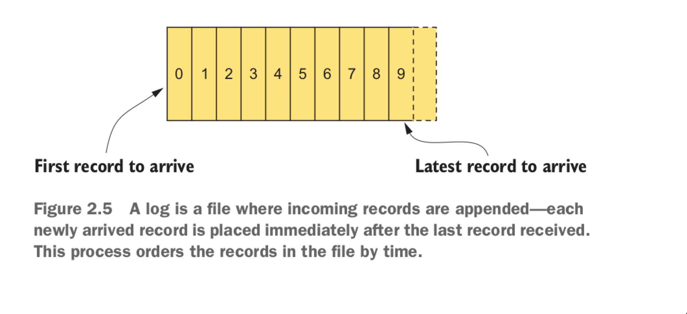

=== Viewing logs

[source,shell]
----
bin/kafka-dump-log.sh --print-data-log \
--files /tmp/kafkainaction/kafka-logs-0/kinaction_topicandpart-1/*.log \
| awk -F: '{print $NF}' | grep kinaction
----

By using the `--files` option, which is required, we chose to look at a segment file.
Assuming the command is successful, we should see a list of messages printed to the screen.
Without using `awk and grep`, you would also see offsets as well as other related metadata like compression codecs.

== Kafka tools

=== Kafka connect

Move data into and out of Apache Kafka

* Read/write content from/to files/database

=== Kafka streams

Kafka Streams API depends on core Kafka.
While event messages continue to come into the cluster, a consumer application can provide the end user with updated information continuously rather than wait for a query to pull a static snapshot of the events.

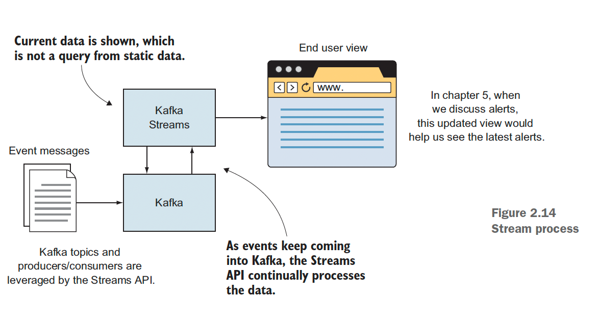

=== Apache Flume

If you have ever heard the term Flafka, you have definitely used this Kafka and Flume integration.
Flume can provide an easier path for getting data into a cluster and relies more on configuration than on custom code.

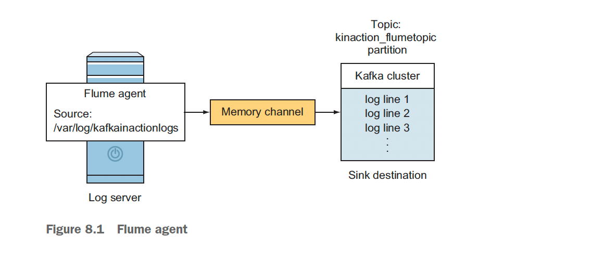

=== Admin tools

==== kcat

kcat (https://github.com/edenhill/kcat) is a handy tool to have on your workstation, especially when connecting remotely to your clusters.

==== Confluent REST Proxy API

This proxy is a separate application that would likely be hosted on its own server for production usage, and its functionality is similar to the kcat utility we just discussed.

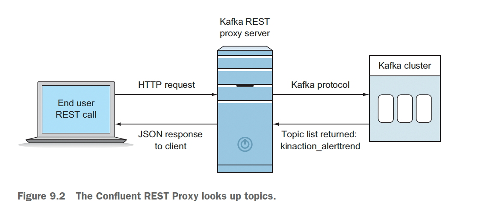
