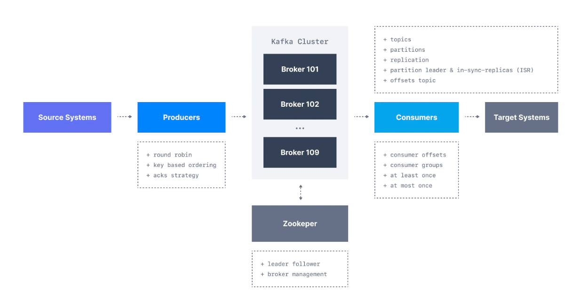
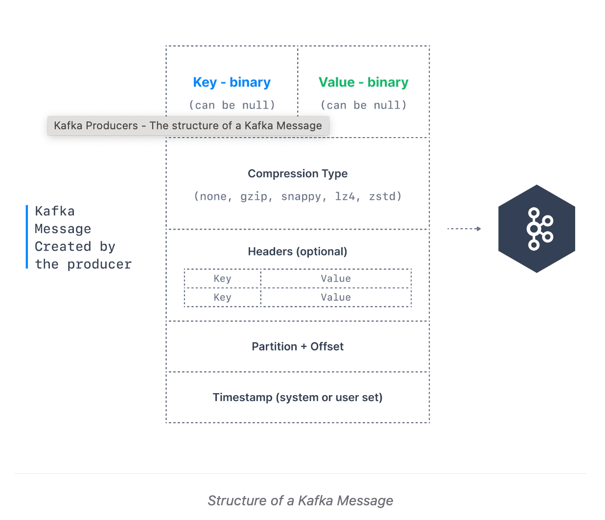
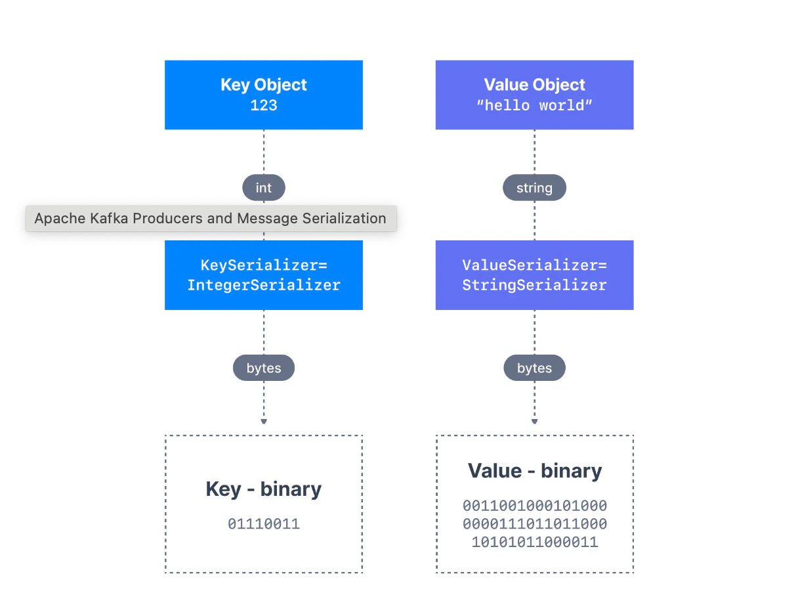
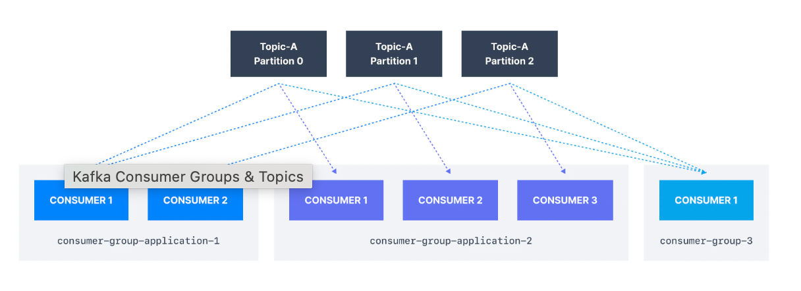
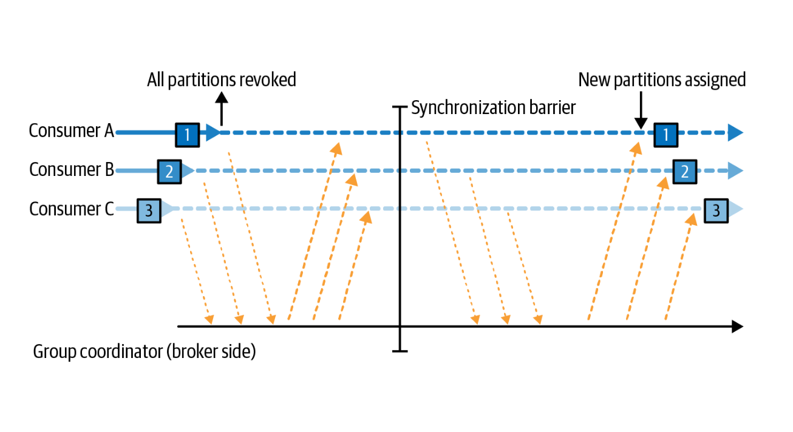
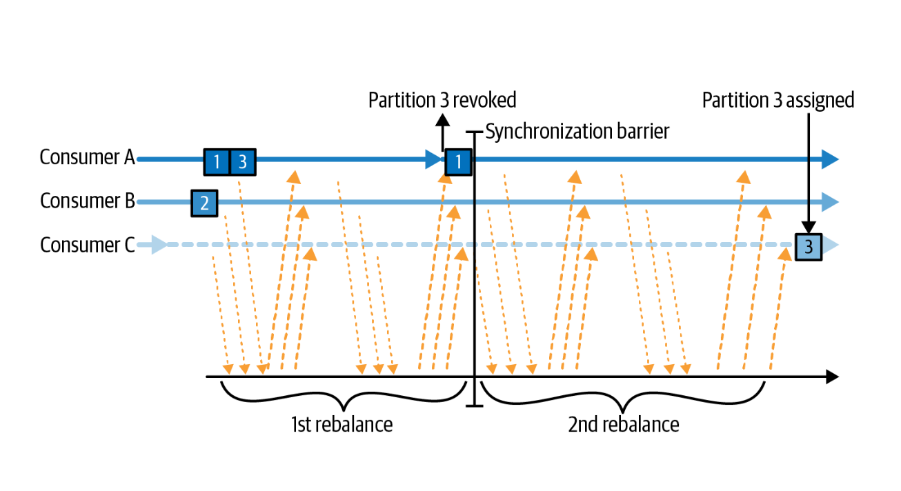
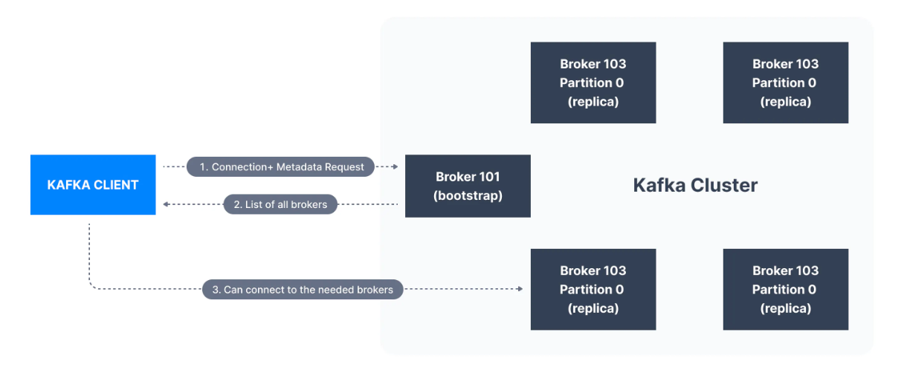
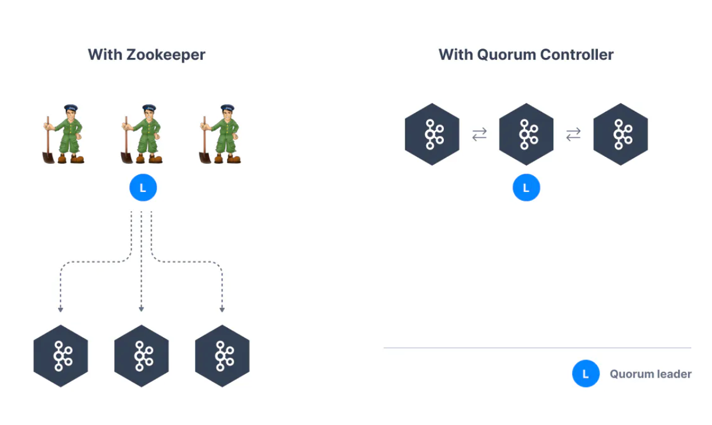

= Kafka notes
:sectnums:
:toc: left
:toclevels: 5
:icons: font
:source-highlighter: coderay

== Introduction

Publish-subscribe based durable messaging system.

System components overview

Broker overview

image::images/image-2024-04-25-13-34-42-642.png[width=500]

=== Main features

* *Multiple brokers across different machines*

* *Multiple producers and consumers at any given time.*
This feature is provided by topics divided by partitions.

* *Disk-Based retention.*
All information is stored to disk for some period of time (Retention policy).

* *High Performance.*
Multiple producers and consumers.
Multiple nodes in cluster.

* *Replication between nodes.*
Provides strong reliability.

* *Batch data in chunks.*
This minimises cross machine latency.

* *Sequential Disk Access.*
Consumer reads data in sequential manner and don't have random access.

=== Alternatives

* RabbitMq
* ActiveMq
* Redis (for queues)

=== Use Cases

* *Activity tracking*
* *Messaging*
* *Metrics and logging.* For example with ELK stack
* *Commit log.* For synchronisation between DB and search engine (Solr)
* *Stream processing*

== Partitions

image::images/image-2024-04-25-13-56-55-420.png[width=500]

*Topics are divided to partitions*

Each partition can be hosted on the different server, which provides horizontal scalability.
Capacity of a given topic isn't limited by the available disk space on one server.

*How to divide to partitions?*

Topic can be divided to partitions in creation time.
By parameter `--partitions 3`

=== Producer

==== Message content

* **Key.** Key is optional in the Kafka message and it can be null.
A key may be a string, number, or any object and then the key is serialized into binary format.
* **Value.** The value represents the content of the message and can also be null.
The value format is arbitrary and is then also serialized into binary format.
* **Compression Type.** Kafka messages may be compressed.
The compression type can be specified as part of the message.
Options are none, gzip, lz4, snappy, and zstd
* **Headers.** There can be a list of optional Kafka message headers in the form of key-value pairs.
It is common to add headers to specify metadata about the message, especially for tracing.
* **Partition + Offset.** Once a message is sent into a Kafka topic, it receives a partition number and an offset id.
The combination of topic+partition+offset uniquely identifies the message
* **Timestamp.** A timestamp is added either by the user or the system in the message.

==== Message keys

*NO key*

The producer does not care what partition a specific message is written to and will balance messages over all partitions of a topic evenly.

*WITH key*

If a key is sent (key != null), then all messages that share the same key will always be sent and stored in the same Kafka partition.
A key can be anything to identify a message - a string, numeric value, binary value, etc.

image::images/image-2024-04-25-14-51-02-644.png[width=500]

==== Kafka Message Serializers

The process of transforming the producer's programmatic representation of the object to binary is called message serialization.

As part of the Java Client SDK for Apache Kafka, several serializers already exist, such as string (which supersedes JSON), integer, float.

==== Kafka Message Key Hashing

A Kafka partitioner is a code logic that takes a record and determines to which partition to send it into.

In that effect, it is common for partitioners to leverage the Kafka message keys to route a message into a specific topic-partition.
As a reminder, all messages with the same key will go to the same partition.

In the default Kafka partitioner, the keys are hashed using the murmur2 algorithm.

[source,kotlin]
----
targetPartition = Math.abs(Utils.murmur2(keyBytes)) % (numPartitions - 1)
----

It is possible to override the default partitioner via the producer property partitioner.class.

==== Producer and acknowledgments

When broker receives the messages, it sends back a response.
If the messages were successfully written to Kafka, return a RecordMetaData object contains <topic, partition, offset>.
If failed, the broker will return an error.
The producer may retry sending the message a few more times before giving up and returning an error.

==== Batches

Messages are written into Kafka in batches.
A batch is just a collection of messages, all of which are being produced to the same topic and partition.

** *linger.ms* Number of milliseconds a producer is willing to wait before sending a batch out.

** *linger.ms=5* we increase the chances of messages being sent together in a batch.
At the expense of introducing a small delay, we can increase throughput, compression and efficiency for our producer

** *batch.size* Maximum number of bytes that will be included in a batch.
The default is 16KB.
Increase batch size to 32KB or 64KB can help increasing throughput A batch is allocated per partition, make sure don't set it to a number that's too high.
If the producer produces faster than the broker can take, the records will be buffered in memory.

====
*Sticky Batch for Partitioner.*
Since Kafka v2.4.0, the partitioner is a Sticky Partitioner, which means the producer that receives messages sent in time close to each other will try to fill a batch into ONE partition before switching to creating a batch for another partition.

To observe the round-robin feature of Kafka, we can add a `Thread.sleep(1000)` in between each iteration of the loop, which will force the batch to be sent and a new batch to be created for a different partition.
====

** *buffer.memory=33554432(32MB)*
If the buffer is full(all 32 MB), .send() method wil start to block

** **max.block.ms=60000 **
The time .send() method will block until throwing an exception

==== Producer partitioners

*default*

If id is specified it is used to spread messages between partitions using hash of the key.

*RoundRobinPartitioner*

Used without key.
To spread messages equally.

*UniformStickyPartitioner*

These provide random partition assignment and sticky random partition assignment even when messages have keys.
These are useful when keys are important for the consuming application, but the workload may be skewed, so a single key may have a disproportionately large workload.
Using the UniformStickyPartitioner will result in an even distribution of workload across all partitions.

*CustomPartitioner*

==== Produce message headers

Provide headers for information that will be used before decoding message body.
For example version, encoding type or message source.

==== Producer properties

* *message.timestamp.type*
`CreateTime` uses the time set by the client, whereas setting it to `LogAppendTime` uses the broker time

* *acks*
Number of replica acknowledgments that a producer requires before success is established

* *bootstrap.servers*
One or more Kafka brokers to connect for startup

* *value.serializer*
The class that’s used for serialization of the value.
AVRO may be used

* *key.serializer*
The class that’s used for serialization of the key.
AVRO may be used

=== Consumer

* The consumer subscribes to one or more topics and reads the messages in the order in which they were produced.
* The consumer keeps track of which message it has already consumed by keeping track of the `offset` of messages.
* Kafka consumers are also known to implement a "pull model".
This means that Kafka consumers must request data from Kafka brokers in order to get it (instead of having Kafka brokers continuously push data to consumers).
This implementation was made so that consumers can control the speed at which the topics are being consumed.

==== Offset

Each consumer in `consumer group` has its own offset

image::images/image-2024-04-25-14-53-58-722.png[width=500]

==== Delivery semantics for consumers

*At most once:*

* Offsets are committed as soon as the message is received.
* If the processing goes wrong, the message will be lost (it won’t be read again).

*At least once (usually preferred):*

* Offsets are committed after the message is processed.
* If the processing goes wrong, the message will be read again.
* This can result in duplicate processing of messages.
Therefore, it is best practice to make sure data processing is idempotent (i.e. processing the same message twice won't produce any undesirable effects

*Exactly once:*

* This can only be achieved for Kafka topic to Kafka topic workflows using the transactions API.
* For Kafka topic to External System workflows, to effectively achieve exactly once, you must use an idempotent consumer.

In practice, at least once with idempotent processing is the most desirable and widely implemented mechanism for Kafka consumers.

==== Consumer properties

* **bootstrap.servers**
One or more Kafka brokers to connect on startup

* **value.deserializer**
Needed for deserialization of the value

* **key.deserializer**
Needed for deserialization of the key

* **group.id**
A name that’s used to join a consumer group

* **client.id**
An ID to identify a user (we will use this in chapter 10)

* **heartbeat.interval.ms**
Interval for consumer’s pings to the group coordinator

==== Consumer Group ID

In order for indicating to Kafka consumers that they are part of the same specific group , we must specify the consumer-side setting `group.id`.

Kafka Consumers automatically use a GroupCoordinator and a ConsumerCoordinator to assign consumers to a partition and ensure the load balancing is achieved across all consumers in the same group.

Each of your applications (that may be composed of many consumers) reading from Kafka topics must specify a different group.id.
That means that multiple applications (consumer groups) can consume from the same topic at the same time.

Consumers work as part of a consumer group, which is one or more consumers that work together to consume a topic.
Group assures that each partition is only consumed by one member.
If a single consumer fails, the remaining members of group will rebalance the partitions being consumed to take over the missing member.

image::images/image-2024-04-25-14-57-07-399.png[width=500]

IMPORTANT: One consumer to multiple partitions but one partition for one consumer.

Using additional consumer group

image::images/image-2024-04-25-15-01-32-782.png[width=500]

==== Partition assignment strategy for consumer

* **range assigner**
Uses a single topic to find the number of partitions (ordered by number) and then is broken down by the number of consumers.
If the split is not even, then the first consumers (using alphabetical order) get the remaining partitions.

* **round-robin**
Strategy is where the partitions are uniformly distributed down the row of consumers.

* **sticky**
The Sticky Assignor has two goals: the first is to have an assignment that is as balanced as possible, and the second is that in case of a rebalance, it will leave as many assignments as possible in place, minimizing the overhead associated with moving partition assignments from one consumer to another.

* **cooperative-sticky**
This assignment strategy is identical to that of the Sticky Assignor but supports cooperative rebalances in which consumers can continue consuming from the partitions that are not reassigned.

image::images/image-2024-04-25-17-59-28-130.png[width=500]

==== Consumer partition Rebalance

** *Eager rebalances.*
During an eager rebalance, all consumers stop consuming, give up their ownership of all partitions, rejoin the consumer group, and get a brand-new partition assignment.
This is essentially a short window of unavailability of the entire consumer group.
The length of the window depends on the size of the consumer group as well as on several configuration parameters.

** *Cooperative rebalances.*
Cooperative rebalances _(also called incremental rebalances)_ typically involve reassigning only a small subset of the partitions from one consumer to another, and allowing consumers to continue processing records from all the partitions that are not reassigned.
This is achieved by rebalancing in two or more phases.
Initially, the consumer group leader informs all the consumers that they will lose ownership of a subset of their partitions, then the consumers stop consuming from these partitions and give up their ownership in them.
In the second phase, the consumer group leader assigns these now orphaned partitions to their new owners.

Consumers maintain membership in a consumer group and ownership of the partitions assigned to them by sending heartbeats to a Kafka broker designated as the group coordinator (this broker can be different for different consumer groups).

====
*How Does the Process of Assigning Partitions to Consumers Work?*

When a consumer wants to join a group, it sends a JoinGroup request to the group coordinator.
The first consumer to join the group becomes the group leader.
The leader receives a list of all consumers in the group from the group coordinator (this will include all consumers that sent a heartbeat recently and that are therefore considered alive) and is responsible for assigning a subset of partitions to each consumer.
It uses an implementation of PartitionAssignor to decide which partitions should be handled by which consumer.

Kafka has few built-in partition assignment policies, which we will discuss in more depth in the configuration section.
After deciding on the partition assignment, the consumer group leader sends the list of assignments to the GroupCoordinator, which sends this information to all the consumers.
Each consumer only sees its own assignment—the leader is the only client process that has the full list of consumers in the group and their assignments.
This process repeats every time a rebalance happens.
====

=== Quotas and Throttling

Kafka brokers have the ability to limit the rate at which messages are produced and consumed.
This is done via the quota mechanism.
Kafka has three quota types: produce, consume, and request.
Produce and consume quotas limit the rate at which clients can send and receive data, measured in bytes per second.
Request quotas limit the percentage of time the broker spends processing client requests.

Quotas can be applied to all clients by setting default quotas, specific client-ids, specific users, or both.
User-specific quotas are only meaningful in clusters where security is configured and clients authenticate.

The default produce and consume quotas that are applied to all clients are part of the Kafka broker configuration file.
For example, to limit each producer to send no more than 2 MBps on average, add the following configuration to the broker configuration file: quota.producer.default=2M.

While not recommended, you can also configure specific quotas for certain clients that override the default quotas in the broker configuration file.
To allow clientA to produce 4 MBps and clientB 10 MBps, you can use the following: quota.producer.override="clientA:4M,clientB:10M”

=== Partitions count

* Small cluster(<6 brokers>): #partitions per topic = 2 x number of brokers
* Big cluster(>12 brokers): 1 x # of brokers

== Broker and Clusters

A single Kafka server is called a broker.
The broker receives messages from producers, assigns offsets to them and commits the messages to storage on disk.
Brokers are designed to operate as part of a cluster.

Kafka uses `Apache Zookeeper` to maintain the list of brokers and offsets.

IMPORTANT: Now cluster could be created without Zookeeper

image::images/image-2024-04-25-15-10-27-111.png[width=500]

=== Bootstrap server

A client that wants to send or receive messages from the Kafka cluster *may connect to any broker in the cluster*.
Every broker in the cluster has metadata about all the other brokers and will help the client connect to them as well, and therefore *any broker in the cluster is also called a bootstrap server*.

In practice, it is common for the Kafka client to reference at least two bootstrap servers in its connection URL, in the case one of them not being available, the other one should still respond to the connection request.

=== Cluster controller

In a cluster, one broker will also function as the cluster controller

A cluster controller is one of the kafka brokers that in addition to the usual broker functionality:

* administrative operations: assigning partitions to brokers and monitoring for broker failures
* electing partition leaders(explained in the next section)
* Cluster only have one controller at a time

The first broker that starts in the cluster becomes the controller.

== Replication

It guarantees availability and durability when individual nodes inevitably fail.

image::images/image-2024-04-25-15-12-35-398.png[width=500]

Each broker holds a number of partitions and each of these partitions can be either a leader or a replica for a topic

*Leader replica*

* Each partition has a single replica designated as the leader.
* All produce and consume requests go through the leader, in order to guarantee consistency.

*Follower replica*

* All replicas for a partition that are not leaders are called followers
* Followers don't serve client requests
* When a leader crashes, one of follower replica will be promoted to become the leader
* Only in-sync replicas are eligible to be elected as partition leader in case the existing leader fail

=== How to set replication?

The `min.insync.replicas` can be configured both at the topic and the broker-level.

Set replication factor in time of topic creation by parameter `--replication-factor 3`

*Replication-factor* is the total number of copies of the data stored in an Apache Kafka cluster.

*min.insync.replicas* is the minimum number of copies of the data that you are willing to have online at any time to continue running and accepting new incoming messages.

=== Replication count

Should be at least 2, usually 3, maximum 4

=== How to write to multiple replications? (acknowledgments)

*acks*

Controls how many partition replicas must receive the record before the producer can consider write successful.

[IMPORTANT]
.Default acks values in Kafka
====
* if using Kafka < v3.0, acks=1
* if using Kafka >= v3.0, acks=all
====

* **acks=0**
The producer will not wait for a reply from the broker before assuming the message was sent successfully.
The message may be lost, but it can send messages as fast as the network will support.
* *acks=1*
The producer will consider write successful when the leader receives the record.
* *acks=all* or *acks=-1*
The producer will consider write successful when all of the in-sync replicas receive the record.

=== Leader election after fail

When the preferred leader goes down, any partition that is an ISR (in-sync replica) is eligible to become a new leader (but not a preferred leader).
Upon recovering the preferred leader broker and having its partition data back in sync, the preferred leader will regain leadership for that partition.

When `unclean.leader.election.enable is true`, the controller selects a leader for a partition even if it is not up to date so that the system keeps running.
The problem with this is that data could be lost because none of the replicas have all the data at the time of the leader’s failure.
At the cost of missing data, this option allows us to keep serving clients.

=== In-Sync Replicas (ISR)

An ISR is a replica that is up to date with the leader broker for a partition.
Any replica that is not up to date with the leader is out of sync.

=== Kafka Topic Durability & Availability

For a topic replication factor of 3, topic data durability can withstand the loss of 2 brokers.
As a general rule, for a replication factor of N, you can permanently lose up to N-1 brokers and still recover your data.

Regarding availability, it is a little bit more complicated... To illustrate, let's consider a replication factor of 3:

* *Reads:* As long as one partition is up and considered an ISR, the topic will be available for reads
* *Writers:*
** *acks=0 & acks=1:* as long as one partition is up and considered an ISR, the topic will be available for writes.
** *acks=all:*
*** *min.insync.replicas=1 (default):* the topic must have at least 1 partition up as an ISR (that includes the reader) and so we can tolerate two brokers being down
*** *min.insync.replicas=2:* the topic must have at least 2 ISR up, and therefore we can tolerate at most one broker being down (in the case of replication factor of 3), and we have the guarantee that for every write, the data will be at least written twice.
*** *min.insync.replicas=3:* this wouldn't make much sense for a corresponding replication factor of 3 and we couldn't tolerate any broker going down.

[IMPORTANT]
.Kafka Topic Replication Settings
====
`acks=all` and `min.insync.replicas=2` are the most popular options for data durability and availability and allows you to withstand at most the loss of one Kafka broker
====

== Retention and compaction policy

Retention is the durable storage of messages for some period of time.
For example, a tracking topic might be retained for several days, whereas application metrics might be retained for only a few hours.

*log.cleanup.policy=delete*

Delete based on age of data(default is a week) Deleted based on max size of log(default is -1 == infinite)

image::images/image-2024-04-25-15-25-56-245.png[width=500]

*log.cleanup.policy=compact*

Delete based on keys of your message Will delete old duplicate keys after the active segment is committed

image::images/image-2024-04-25-15-26-12-924.png[width=500]

*log.retention.hours*

*log.retention.minutes*

*log.retention.ms*

*log.retention.bytes*

By setting both `log.retention.bytes` and `log.retention.ms` to –1, we can effectively turn off data deletion

=== Creating a compacted topic

[source,shell]
----
bin/kafka-topics.sh --create --bootstrap-server localhost:9094 \
--topic kinaction_compact --partitions 3 --replication-factor 3 \
--config cleanup.policy=compact
----

== Kafka’s high-level architecture

In general, core Kafka can be thought of as Scala application processes that run on a Java virtual machine (JVM).
Kafka uses operating system’s _page cache_ by avoiding caching in the __JVM heap__.
Another design consideration is the access pattern of data.
When new messages flood in, it is likely that the latest messages are of more interest to many consumers, which can then be served from this cache.

image::images/image-2024-04-25-15-54-16-199.png[width=500]

All information is stored into the log files sequentially

image::images/image-2024-04-25-13-54-23-970.png[width=500]

=== Zookeeper with Kafka

[IMPORTANT]
====
* Kafka `0.x, 1.x & 2.x` must use Zookeeper
* Kafka `3.x` can work without Zookeeper (KIP-500) but is not production ready yet
* Kafka `4.x` will not have Zookeeper
====

* Zookeeper keeps track of which brokers are part of the Kafka cluster
* Zookeeper is used by Kafka brokers to determine which broker is the leader of a given partition and topic and perform leader elections
* Zookeeper stores configurations for topics and permissions
* Zookeeper sends notifications to Kafka in case of changes (e.g. new topic, broker dies, broker comes up, delete topics, etc.…)

IMPORTANT: Zookeeper does NOT store consumer offsets with Kafka clients >= v0.10

==== Kafka KRaft Mode

Removing Zookeeper means that Kafka must still act as a quorum to perform controller election and therefore the Kafka brokers implement the Raft protocol thus giving the name KRaft to the new Kafka Metadata Quorum mode.

=== Viewing logs

[source,shell]
----
bin/kafka-dump-log.sh --print-data-log \
--files /tmp/kafkainaction/kafka-logs-0/kinaction_topicandpart-1/*.log \
| awk -F: '{print $NF}' | grep kinaction
----

By using the `--files` option, which is required, we chose to look at a segment file.
Assuming the command is successful, we should see a list of messages printed to the screen.
Without using `awk and grep`, you would also see offsets as well as other related metadata like compression codecs.

== Kafka tools

=== Kafka connect

Move data into and out of Apache Kafka

* Read/write content from/to files/database

=== Kafka streams

Kafka Streams API depends on core Kafka.
While event messages continue to come into the cluster, a consumer application can provide the end user with updated information continuously rather than wait for a query to pull a static snapshot of the events.

image::images/image-2024-04-25-16-02-36-522.png[width=500]

=== Apache Flume

If you have ever heard the term Flafka, you have definitely used this Kafka and Flume integration.
Flume can provide an easier path for getting data into a cluster and relies more on configuration than on custom code.

image::images/image-2024-04-26-02-52-21-449.png[width=500]

=== Admin tools

==== Admin client

==== kcat

kcat (https://github.com/edenhill/kcat) is a handy tool to have on your workstation, especially when connecting remotely to your clusters.

==== Confluent REST Proxy API

This proxy is a separate application that would likely be hosted on its own server for production usage, and its functionality is similar to the kcat utility we just discussed.

image::images/image-2024-04-26-03-01-30-496.png[width=500]

==== MirrorMaker

== Usage

=== Start kafka

*docker-compose.yml*

[source,yaml]
----
version: '2'
services:
  broker:
    image: confluentinc/cp-kafka:7.4.1
    hostname: broker
    container_name: broker
    ports:
    - 29092:29092
    environment:
      KAFKA_BROKER_ID: 1
      KAFKA_LISTENER_SECURITY_PROTOCOL_MAP: PLAINTEXT:PLAINTEXT,PLAINTEXT_HOST:PLAINTEXT,CONTROLLER:PLAINTEXT
      KAFKA_ADVERTISED_LISTENERS: PLAINTEXT://broker:9092,PLAINTEXT_HOST://localhost:29092
      KAFKA_OFFSETS_TOPIC_REPLICATION_FACTOR: 1
      KAFKA_GROUP_INITIAL_REBALANCE_DELAY_MS: 0
      KAFKA_TRANSACTION_STATE_LOG_MIN_ISR: 1
      KAFKA_TRANSACTION_STATE_LOG_REPLICATION_FACTOR: 1
      KAFKA_PROCESS_ROLES: broker,controller
      KAFKA_NODE_ID: 1
      KAFKA_CONTROLLER_QUORUM_VOTERS: 1@broker:29093
      KAFKA_LISTENERS: PLAINTEXT://broker:9092,CONTROLLER://broker:29093,PLAINTEXT_HOST://0.0.0.0:29092
      KAFKA_INTER_BROKER_LISTENER_NAME: PLAINTEXT
      KAFKA_CONTROLLER_LISTENER_NAMES: CONTROLLER
      KAFKA_LOG_DIRS: /tmp/kraft-combined-logs
      CLUSTER_ID: MkU3OEVBNTcwNTJENDM2Qk
----

*Use in docker*

[source,shell]
----
docker exec -it broker bash
----

=== Topics manipulation

==== Create topic

[source,shell]
----
bin/kafka-topics.sh --create --bootstrap-server localhost:9094
--topic kinaction_helloworld --partitions 3 --replication-factor 3

OR

kafka-topics --create --topic example-topic --bootstrap-server broker:9092 --replication-factor 1 --partitions 2
----

*bootstrap.servers*
Property that can take many or just one initial broker.
By connecting to this broker, the client can discover the metadata it needs, which includes data about other brokers in the cluster as well.

Disable auto creation for topics using property *auto.create.topics.enable* to false.

Attempting to create a topic with the number of replicas being greater than the total number of brokers results in an error: *InvalidReplicationFactorException*.

==== Get topics

[source,shell]
----
bin/kafka-topics.sh --list --bootstrap-server localhost:9094

OR

kafka-topics --list --bootstrap-server broker:9092
----

==== Describe topic

[source,shell]
----
bin/kafka-topics.sh --bootstrap-server localhost:9094 \
--describe --topic kinaction_helloworld

OR

kafka-topics --bootstrap-server broker:9092 \
--describe --topic example-topic

Topic:kinaction_helloworld PartitionCount:3 ReplicationFactor:3 Configs:
Topic: kinaction_helloworld Partition: 0 Leader: 0 Replicas: 0,1,2 Isr: 0,1,2
Topic: kinaction_helloworld Partition: 1 Leader: 1 Replicas: 1,2,0 Isr: 1,2,0
Topic: kinaction_helloworld Partition: 2 Leader: 2 Replicas: 2,0,1 Isr: 2,0,1
----

* *Partition.* In this situation all partitions are spread between nodes of cluster.
* *Leader.* And each partition has its own leader.
* *Replicas.* Topic has several replicas.
* *Isr.* Stands for in-sync replicas (ISRs).
In-sync replicas show which brokers are current and not lagging behind the leader.

image::images/image-2024-04-25-14-22-35-020.png[width=500]

==== Delete topic

[source,shell]
----
bin/kafka-topics.sh --delete --bootstrap-server localhost:9094 \
--topic kinaction_topicandpart
----

=== Increase the number of partitions

IMPORTANT: Increasing the number of partitions in a Kafka topic a DANGEROUS OPERATION if your applications are relying on key-based ordering.
In that case, create a new topic and copy all data there instead to have keys properly re-distributed.

[source,shell]
----
bin/kafka-topics.sh --alter --bootstrap-server localhost:9094 \
--topic first_topic \
--partitions 5
----

IMPORTANT: You can only add partitions, not remove partitions

=== Producer

==== Write to topic

[source,shell]
----
kafka-console-producer --bootstrap-server broker:9092 \
--topic first_topic
----

* **--compression-codec**
To enable message compression, default gzip, possible values 'none', 'gzip', 'snappy', 'lz4', or 'zstd'
* **--producer-property**
To pass in any producer property, such as the `acks=all` setting
* **--request-required-acks**
An alternative to set the acks setting directly

==== Write file to topic

Create file with content

[source,shell]
----
cat > topic-input.txt << EOF
bla 1
bla 2
bla 3
bla 4
bla 5
EOF
----

[source,shell]
----
kafka-console-producer --bootstrap-server broker:9092 \
--topic first_topic < topic-input.txt
----

==== Produce messages with key

[source,shell]
----
kafka-console-producer --bootstrap-server broker:9092 \
--topic first_topic \
--property parse.key=true \
--property key.separator=:

>example key:example value
>name:Stephane
----

=== Consumer

==== Read from topic

[source,shell]
----
kafka-console-consumer --bootstrap-server broker:9092 \
--topic first_topic --from-beginning
----

If we eliminate the `--from-beginning` option when we restart command.
We will see only messages that were produced since the consumer console was started show up.
This is provided by `offset` property.

==== Read from topic with key

[source,shell]
----
kafka-console-consumer --bootstrap-server broker:9092 \
--topic first_topic \
--formatter kafka.tools.DefaultMessageFormatter \
--property print.timestamp=true \
--property print.key=true \
--property print.value=true \
--from-beginning
----

=== Consumer in group

==== Example

Create topic

[source,shell]
----
kafka-topics --create --bootstrap-server broker:9092 \
--topic second_topic \
--partitions 3 \
--replication-factor 1
----

Launch three consumers in separate terminals

[source,shell]
----
kafka-console-consumer --bootstrap-server broker:9092 \
--topic second_topic \
--group my-first-application
----

Write messages to the topic

[source,shell]
----
kafka-console-producer --bootstrap-server broker:9092 \
--topic second_topic
----

==== Management

Ensure that the consumers are stopped

IMPORTANT: You cannot reset a consumer group if consumers are active in it.

[source,shell]
----
kafka-consumer-groups --bootstrap-server broker:9092 \
--describe \
--group my-first-application
----

Reset offset

[source,shell]
----
kafka-consumer-groups --bootstrap-server broker:9092 \
--group my-first-application \
--reset-offsets --to-earliest --execute --topic second_topic
----

Shift offset

[source,shell]
----
kafka-consumer-groups --bootstrap-server broker:9092 \
--group my-first-application \
--reset-offsets --shift-by -2 --execute --topic second_topic
----

=== Clients

*Java*

* *The official client library:* low-level client
* *The official Kafka Streams client library:* to create your Kafka Streams application
* *Kafka for Spring Boot:* applies Spring concepts to Kafka development
* *Spring Cloud Stream:* bindings for Kafka Stream
* *Akka Streams & Alpakka Kafka*

*Golang*

* *Confluent Kafka Go:* wrapper of librdkafka, currently no Schema Registry support
* *Schema Registry Client for Go:* compatible with Confluent Kafka Go
* *Segment's Kafka Go:* pure Go implementation of the Kafka Client, good support
* *Franz Go:* Pure go implementation, supports most KIPs
* others if you're curious: *Sarama, Goka*

== Examples

link:../../code/kafka_java_example[Java example]

