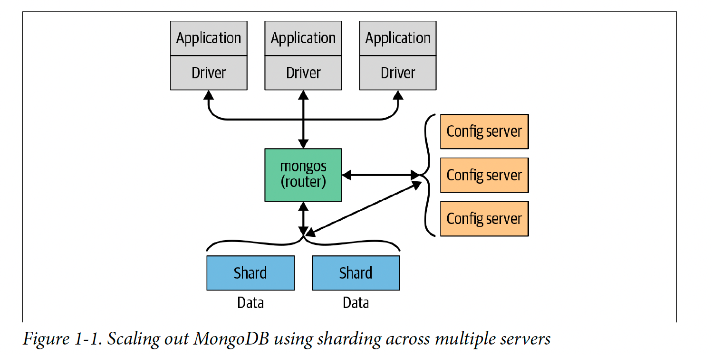

= MongoDB notes
:sectnums:
:toc: left
:toclevels: 5
:icons: font
:source-highlighter: coderay

== Introduction

MongoDB is a powerful, flexible, and scalable general-purpose database.
It combines the ability to scale out with features such as secondary indexes, range queries, sorting, aggregations, and geospatial indexes.

MongoDB is a document-oriented database, not a relational one.

A document-oriented database replaces the concept of a “row” with a more flexible model, the “document.” By allowing embedded documents and arrays, the documentoriented approach makes it possible to represent complex hierarchical relationships with a single record.

There are also no predefined schemas: a document’s keys and values are not of fixed types or sizes.
Without a fixed schema, adding or removing fields as needed becomes easier.

=== Designed to Scale

Scaling a database comes down to the choice between scaling up (getting a bigger machine) or scaling out (partitioning data across more machines).

MongoDB was designed to scale out.
The document-oriented data model makes it easier to split data across multiple servers.
MongoDB automatically takes care of balancing data and load across a cluster, redistributing documents automatically and routing reads and writes to the correct machines

The topology of a MongoDB cluster, or whether there is in fact a cluster rather than a single node at the other end of a database connection, is transparent to the application.
This allows developers to focus on programming the application, not scaling it.

=== Features

** *Indexing*
MongoDB supports generic secondary indexes and provides unique, compound, geospatial, and full-text indexing capabilities as well.
Secondary indexes on hierarchical structures such as nested documents and arrays are also supported and enable developers to take full advantage of the ability to model in ways that best suit their applications.
** *Aggregation*
MongoDB provides an aggregation framework based on the concept of data processing pipelines.
Aggregation pipelines allow you to build complex analytics engines by processing data through a series of relatively simple stages on the server side, taking full advantage of database optimizations.
** *Special collection and index types*
MongoDB supports time-to-live (TTL) collections for data that should expire at a certain time, such as sessions and fixed-size (capped) collections, for holding recent data, such as logs.
MongoDB also supports partial indexes limited to only those documents matching a criteria filter in order to increase efficiency and reduce the amount of storage space required.
** *File storage*
MongoDB supports an easy-to-use protocol for storing large files and file metadata.
** *Limited Joins*
MongoDB supports joins in a very limited way through use of the $lookup aggregation operator

== Getting Started

* A *document* is the basic unit of data for MongoDB and is roughly equivalent to a row in a relational database management system (but much more expressive).
* Similarly, a *collection* can be thought of as a table with a dynamic schema.
* A single instance of MongoDB can host multiple independent *databases*, each of which contains its own collections.
* Every document has a special *key*, "_id", that is unique within a collection.
* MongoDB is distributed with a simple but powerful tool called the *mongo shell*.
The mongo shell provides built-in support for administering MongoDB instances and manipulating data using the MongoDB query language.
* It is also a fully functional *JavaScript interpreter* that enables users to create and load their own scripts for a variety of purposes.

=== Documents

Document: an ordered set of keys with associated values.

[source,json]
----
{"greeting" : "Hello, world!", "views" : 3}
----

=== Collections

A collection is a group of documents.
If a document is the MongoDB analog of a row in a relational database, then a collection can be thought of as the analog to a table.

==== Dynamic Schemas

Collections have dynamic schemas.
This means that the documents within a single collection can have any number of different “shapes.” For example, both of the following documents could be stored in a single collection:

[source,json]
----
{"greeting" : "Hello, world!", "views": 3}

{"signoff": "Good night, and good luck"}
----

==== Subcollections

One convention for organizing collections is to use namespaced subcollections separated by the . character.
For example, an application containing a blog might have a collection named blog.posts and a separate collection named blog.authors.
This is for organizational purposes only—there is no relationship between the blog collection (it doesn’t even have to exist) and its “children.”

=== Databases

MongoDB groups collections into databases.
A single instance of MongoDB can host several databases, each grouping together zero or more collections.
A good rule of thumb is to store all data for a single application in the same database.

Historically, prior to the use of the WiredTiger storage engine, database names became files on your filesystem.
It is no longer the case.
This explains why many of the previous restrictions exist in the first place.

There are also some reserved database names, which you can access but which have special semantics.
These are as follows:

** *admin*
The admin database plays a role in authentication and authorization.
In addition, access to this database is required for some administrative operations.
See Chapter 19 for more information about the admin database.
** *local*
This database stores data specific to a single server.
In replica sets, local stores data used in the replication process.
The local database itself is never replicated.
(See Chapter 10 for more information about replication and the local database.)
** *config*
Sharded MongoDB clusters (see Chapter 14) use the config database to store information about each shard.

IMPORTANT: By concatenating a database name with a collection in that database you can get a fully qualified collection name, which is called a namespace.
For instance, if you are using the blog.posts collection in the cms database, the namespace of that collection would be cms.blog.posts.
Namespaces are limited to 120 bytes in length and, in practice, should be fewer than 100 bytes long.

== Getting and Starting MongoDB

=== Start server

[source,shell]
----
docker run --name mongo-lessons \
-p 27017:27017 \
--platform linux/arm64/v8 \
mongo:7.0.9

docker start mongo-lessons
----

=== Execute commands

[source,shell]
----
docker exec -it mongo-lessons mongosh
----

=== JavaScript interpreter

[source,shell]
----
> x = 200;
200
> x / 5;
40

> Math.sin(Math.PI / 2);
1
> new Date("20109/1/1");
ISODate("2019-01-01T05:00:00Z")
> "Hello, World!".replace("World", "MongoDB");
Hello, MongoDB!

> function factorial (n) {
... if (n <= 1) return 1;
... return n * factorial(n - 1);
... }
> factorial(5);
120
----

== Basic Commands

To see the database to which db is currently assigned

[source,shell]
----
db
----

Select which database to use

[source,shell]
----
use video
----

=== Create

[source,shell]
----
movie = {"title" : "Star Wars: Episode IV - A New Hope",
  "director" : "George Lucas",
  "year" : 1977}

db.movies.insertOne(movie)
----

=== Read

[source,shell]
----
db.movies.findOne()
----

=== Update

[source,shell]
----
db.movies.updateOne({title : "Star Wars: Episode IV - A New Hope"}, {$set : {reviews: []}})
----

=== Delete

[source,shell]
----
db.movies.deleteOne({title : "Star Wars: Episode IV - A New Hope"})
----

Use deleteMany to delete all documents matching a filter

== Data Types

=== Common data types

==== Null

The null type can be used to represent both a null value and a nonexistent field:

{"x" : null}

==== Boolean

There is a boolean type, which can be used for the values true and false:

{"x" : true}

==== Number

The shell defaults to using 64-bit floating-point numbers.
Thus, these numbers both look “normal” in the shell:

{"x" : 3.14}
{"x" : 3}

For integers, use the NumberInt or NumberLong classes, which represent 4-byte or 8-byte signed integers, respectively.

{"x" : NumberInt("3")}
{"x" : NumberLong("3")}

==== String

Any string of UTF-8 characters can be represented using the string type:

{"x" : "foobar"}

==== Date

MongoDB stores dates as 64-bit integers representing milliseconds since the Unix epoch (January 1, 1970).
The time zone is not stored:

{"x" : new Date()}

==== Regular expression

Queries can use regular expressions using JavaScript’s regular expression syntax:

{"x" : /foobar/i}

==== Array

Sets or lists of values can be represented as arrays:

{"x" : ["a", "b", "c"]}

==== Embedded document

Documents can contain entire documents embedded as values in a parent document:

{"x" : {"foo" : "bar"}}

==== Object ID

An object ID is a 12-byte ID for documents:

{"x" : ObjectId()}

See the section “_id and ObjectIds” on page 20 for details.

==== Binary data

Binary data is a string of arbitrary bytes.
It cannot be manipulated from the shell.
Binary data is the only way to save non-UTF-8 strings to the database.

==== Code

MongoDB also makes it possible to store arbitrary JavaScript in queries and documents:

{"x" : function() { /* ... */ }}

