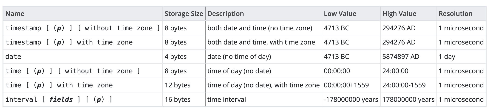

= PostgreSQL notes
:sectnums:
:toc: left
:toclevels: 5
:icons: font
:source-highlighter: coderay

== Introduction

*DDL* - SQL schema statements, which are used to define the data structures stored in the database

*DML* - SQL data statements, which are used to manipulate the data structures previously defined using SQL schema statements

*TCL* - SQL transaction statements, which are used to begin, end, and roll back transactions

== Database Objects

** *Databases*
** *Schemas*
** *Tables*
** *Views*
** *Extension*
Extensions allow developers to package functions, data types, casts, custom index types, tables, attribute variables, etc., for installation or removal as a unit.
** *Functions.*
You can program your own custom functions to handle data manipulation, perform complex calculations, or wrap similar functionality.
** *Languages.*
Create functions using a PL.
PostgreSQL installs three by default: SQL, PL/pgSQL, and C.
** *Operators.*
Operators are nothing more than symbolically named aliases such as = or && for functions.
In PostgreSQL, you can invent your own.
This is often the case when you create custom data types.
** *Foreign tables and foreign data wrappers.*
Foreign tables are virtual tables linked to data outside a PostgreSQL database.
Once you’ve configured the link, you can query them like any other tables.
Foreign tables can link to CSV files, a PostgreSQL table on another server, a table in a different product such as SQL Server or Oracle, a NoSQL database such as Redis, or even a web service such as Twitter or Salesforce.
** *Catalogs.*
Catalogs are system schemas that store PostgreSQL builtin functions and metadata.
Every database contains two catalogs: pg_catalog, which holds all functions, tables, system views, casts, and types packaged with PostgreSQL; and information_schema, which offers views exposing metadata in a format dictated by the ANSI SQL standard.
** *Types.*
Type is short for data type.
** *Full text search.*
** *Casts.*
Casts prescribe how to convert from one data type to another.
They are backed by functions that actually perform the conversion.
In PostgreSQL, you can create your own casts and override or enhance the default casting behavior.
** *Sequences.*
A sequence controls the autoincrementation of a serial data type.
PostgresSQL automatically creates sequences when you define a serial column, but you can easily change the initial value, step, and next available value.
** *Rules.*
Rules are instructions to rewrite an SQL prior to execution.
Triggers can accomplish the same things.

== Database administration

=== Configuration Files

Three main configuration files control operations of a PostgreSQL server:

** *postgresql.conf* Controls general settings, such as memory allocation, default storage location for new databases, the IP addresses that PostgreSQL listens on, location of logs, and plenty more.
** *pg_hba.conf* Controls access to the server, dictating which users can log in to which databases, which IP addresses can connect, and which authentication scheme to accept.
** *pg_ident.conf* If present, this file maps an authenticated OS login to a PostgreSQL user.
People sometimes map the OS root account to the PostgresSQL superuser account, postgres.

==== Checking postgresql.conf settings

Using full query

[source,sql]
----
SELECT
    name,
    context ,
    unit ,
    setting, boot_val, reset_val
FROM pg_settings
WHERE name IN ('listen_addresses','deadlock_timeout','shared_buffers',
    'effective_cache_size','work_mem','maintenance_work_mem')
ORDER BY context, name;
----

----
name | context | unit | setting | boot_val | reset_val
---------------------+------------+------+-------- +-----------+----------
listen_addresses | postmaster | | * | localhost | *
shared_buffers | postmaster | 8kB | 131584 | 1024 | 131584
deadlock_timeout | superuser | ms | 1000 | 1000 | 1000
effective_cache_size | user | 8kB | 16384 | 16384 | 16384
maintenance_work_mem | user | kB | 16384 | 16384 | 16384
work_mem | user | kB | 5120 | 1024 | 5120
----

Or short query

[source,sql]
----
SHOW shared_buffers;
SHOW deadlock_timeout;
----

==== Changing the postgresql.conf settings

PostgreSQL 9.4 introduced the ability to change settings using the ALTER SYSTEM SQL command.
For example, to set the work_mem globally, enter the following:

[source,sql]
----
ALTER SYSTEM SET work_mem = '500MB';
----

This command is wise enough to not directly edit postgres.conf but will make the change in postgres.auto.conf.
Depending on the particular setting changed, you may need to restart the service.
If you just need to reload it, here’s a convenient command:

[source,sql]
----
SELECT pg_reload_conf();
----

[IMPORTANT]
.I edited my postgresql.conf and now my server won’t start
====
The easiest way to figure out what you screwed up is to look at the logfile, located at the root of the data folder, or in the pg_log subfolder.
Open the latest file and read what the last line says.
The error raised is usually self-explanatory.
====

=== Managing Connections

==== Cancelling the query

[source,sql]
----
-- this query returns pid
SELECT pid, usename FROM pg_stat_activity;
SELECT pg_cancel_backend(1234);
SELECT pg_terminate_backend(1234);

-- or terminate in a query
SELECT pg_terminate_backend(pid) FROM pg_stat_activity
WHERE usename = 'postgres_tutorial';
----

==== Check for Queries Being Blocked

Use pg_stat_activity view.
Prior to PostgreSQL 9.6, use waiting = true to determine what queries are being blocked.
In PostgreSQL 9.6 or higher, use wait_event IS NOT NULL.

[source,sql]
----
SELECT pid, usename, wait_event, wait_event_type FROM pg_stat_activity
WHERE wait_event IS NOT NULL;
----

=== Roles

PostgreSQL handles credentialing using roles.
Roles that can log in are called login roles.
Roles can also be members of other roles; the roles that contain other roles are called group roles.
(And yes, group roles can be members of other group roles and so on, but don’t go there unless you have a knack for hierarchical thinking.) Group roles that can log in are called group login roles.
However, for security, group roles generally cannot log in.
A role can be designated as a superuser.

IMPORTANT: Recent versions of PostgreSQL no longer use the terms users and groups.
You will still run into these terms; just know that they mean login roles and group roles, respectively.
For backward compatibility, CREATE USER and CREATE GROUP still work in current versions, but shun them and use CREATE ROLE instead.

==== Creating Login Roles

[source,sql]
----
CREATE ROLE leo LOGIN PASSWORD 'king' VALID UNTIL 'infinity' CREATEDB;
----

Specifying VALID UNTIL is optional.
If omitted, the role remains active indefinitely.
CREATEDB grants database creation privilege to the new role.

==== Creating Superuser Roles

[source,sql]
----
CREATE ROLE regina LOGIN PASSWORD 'queen' VALID UNTIL '2025-1-1 00:00' SUPERUSER;
----

==== Creating Group Roles

[source,sql]
----
CREATE ROLE royalty INHERIT;

GRANT royalty TO leo;
GRANT royalty TO regina;
----

Note the use of the modifier INHERIT.
This means that any member of royalty will automatically inherit privileges of the royalty role, except for the superuser privilege.
For security, PostgreSQL never passes down the superuser privilege.
INHERIT is the default, but we recommend that you always include the modifier for clarity.

=== Database Creation

[IMPORTANT]
.Template database
====
A template database is, as the name suggests, a database that serves as a skeleton for new databases.
When you create a new database, PostgreSQL copies all the database settings and data from the template database to the new database.
The default PostgreSQL installation comes with two template databases: `template0 and template1`.
If you don’t specify a template database to follow when you create a database, `template1` is used.
====

[source,sql]
----
CREATE DATABASE mydb;

-- or with link to the role
CREATE DATABASE mydb WITH owner = mydb_admin;

-- or from custom template
CREATE DATABASE my_db TEMPLATE my_template_db;
----

==== Using Schemas

[source,sql]
----
CREATE SCHEMA customer1;

CREATE SCHEMA customer1 authorization customer1;
----

IMPORTANT: Role uses SCHEMA with the same name by default.
If such schema not found it uses public schema.
`search_path = "$user", public;`

=== Privileges

PostgreSQL has a few dozen privileges, some of which you may never need to worry about.
The more mundane privileges are SELECT, INSERT, UPDATE, ALTER, EXECUTE, DELETE, and TRUNCATE.

Most privileges must have a context.
For example, a role having an ALTER privilege is meaningless unless qualified with a database object such as ALTER privilege on tables1, SELECT privilege on table2, EXECUTE privilege on function1, and so on.
Not all privileges apply to all objects: an EXECUTE privilege for a table is nonsense.

Some privileges make sense without a context.
CREATEDB and CREATE ROLE are two privileges where context is irrelevant.

==== GRANT

[source,sql]
----
-- template for GRANT
GRANT some_privilege TO some_role;

-- grant specific privileges on ALL objects of a specific type use ALL instead of the specific object name
GRANT SELECT, REFERENCES, TRIGGER ON ALL TABLES IN SCHEMA my_schema TO PUBLIC;

-- granting privileges, you can add WITH GRANT OPTION. This means that the grantee can grant her own privileges to others
GRANT ALL ON ALL TABLES IN SCHEMA public TO mydb_admin WITH GRANT OPTION;
---
----

=== Backup and Restore

PostgreSQL ships with three utilities for backup: pg_dump, pg_dumpall, and pg_basebackup.
You’ll find all of them in the PostgreSQL bin folder.

Use pg_dump to back up specific databases.
To back up all databases in plain text along with server globals, use pg_dumpall, which needs to run under a superuser account so that it back up all databases.
Use pg_basebackup to do system-level disk backup of all databases.

pg_basebackup is the most efficient way of doing a full postgresql server cluster backup.
If you have a reasonably sized database, as in 500 GB or more, you should be using pg_basebackup as part of your backup strategy.

=== Tablespaces

PostgreSQL uses tablespaces to ascribe logical names to physical locations on disk.
Initializing a PostgreSQL cluster automatically begets two tablespaces: pg_default, which stores all user data, and pg_global, which stores all system data.
These are located in the same folder as your default data cluster.
You’re free to create tablespaces at will and house them on any serverdisks.
You can explicitly assign default tablespaces for new objects by database.
You can also move existing database objects to new ones.

[source,sql]
----
CREATE TABLESPACE secondary LOCATION '/usr/data/pgdata94_secondary';

-- use
ALTER DATABASE mydb SET TABLESPACE secondary;
ALTER TABLE mytable SET TABLESPACE secondary;

-- move
ALTER TABLESPACE pg_default MOVE ALL TO secondary;
----

=== Metadata

information_schema

[source,sql]
----
SELECT table_name, table_type
    FROM information_schema.tables
    WHERE table_schema = 'example'
    ORDER BY 1;

-- or other tables (information_schema.views, ...)
----

== Data Types

https://www.postgresql.org/docs/current/datatype.html

PostgreSQL supports the workhorse data types of any database: numerics, strings, dates, times, and booleans.
But PostgreSQL sprints ahead by adding support for arrays, time zone−aware datetimes, time intervals, ranges, JSON, XML, and many more.
If that’s not enough, you can invent custom types.

=== Character Types

The n is a positive integer.
An attempt to store a longer string into a column of these types will result in an error.
If the string to be stored is shorter than the declared length, values of type character will be space-padded; values of type character varying will simply store the shorter string.

IMPORTANT: If specified, the length n must be between zero and 10,485,760.
If varchar is used without length specifier, the type accepts strings of any length.
If bpchar lacks a length specifier, it also accepts strings of any length, but trailing spaces are semantically insignificant.
If char lacks a specifier, it is equivalent to character(1).

=== Numeric Types

==== Integer types

The type `integer` is the common choice, as it offers the best balance between range, storage size, and performance.
The `smallint` type is generally only used if disk space is at a premium.
The `bigint` type is designed to be used when the range of the `integer` type is insufficient.

==== Arbitrary Precision Numbers

----
NUMERIC(precision, scale)
NUMERIC(precision) - selects a scale of 0
NUMERIC - without any precision or scale creates an “unconstrained numeric” column in which numeric values of any length can be stored, up to the implementation limits
----

The type numeric can store numbers with a very large number of digits.
It is especially recommended for storing monetary amounts and other quantities where exactness is required.
Calculations with numeric values yield exact results where possible, e.g., addition, subtraction, multiplication.
However, calculations on numeric values are very slow compared to the integer types, or to the floating-point types described in the next section.

=== Binary Data Types

The bytea data type allows storage of binary strings

A binary string is a sequence of octets (or bytes).
Binary strings are distinguished from character strings in two ways.
First, binary strings specifically allow storing octets of value zero and other “non-printable” octets (usually, octets outside the decimal range 32 to 126).

=== Date/Time Types

time, timestamp, and interval accept an optional precision value p which specifies the number of fractional digits retained in the seconds field.
By default, there is no explicit bound on precision.
The allowed range of p is from 0 to 6.

`https://www.postgresql.org/docs/current/datatype-datetime.html`

=== Boolean Type

PostgreSQL provides the standard SQL type boolean; see Table 8.19. The boolean type can have several states: “true”, “false”, and a third state, “unknown”, which is represented by the SQL null value.

Boolean constants can be represented in SQL queries by the SQL key words TRUE, FALSE, and NULL.

The datatype input function for type boolean accepts these string representations for the “true” state:

* true
* yes
* on
* 1

and these representations for the “false” state:

* false
* no
* off
* 0

=== Enumerated Types

Enumerated (enum) types are data types that comprise a static, ordered set of values.
They are equivalent to the enum types supported in a number of programming languages.
An example of an enum type might be the days of the week, or a set of status values for a piece of data.

[source,sql]
----
CREATE TYPE mood AS ENUM ('sad', 'ok', 'happy');
CREATE TABLE person (
    name text,
    current_mood mood
);
INSERT INTO person VALUES ('Moe', 'happy');
SELECT * FROM person WHERE current_mood = 'happy';

-- result
 name | current_mood
------+--------------
 Moe  | happy
(1 row)
----

=== JSON

[source,sql]
----
CREATE TABLE persons (id serial PRIMARY KEY, person json);

INSERT INTO persons (person)
VALUES (
'{
  "name": "Sonia",
  "spouse": {
    "name": "Alex",
    "parents": {
      "father": "Rafael",
      "mother": "Ofelia"
    },
    "phones": [
      {
        "type": "work",
        "number": "619-722-6719"
      },
      {
        "type": "cell",
        "number": "619-852-5083"
      }
    ]
  },
  "children": [
    {
      "name": "Brandon",
      "gender": "M"
    },
    {
      "name": "Azaleah",
      "girl": true,
      "phones": []
    }
  ]
}'
);

-- select
SELECT person->'name' FROM persons;
SELECT person->'spouse'->'parents'->'father' FROM persons;
SELECT person->'children'->0->'name' FROM persons;

-- or select path array
SELECT person#>array['spouse','parents','father'] FROM persons;

-- or return text representation
SELECT person->'spouse'->'parents'->>'father' FROM persons;
SELECT person#>>array['children','0','name'] FROM persons;
----

=== Full Text Search (FTS)

At the core of FTS is an FTS configuration.
The configuration codifies the rules under which match will occur by referring to one or more dictionaries.
For instance, if your dictionary contains entries that equate the words love, romance, infatuation, lust, then any search by one of the words will find matches with any of the words.

[source,sql]
----
SELECT cfgname FROM pg_ts_config;

cfgname
----------
simple
danish
dutch
english
finnish
french
german
hungarian
italian
norwegian
portuguese
romanian
russian
spanish
swedish
turkish
(16 rows)
----

Create gin index.
It is required for FTS

[source,sql]
----
CREATE INDEX ix_film_fts_gin ON film USING gin (fts);
----

==== Advanced concepts

* TSVectors
* TSQueries
* Ranking Results
* Full Text Stripping

=== Custom and Composite Data Types

[source,sql]
----
CREATE TYPE complex_number AS (r double precision, i double precision);
CREATE TABLE circuits (circuit_id serial PRIMARY KEY, ac_volt complex_number);

-- use one of this options
SELECT circuit_id, (ac_volt).* FROM circuits;
SELECT circuit_id, (ac_volt).r, (ac_volt).i FROM circuits;
----

== Tables, Constraints, and Indexes

=== Tables

In addition to ordinary data tables, PostgreSQL offers several kinds of tables that are rather uncommon: temporary, unlogged, inherited, typed, and foreign

[source,sql]
----
CREATE TABLE logs (
    log_id serial PRIMARY KEY,
    user_name varchar(50),
    description text,
    log_ts timestamp with time zone NOT NULL DEFAULT current_timestamp
);

CREATE INDEX idx_logs_log_ts ON logs USING btree (log_ts);
----

==== Inherited Tables

PostgreSQL stands alone as the only database product offering inherited tables.
When you specify that a table (the child table) inherits from another table (the parent table), PostgreSQL creates the child table with its own columns plus all the columns of the parent table.
PostgreSQL will remember this parent-child relationship so that any subsequent structural changes to the parent automatically propagate to its children.
Parent-child table design is perfect for partitioning your data.
When you query the parent table, PostgreSQL automatically includes all rows in the child tables.

[source,sql]
----
CREATE TABLE logs_2011 (PRIMARY KEY (log_id)) INHERITS (logs);

CREATE INDEX idx_logs_2011_log_ts ON logs_2011 USING btree(log_ts);
ALTER TABLE logs_2011
ADD CONSTRAINT chk_y2011
CHECK (
log_ts >= '2011-1-1'::timestamptz AND log_ts < '2012-1-1'::timestamptz
);
----

==== Partitioned Tables

[source,sql]
----
CREATE TABLE logs (
log_id int GENERATED BY DEFAULT AS IDENTITY,
user_name varchar(50),
description text,
log_ts timestamp with time zone NOT NULL DEFAULT current_timestamp
) PARTITION BY RANGE (log_ts);

-- Create a child partition
CREATE TABLE logs_2011 PARTITION OF logs
FOR VALUES FROM ('2011-1-1') TO ('2012-1-1') ;
CREATE INDEX idx_logs_2011_log_ts ON logs_2011 USING btree(log_ts);
ALTER TABLE logs_2011 ADD CONSTRAINT pk_logs_2011 PRIMARY KEY (log_id) ;
----

==== Unlogged Tables

For ephemeral data that could be rebuilt in the event of a disk failure or doesn’t need to be restored after a crash, you might prefer having more speed than redundancy.
These tables will not be part of any write-ahead logs.
Writing data to it is much faster than to a logged table—10−15 times faster.

After server reloading, the rollback process will wipe clean all data in unlogged tables.
Its data won’t be able to participate in PostgreSQL replication.

[source,sql]
----
CREATE UNLOGGED TABLE web_sessions (
    session_id text PRIMARY KEY,
    add_ts timestamptz,
    upd_ts timestamptz,
    session_state xml);
----

=== Constraints

==== Foreign Key Constraints

[source,sql]
----
ALTER TABLE facts ADD CONSTRAINT fk_facts_1 FOREIGN KEY (fact_type_id)
REFERENCES lu_fact_types (fact_type_id) ON UPDATE CASCADE ON DELETE RESTRICT;

-- Unlike for primary key and unique constraints, PostgreSQL doesn’t automatically create an
-- index for foreign key constraints
CREATE INDEX fki_facts_1 ON facts (fact_type_id);
----

==== Unique Constraints

[source,sql]
----
ALTER TABLE logs_2011 ADD CONSTRAINT uq UNIQUE (user_name,log_ts);
----

==== Check Constraints

[source,sql]
----
-- requires all usernames in the logs tables to be lowercase
ALTER TABLE logs ADD CONSTRAINT chk CHECK (user_name = lower(user_name));
----

=== Indexes

** *B-Tree*
B-Tree is a general-purpose index common in relational databases.
You can usually get by with B-Tree alone if you don’t want to experiment with additional index types.
If PostgreSQL automatically creates an index, B-Tree will be chosen.
It is currently the only indexing method for primary keys and unique keys.

** *BRIN*
Block range index (BRIN) is an index type introduced in PostgreSQL 9.4.
It’s designed specifically for very large tables where using an index such as B-Tree would take up too much space and not fit in memory.
The approach of BRIN is to treat a range of pages as one unit.
BRIN indexes are much smaller than B-Tree and other indexes and faster to build.
But they are slower to use and can’t be used for primary keys or certain other situations.

** *GiST*
Generalized Search Tree (GiST) is an index optimized for FTS, spatial data, scientific data, unstructured data, and hierarchical data.
Although you can’t use it to enforce uniqueness, you can create the same effect by using it in an exclusion constraint.
GiST is a lossy index, in the sense that the index itself will not store the value of what it’s indexing, but merely a bounding value such as a box for a polygon.

** *GIN*
Generalized Inverted Index (GIN) is geared toward the built-in full text search and binary json data type of PostgreSQL.
Many other extensions, such as hstore and pg_trgm, also utilize it.
GIN is a descendent of GiST but without the lossiness.
GIN will clone the values in the columns that are part of the index.
If you ever need a query limited to covered columns, GIN is faster than GiST.
However, the extra replication required by GIN means the index is larger and updating the index is slower than a comparable GiST index.
Also, because each index row is limited to a certain size, you can’t use GIN to index large objects such as large hstore documents or text.
If there is a possibility you’ll be inserting a 600- page manual into a field of a table, don’t use GIN to index that column.
You can find a wonderful example of GIN in Waiting for Faster LIKE/ILIKE.
As of version 9.3, you can index regular expressions that leverage the GIN-based pg_trgm extension.

** *SP-GiST*
Space-Partitioned Generalized Search Tree (SP-GiST) can be used in the same situations as GiST but can be faster for certain kinds of data distribution.
PostgreSQL’s native geometric data types, such as point and box, and the text data type, were the first to support SP-GiST.
In version 9.3, support extended to range types.

** *hash*
Hash indexes were popular prior to the advent of GiST and GIN.
General consensus rates GiST and GIN above hash in terms of both performance and transaction safety.
The writeahead log prior to PostgreSQL 10 did not track hash indexes; therefore, you couldn’t use them in streaming replication setups.
Although hash indexes were relegated to legacy status for some time, they got some love in PostgreSQL 10. In that version, they gained transactional safety and some performance improvements that made them more efficient than B-Tree in some cases.

** *B-Tree-GiST/B-Tree-GIN*
If you want to explore indexes beyond what PostgreSQL installs by default, either out of need or curiosity, start with the composite B-Tree-GiST or B-Tree-GIN indexes, both available as extensions and included with most PostgreSQL distributions.
These hybrids support the specialized operators of GiST or GIN, but also offer indexability of the equality operator like B-Tree indexes.
You’ll find them indispensable when you want to create a compound index comprised of multiple columns containing both simple and complex types.
For example, you can have a compound index that consists of a column of plain text and a column of full text.
Normally complex types such as full-text, ltree, geometric, and spatial types can use only GIN or GiST indexes, and thus can never be combined with simpler types that can only use B-Tree.
These combo methods allow you to combine columns indexed with GIST with columns indexed with B-Tree in a single index.

Although not packaged with PostgreSQL, other indexes can be found in extensions for PostgreSQL.
Most popular others are the VODKA and RUM (a variant based on GIN) index method types, which will work with PostgreSQL 9.6 and up.
RUM is most suited for work with complex types such as full-text and is required if you need index support for full-text phrase searches.
It also offers additional distance operators.

[source,sql]
----
CREATE INDEX idx2 ON census.lu_tracts USING btree (tract_name);

-- multicolumn
CREATE INDEX idx ON subscribers USING btree (type, upper(name) varchar_pattern_ops);
----

IMPORTANT: If you have a multicolumn B-Tree index on type and upper(name), there is no need for an index on just type, because the planner can still use the compound index for cases in which you just need to filter by type.
Although the planner can use the index even if the columns you are querying are not the first in the index, querying by the first column in an index is much more efficient than querying by just secondary columns.

== Views

=== Single table views

[source,sql]
----
CREATE OR REPLACE VIEW census.vw_facts_2011 AS
SELECT fact_type_id, val, yr, tract_id FROM census.facts WHERE yr = 2011;

-- Single table view WITH CHECK OPTION
CREATE OR REPLACE VIEW census.vw_facts_2011 AS
SELECT fact_type_id, val, yr, tract_id FROM census.facts
WHERE yr = 2011 WITH CHECK OPTION;

-- ERROR: New row violates WITH CHECK OPTION for view "vw_facts_2011"
UPDATE census.vw_facts_2011 SET yr = 2012 WHERE val > 2942;
----

As of version 9.3, you can alter the data in this view by using INSERT, UPDATE, or DELETE commands.

=== Materialized Views

[source,sql]
----
CREATE MATERIALIZED VIEW census.vw_facts_2011_materialized AS
SELECT fact_type_id, val, yr, tract_id FROM census.facts WHERE yr = 2011;

-- indexes could be created
CREATE UNIQUE INDEX ix
ON census.vw_facts_2011_materialized (tract_id, fact_type_id, yr);

-- refresh
REFRESH MATERIALIZED VIEW census.vw_facts_2011_materialized;

-- concurrent refresh
REFRESH MATERIALIZED VIEW CONCURRENTLY census.vw_facts_2011_materialized;
----

IMPORTANT: You need to run REFRESH MATERIALIZED VIEW to rebuild the cache.
PostgreSQL doesn’t perform automatic recaching of any kind.
You need to resort to mechanisms such as crontab, pgAgent jobs, or triggers to automate any kind of refresh.

== Select

=== Filtering

[source,sql]
----
-- two conditions with AND
WHERE first_name = 'STEVEN' AND create_date > '2006-01-01'

-- any of two
WHERE first_name = 'STEVEN' OR create_date > '2006-01-01'

-- using parentheses (parentheses haas higher priority)
WHERE (first_name = 'STEVEN' OR last_name = 'YOUNG')
AND create_date > '2006-01-01'

-- not Operator
WHERE NOT (first_name = 'STEVEN' AND last_name = 'YOUNG')
AND create_date > '2006-01-01'

-- better not approach
WHERE (first_name <> 'STEVEN' OR last_name <> 'YOUNG')
AND create_date > '2006-01-01'
----

// TODO: find English version

==== Condition Types

* *Equality Conditions* =
* *Inequality conditions* <> OR !=
* *Range Conditions* WHERE rental_date <= '2005-06-16'AND rental_date >= '2005-06-14'
* *The between operator* WHERE rental_date BETWEEN '2005-06-14' AND '2005-06-16'
* *Membership Conditions* WHERE rating IN ('G','PG')
* *Using subqueries* WHERE rating IN (SELECT rating FROM film WHERE title LIKE '%PET%')
* *Using not in* WHERE rating NOT IN ('PG-13','R', 'NC-17')

==== Matching Conditions

Using wildcards `WHERE last_name LIKE '_A_T%S';`

* _ Exactly one character
* % Any number of characters (including 0)

Using regular expressions `WHERE last_name REGEXP '^[QY]';`

==== NULL

[source,sql]
----
WHERE return_date IS NULL;

WHERE return_date IS NOT NULL;
----

=== Group by

[source,sql]
----
SELECT customer_id, count(*)
 FROM rental
 GROUP BY customer_id
 HAVING count(*) >= 40
 ORDER BY 2 DESC;
----

IMPORTANT: the group by clause runs after the where clause has been evaluated, you cannot add filter conditions to your where clause for this purpose.
Use HAVING closure.

Multicolumn Grouping

[source,sql]
----
SELECT fa.actor_id, f.rating, count(*)
  FROM film_actor fa
  INNER JOIN film f
  ON fa.film_id = f.film_id
  GROUP BY fa.actor_id, f.rating
  ORDER BY 1,2;
----

Grouping via Expressions

[source,sql]
----
SELECT extract(YEAR FROM rental_date) year,
  COUNT(*) how_many
  FROM rental
  GROUP BY extract(YEAR FROM rental_date);
----

==== Aggregate Functions

* **max()**
Returns the maximum value within a set
* **min()**
Returns the minimum value within a set
* **avg()**
Returns the average value across a set
* **sum()**
Returns the sum of the values across a set
* **count()**
Returns the number of values in a set.
Can be used without aggregation.
Has options `COUNT(DISTINCT city)`

==== Using Expressions

====
*COUNT(DISTINCT customer_id)* - counts only the number of unique values

**MAX(datediff(return_date,rental_date))** - datediff function is used to compute the number of days between the return date and the rental date for every rental, and the max function returns the highest value
====

==== ROLLUP

The ROLLUP is an extension of the GROUP BY clause.
The ROLLUP option allows you to include extra rows that represent the subtotals, which are commonly referred to as super-aggregate rows, along with the grand total row.
By using the ROLLUP option, you can use a single query to generate multiple grouping sets.

[source,sql]
----
SELECT
    warehouse, product, SUM(quantity)
FROM
    inventory
GROUP BY ROLLUP (warehouse , product);
----

=== Window Functions (Data Windows)

A window function performs a calculation across a set of table rows that are somehow related to the current row.

[source,sql]
----
SELECT depname, empno, salary,
       avg(salary) OVER (PARTITION BY depname)
FROM empsalary;

-- depname  | empno | salary |          avg
-- -----------+-------+--------+-----------------------
--  develop   |    11 |   5200 | 5020.0000000000000000
--  develop   |     7 |   4200 | 5020.0000000000000000
--  develop   |     9 |   4500 | 5020.0000000000000000
--  develop   |     8 |   6000 | 5020.0000000000000000
--  develop   |    10 |   5200 | 5020.0000000000000000
--  personnel |     5 |   3500 | 3700.0000000000000000
--  personnel |     2 |   3900 | 3700.0000000000000000
--  sales     |     3 |   4800 | 4866.6666666666666667
--  sales     |     1 |   5000 | 4866.6666666666666667
--  sales     |     4 |   4800 | 4866.6666666666666667
-- (10 rows)
----

You can also control the order in which rows are processed by window functions using ORDER BY within OVER.
As shown here, the rank function produces a numerical rank for each distinct ORDER BY value in the current row's partition, using the order defined by the ORDER BY clause. rank needs no explicit parameter, because its behavior is entirely determined by the OVER clause.

[source,sql]
----
SELECT depname, empno, salary,
       rank() OVER (PARTITION BY depname ORDER BY salary DESC)
FROM empsalary;

--   depname  | empno | salary | rank
-- -----------+-------+--------+------
--  develop   |     8 |   6000 |    1
--  develop   |    10 |   5200 |    2
--  develop   |    11 |   5200 |    2
--  develop   |     9 |   4500 |    4
--  develop   |     7 |   4200 |    5
--  personnel |     2 |   3900 |    1
--  personnel |     5 |   3500 |    2
--  sales     |     1 |   5000 |    1
--  sales     |     4 |   4800 |    2
--  sales     |     3 |   4800 |    2
-- (10 rows)
----

When ORDER BY is omitted the default frame consists of all rows in the partition.

[source,sql]
----
SELECT salary, sum(salary) OVER () FROM empsalary;

--  salary |  sum
-- --------+-------
--    5200 | 47100
--    5000 | 47100
--    3500 | 47100
--    4800 | 47100
--    3900 | 47100
--    4200 | 47100
--    4500 | 47100
--    4800 | 47100
--    6000 | 47100
--    5200 | 47100
-- (10 rows)
----

=== Subqueries

A subquery is a query contained within another SQL statement (which I refer to as the containing statement for the rest of this discussion).
A subquery is always enclosed within parentheses, and it is usually executed prior to the containing statement.
Like any query, a subquery returns a result set that may consist of:

* A single row with a single column
* Multiple rows with a single column
* Multiple rows having multiple columns

[source,sql]
----
-- get last customer
SELECT customer_id, first_name, last_name
    FROM customer
    WHERE customer_id = (SELECT MAX(customer_id) FROM customer);
----

==== Subquery Expressions

https://www.postgresql.org/docs/current/functions-subquery.html

=== Handy Constructions

Not represented in all other SQL dialects.

==== DISTINCT ON

It behaves like DISTINCT, but with two enhancements:
you can specify which columns to consider as distinct and to sort the remaining columns.

[source,sql]
----
SELECT DISTINCT ON (left(tract_id, 5)) left(tract_id, 5) As county, tract_id, tract_name
FROM census.lu_tracts
ORDER BY county, tract_id;

county | tract_id | tract_name
-------+-------------+---------------------------------------------------
25001 | 25001010100 | Census Tract 101, Barnstable County, Massachusetts
25003 | 25003900100 | Census Tract 9001, Berkshire County, Massachusetts
25005 | 25005600100 | Census Tract 6001, Bristol County, Massachusetts
25007 | 25007200100 | Census Tract 2001, Dukes County, Massachusetts
25009 | 25009201100 | Census Tract 2011, Essex County, Massachusetts
:
(14 rows)
----

==== LIMIT and OFFSET

LIMIT returns only the number of rows indicated; OFFSET indicates the number of rows to skip.
You can use them in tandem or separately.
You almost always use them in conjunction with an ORDER BY.

[source,sql]
----
SELECT DISTINCT ON (left(tract_id, 5)) left(tract_id, 5) As county, tract_id, tract_name
FROM census.lu_tracts
ORDER BY county, tract_id LIMIT 3 OFFSET 2;

county | tract_id | tract_name
-------+-------------+-------------------------------------------------
25005 | 25005600100 | Census Tract 6001, Bristol County, Massachusetts
25007 | 25007200100 | Census Tract 2001, Dukes County, Massachusetts
25009 | 25009201100 | Census Tract 2011, Essex County, Massachusetts
(3 rows)
----

==== Shorthand Casting

ANSI SQL defines a construct called CAST that allows you to morph one data type to another.
For example, CAST('2011-1-11' AS date) casts the text 2011-1-1 to a date.
PostgreSQL has shorthand for doing this, using a pair of colons, as in '2011-1-1'::date.
This syntax is shorter and easier to apply for cases in which you can’t directly cast from one type to another and have to intercede with one or more intermediary types, such as someXML::text::integer.

==== Multirow Insert

[source,sql]
----
INSERT INTO logs_2011 (user_name, description, log_ts)
VALUES
    ('robe', 'logged in', '2011-01-10 10:15 AM EST'),
    ('lhsu', 'logged out', '2011-01-11 10:20 AM EST');
----

==== ILIKE for Case-Insensitive Search

You can apply the upper function to both sides of the ANSI LIKE operator, or you can simply use the ILIKE (~~*) operator

[source,sql]
----
SELECT tract_name FROM census.lu_tracts WHERE tract_name ILIKE '%duke%';

tract_name
------------------------------------------------
Census Tract 2001, Dukes County, Massachusetts
Census Tract 2002, Dukes County, Massachusetts
Census Tract 2003, Dukes County, Massachusetts
Census Tract 2004, Dukes County, Massachusetts
Census Tract 9900, Dukes County, Massachusetts
----

==== ANY Array Search

PostgreSQL has a construct called ANY that can be used in conjunction with arrays, combined with a comparator operator or comparator keyword.
If any element of the array matches a row, that row is returned.

[source,sql]
----
SELECT tract_name
FROM census.lu_tracts
WHERE tract_name ILIKE ANY(ARRAY['%99%duke%','%06%Barnstable%']::text[]);

tract_name
-----------------------------------------------------
Census Tract 102.06, Barnstable County, Massachusetts
Census Tract 103.06, Barnstable County, Massachusetts
Census Tract 106, Barnstable County, Massachusetts
Census Tract 9900, Dukes County, Massachusetts
(4 rows)
----

==== DELETE USING

Often, when you delete data from a table, you’ll want to delete the data based on its presence in another set of data.
Specify this additional set with the USING predicate.
Then, in the WHERE clause, you can use both datasets in the USING and in the FROM to define conditions for deletion.

[source,sql]
----
DELETE FROM census.facts
USING census.lu_fact_types As ft
WHERE facts.fact_type_id = ft.fact_type_id AND ft.short_name = 's01';
----

The standards-compliant way would be to use a clunkier IN expression in the WHERE.

==== Returning Affected Records to the User

The RETURNING predicate is supported by ANSI SQL standards but not commonly found in other relational databases.

==== UPSERTs: INSERT ON CONFLICT UPDATE

New in version 9.5 is the INSERT ON CONFLICT construct, which is often referred to as an UPSERT.
This feature is useful if you don’t know a record already exists in a table and rather than having the insert fail, you want it to either update the existing record or do nothing.

[source,sql]
----
CREATE TABLE colors(color varchar(50) PRIMARY KEY, hex varchar(6));
INSERT INTO colors(color, hex)
    VALUES('blue', '0000FF'), ('red', 'FF0000');

INSERT INTO colors(color, hex)
    VALUES('blue', '0000FF'), ('red', 'FF0000'), ('green', '00FF00')
ON CONFLICT DO NOTHING ;

INSERT INTO colors(color, hex)
    VALUES('Blue', '0000FF'), ('Red', 'FF0000'), ('Green', '00FF00')
ON CONFLICT(lower(color))
    DO UPDATE SET color = EXCLUDED.color, hex = EXCLUDED.hex;

INSERT INTO colors(color, hex)
    VALUES('Blue', '0000FF'), ('Red', 'FF0000'), ('Green', '00FF00')
ON CONFLICT ON CONSTRAINT colors_pkey
    DO UPDATE SET color = EXCLUDED.color, hex = EXCLUDED.hex;;
----

==== Dollar Quoting

[source,sql]
----
-- If you are writing an SQL statement that glues two sentences with many single quotes, the
-- ANSI standard way would be to escape as in the following:
SELECT 'It''s O''Neil''s play. ' || 'It''ll start at two o''clock.';

-- With dollar quoting:
SELECT $$It's O'Neil's play. $$ || $$It'll start at two o'clock.$$;
----

=== Common Table Expressions (WITH)

Essentially, common table expressions (CTEs) allow you to define a query that can be reused in a larger query.
CTEs act as temporary tables defined within the scope of the statement; they’re gone once the enclosing statement has finished executing.

** *Basic CTE*
This is your plain-vanilla CTE, used to make your SQL more readable or to encourage the planner to materialize a costly intermediate result for better performance.
** *Writable CTE*
This is an extension of the basic CTE with UPDATE, INSERT, and DELETE commands.
A common final step in the CTE is to return changed rows.
** *Recursive CTE*
This puts an entirely new whirl on standard CTE.
The rows returned by a recursive CTE vary during the execution of the query.

==== Basic

[source,sql]
----
WITH cte AS (
    SELECT
        tract_id, substring(tract_id,1, 5) As county_code,
        COUNT(*) OVER(PARTITION BY substring(tract_id,1, 5)) As cnt_tracts
    FROM census.lu_tracts
)
SELECT MAX(tract_id) As last_tract, county_code, cnt_tracts
FROM cte
WHERE cnt_tracts > 100
GROUP BY county_code, cnt_tracts;
----

==== Writable

[source,sql]
----
WITH t AS (
    DELETE FROM ONLY logs_2011 WHERE log_ts < '2011-03-01' RETURNING *
)
INSERT INTO logs_2011_01_02 SELECT * FROM t;
----

=== Joins

==== Cartesian Product (Cross Join)

Cartesian product, which is every permutation of the two tables (599 customers x 603 addresses = 361,197 permutations).
This type of join is known as a cross join, and it is rarely used (on purpose, at least)

[source,sql]
----
SELECT c.first_name, c.last_name, a.address
    FROM customer c CROSS JOIN address a;
----

==== Inner Join

[source,sql]
----
SELECT c.first_name, c.last_name, a.address
 FROM customer c JOIN address a
 ON c.address_id = a.address_id;

-- OR
SELECT c.first_name, c.last_name, a.address
 FROM customer c INNER JOIN address a
 ON c.address_id = a.address_id;

-- OR if the property name is the same
SELECT c.first_name, c.last_name, a.address
 FROM customer c INNER JOIN address a
 USING (address_id);
----

==== Left Join
// TODO:

==== Right Join
// TODO:

==== Outer Join
// TODO:

==== Lateral Joins

ATERAL is a new ANSI SQL construction in version 9.3. Here’s the motivation behind it:
suppose you perform joins on two tables or subqueries; normally, the pair participating in the join are independent units and can’t read data from each other.
For example, the following interaction would generate an error because l.yr = 2011 is not a column on the righthand side of the join:

[source,sql]
----
-- ERROR
SELECT *
FROM census.facts L
         INNER JOIN
     (SELECT *
      FROM census.lu_fact_types
      WHERE category = CASE
                           WHEN L.yr = 2011
                               THEN 'Housing'
                           ELSE category END) R
      ON L.fact_type_id = R.fact_type_id;

-- Now add the LATERAL keyword, and the error is gone
SELECT *
FROM census.facts L
         INNER JOIN LATERAL
    (
    SELECT *
    FROM census.lu_fact_types
    WHERE category = CASE
                         WHEN L.yr = 2011
                             THEN 'Housing'
                         ELSE category END) R
    ON L.fact_type_id = R.fact_type_id;
----

LATERAL lets you share data in columns across two tables in a FROM clause.
However, it works only in one direction: the righthand side can draw from the lefthand side, but not vice versa.

=== Set Operators

In general, compound queries containing three or more queries are evaluated in order from top to bottom, but with the following caveats:

* The ANSI SQL specification calls for the `intersect` operator to have precedence over the other set operators.
* You may dictate the order in which queries are combined by enclosing multiple queries in parentheses.

==== Union

[source,sql]
----
SELECT c.first_name, c.last_name
FROM customer c
WHERE c.first_name LIKE 'J%' AND c.last_name LIKE 'D%'
UNION ALL
SELECT a.first_name, a.last_name
FROM actor a
WHERE a.first_name LIKE 'J%' AND a.last_name LIKE 'D%';
----

IMPORTANT: The union and union all operators allow you to combine multiple data sets.
The difference between the two is that union sorts the combined set and removes duplicates, whereas union all does not.
With union all, the number of rows in the final data set will always equal the sum of the number of rows in the sets being combined.

==== Intersect

[source,sql]
----
SELECT c.first_name, c.last_name
FROM customer c
WHERE c.first_name LIKE 'D%' AND c.last_name LIKE 'T%'
INTERSECT
SELECT a.first_name, a.last_name
FROM actor a
WHERE a.first_name LIKE 'D%' AND a.last_name LIKE 'T%';
----

==== Except

[source,sql]
----
SELECT a.first_name, a.last_name
FROM actor a
WHERE a.first_name LIKE 'J%' AND a.last_name LIKE 'D%'
EXCEPT
SELECT c.first_name, c.last_name
FROM customer c
WHERE c.first_name LIKE 'J%' AND c.last_name LIKE 'D%';
----

=== Conditional Logic

==== CASE

[source,sql]
----
CASE expression
    WHEN value THEN result
    [WHEN ...]
    [ELSE result]
END

-- example
SELECT first_name, last_name,
 CASE
  WHEN active = 1 THEN 'ACTIVE'
  ELSE 'INACTIVE'
 END activity_type
 FROM customer;
----

==== COALESCE

The COALESCE function returns the first of its arguments that is not null.
Null is returned only if all arguments are null.
It is often used to substitute a default value for null values when data is retrieved for display, for example:

[source,sql]
----
COALESCE(value [, ...])

-- example
SELECT COALESCE(description, short_description, '(none)') ...
----

==== NULLIF

The NULLIF function returns a null value if value1 equals value2; otherwise it returns value1.

[source,sql]
----
NULLIF(value1, value2)

-- example
SELECT NULLIF(value, '(none)') ...
----

In this example, if value is (none), null is returned, otherwise the value of value is returned.

==== GREATEST and LEAST

The GREATEST and LEAST functions select the largest or smallest value from a list of any number of expressions.

[source,sql]
----
GREATEST(value [, ...])

LEAST(value [, ...])
----

== Transactions

[source,sql]
----
BEGIN;
UPDATE accounts SET balance = balance - 100.00
    WHERE name = 'Alice';
-- etc etc
COMMIT;
----

We can issue the command ROLLBACK instead of COMMIT, and all our updates so far will be canceled.

IMPORTANT: PostgreSQL actually treats every SQL statement as being executed within a transaction.
If you do not issue a BEGIN command, then each individual statement has an implicit BEGIN and (if successful) COMMIT wrapped around it.

It's possible to control the statements in a transaction in a more granular fashion through the use of savepoints.
Savepoints allow you to selectively discard parts of the transaction, while committing the rest.
After defining a savepoint with SAVEPOINT, you can if needed roll back to the savepoint with ROLLBACK TO.
All the transaction's database changes between defining the savepoint and rolling back to it are discarded, but changes earlier than the savepoint are kept.

[source,sql]
----
BEGIN;
UPDATE accounts SET balance = balance - 100.00
    WHERE name = 'Alice';
SAVEPOINT my_savepoint;
UPDATE accounts SET balance = balance + 100.00
    WHERE name = 'Bob';
-- oops ... forget that and use Wally's account
ROLLBACK TO my_savepoint;
UPDATE accounts SET balance = balance + 100.00
    WHERE name = 'Wally';
COMMIT;
----

=== Transaction Isolation

IMPORTANT: Read Committed is the default isolation level in PostgreSQL

==== FOR UPDATE

FOR UPDATE causes the rows retrieved by the SELECT statement to be locked as though for update.
This prevents them from being locked, modified or deleted by other transactions until the current transaction ends.

==== Deadlocks

https://www.postgresql.org/docs/current/explicit-locking.html

== Query Performance Tuning

=== EXPLAIN

* EXPLAIN by itself will just give you an idea of how the planner intends to execute the query without running it.
* Adding the ANALYZE argument, as in EXPLAIN (ANALYZE), will execute the query and give you a comparative analysis of expected versus actual behavior.
* Adding the VERBOSE argument, as in EXPLAIN (VERBOSE), will report the planner’s activities down to the columnar level.
* Adding the BUFFERS argument, which must be used in conjunction with ANALYZE, as in EXPLAIN (ANALYZE, BUFFERS), will report share hits.
The higher this number, the more records were already in memory from prior queries, meaning that the planner did not have to go back to disk to reretrieve them.

An EXPLAIN that provides all details, including timing, output of columns, and buffers, would look like EXPLAIN (ANALYZE, VERBOSE, BUFFERS) your_query_here;.

To see the results of EXPLAIN (ANALYZE) on a data-changing statement such as UPDATE or INSERT without making the actual data change, wrap the statement in a transaction that you abort: place BEGIN before the statement and ROLLBACK after it.

You can use graphical explain with a GUI such as pgAdmin.
After launching pgAdmin, compose your query as usual, but instead of executing it, choose EXPLAIN or EXPLAIN (ANALYZE) from the drop-down menu.

[source,sql]
----
-- Without indexes
EXPLAIN (ANALYZE)
SELECT tract_id, hispanic_or_latino
FROM census.hisp_pop
WHERE tract_id = '25025010103';

-- result
Seq Scan on hisp_pop
    (cost=0.00..33.48 rows=1 width=16)
    (actual time=0.213..0.346 rows=1 loops=1)
    Filter: ((tract_id)::text = '25025010103'::text)
    Rows Removed by Filter: 1477
Planning time: 0.095 ms
Execution time: 0.381 ms
----

* Seq Scan - not indexed
* cost=0.00..33.48 - 0.00, which is the estimated startup cost, and the second number, 33.48, which is the total estimated cost of the step
* Rows Removed by Filter: 1477 shows the number of rows that the planner examined before excluding them from the output.

[source,sql]
----
-- With indexes
EXPLAIN (ANALYZE)
SELECT tract_id, hispanic_or_latino
FROM census.hisp_pop
WHERE tract_id = '25025010103';

-- result
Index Scan using idx_hisp_pop_tract_id_pat on hisp_pop
    (cost=0.28..8.29 rows=1 width=16)
    (actual time=0.018..0.019 rows=1 loops=1)
    Index Cond: ((tract_id)::text = '25025010103'::text)
Planning time: 0.110 ms
Execution time: 0.046 ms
----

* Index Scan - now it is indexed
* cost=0.28..8.29 - timing is much better
* You’ll also notice that the planner no longer needed to scan 1,477 records.

=== Gathering Statistics on Statements

The first step in optimizing performance is to determine which queries are bottlenecks.
One monitoring extension useful for getting a handle on your most costly queries is `pg_stat_statements`.
This extension provides metrics on running queries, the most frequently run queries, and how long each takes.

Five most costly queries in the `postgresql_book` database

[source,sql]
----
SELECT
    query, calls, total_time, rows,
    100.0*shared_blks_hit/NULLIF(shared_blks_hit+shared_blks_read,0) AS hit_percent
FROM pg_stat_statements As s INNER JOIN pg_database As d On d.oid = s.dbid
WHERE d.datname = 'postgresql_book'
ORDER BY total_time DESC LIMIT 5;
----

== Usage examples

=== Start database in Docker

[source,shell]
----
docker run --name sql-postgres-tutorial -p 5432:5432 -e POSTGRES_PASSWORD=postgres -d postgres:15.2

docker start sql-postgres-tutorial
docker stop sql-postgres-tutorial
docker rm sql-postgres-tutorial
----

=== Get user

[source,sql]
----
SELECT session_user, current_user;
----

=== Pretty print (Expanded display)

[source,sql]
----
\x on
----

=== Connect to psql

[source,shell]
----
docker exec -it sql-postgres-tutorial bash
psql -U postgres
----

=== Get start commands

[source,sql]
----
CREATE DATABASE postgres_tutorial;
\c postgres_tutorial
CREATE ROLE postgres_tutorial WITH LOGIN PASSWORD 'password';
CREATE SCHEMA postgres_tutorial authorization postgres_tutorial;

-- Do in another terminal or in another connection
-- psql -U postgres_tutorial postgres_tutorial
create table example(id integer);
\dt
----
